# Workflow debugger

Source: https://www.unifyapps.com/docs/unify-automations/workflow-debugger
Section: automations

---

## Overview

**Breakpoints** are intentional pause points in a program’s execution that let you stop the code while it’s running so you can inspect what’s going on under the hood.

They’re most commonly used in debugging.

Breakpoints help you:

- Find bugs faster than printing logs everywhere.
- Understand program flow, especially in complex logic.
- Debug edge cases that only happen in certain conditions.

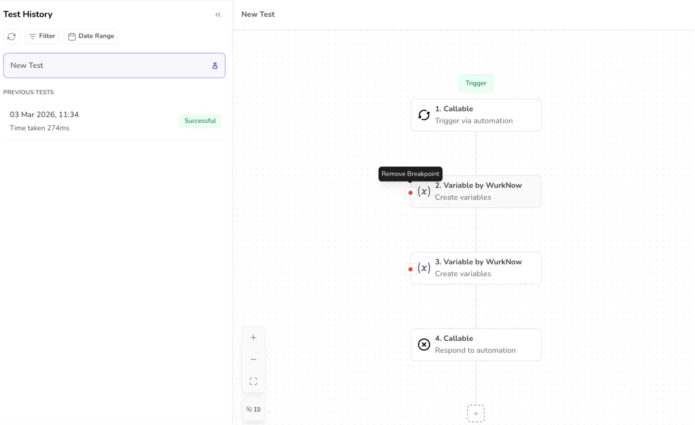

## Actions in breakpoints

- **Continue**: This action moves the flow to the next breakpoint while executing the immediate nodes.
- **Step over**: This action executes the current node and moves to the following node.
- **Step into:** This action enables running of the child automation first, and then the parent automation is executed (used in case of callable automation).
- **Stop:** This action stops the workflow and the remaining nodes go into the disabled state.

## Feature

1. Breakpoints can simply be ***ADDED*** or ***REMOVED*** by hovering over the breakpoint icon.

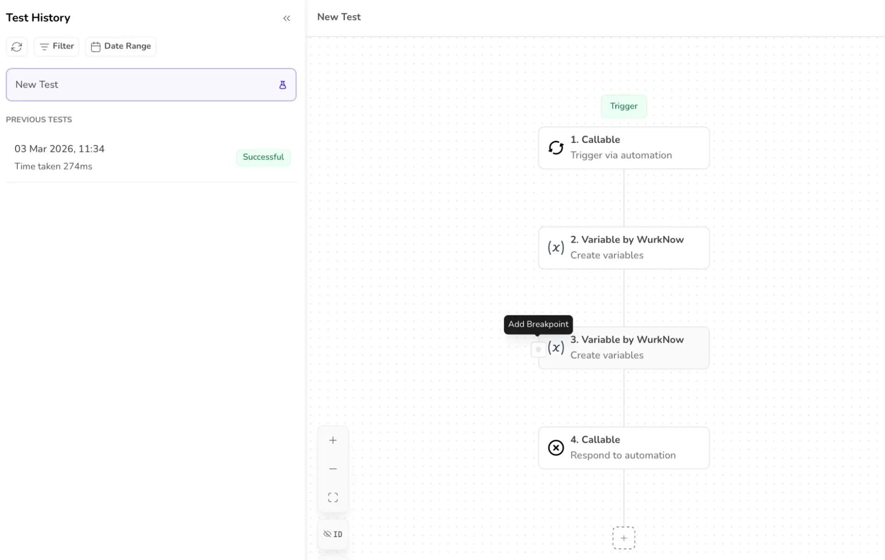

2. The ***Debug icon*** appears or disappears with the breakpoints.

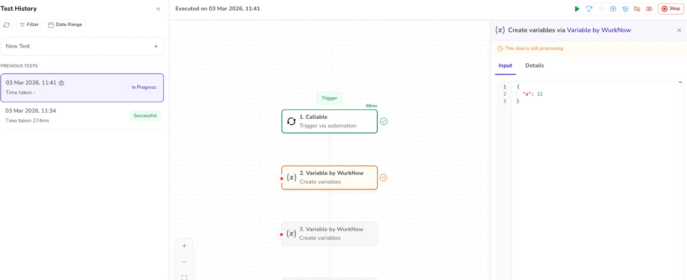

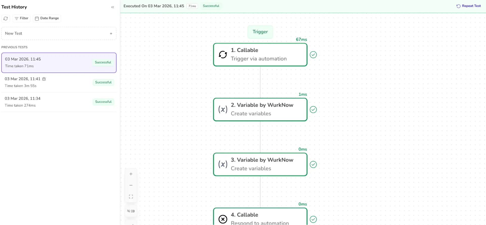

3. Clicking the RUN Button enables the ***STEP OVER****,* ***STEP INTO****,* ***CONTINUE*** actions.

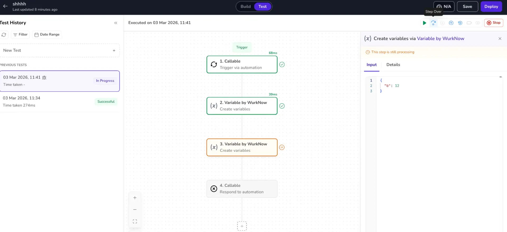

4. Clicking *CONTINUE* after a breakpoint moves execution to the next breakpoint and executes immediate nodes.

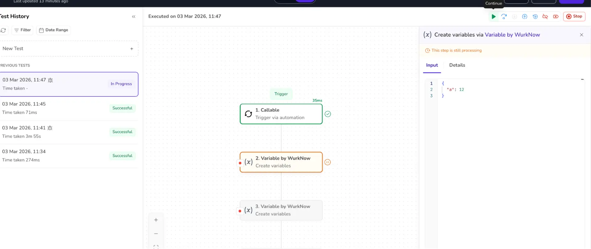

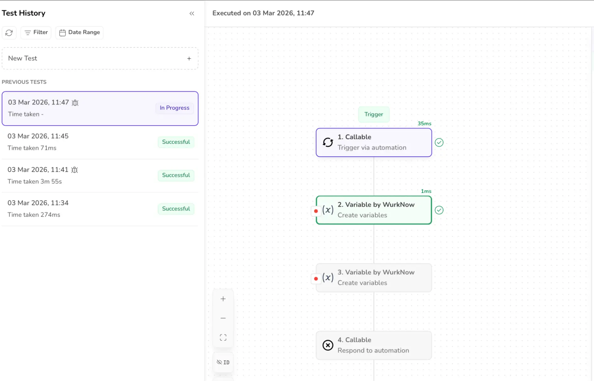

5. After adding a new breakpoint and running the test, the previously added breakpoints reappear with clicking on the *NEW TEST.*

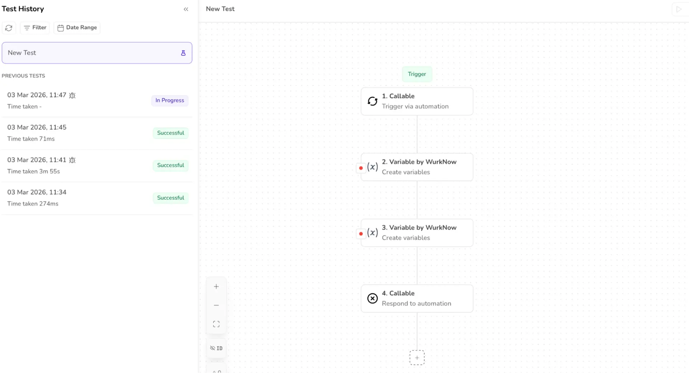

6. The test status is shown *“IN PROGRESS”* after adding the breakpoints and running the tests.

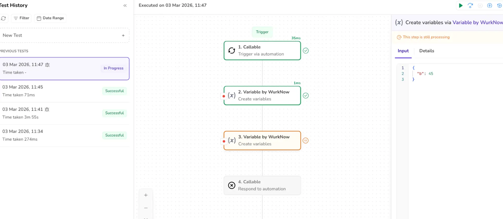

7. When the new test is run, the test parameters are asked in the form.

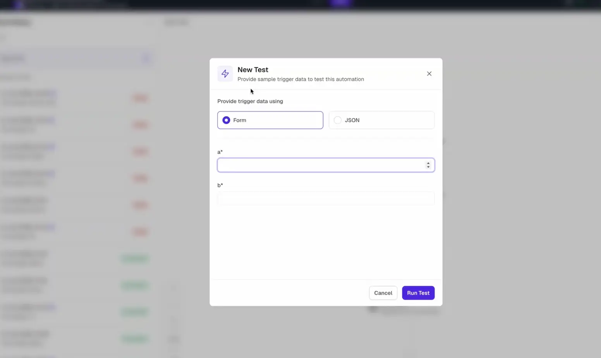

8. The breakpoints and the debug icon are not visible after the successful execution of the test and when clicking the *Repeat Test.*

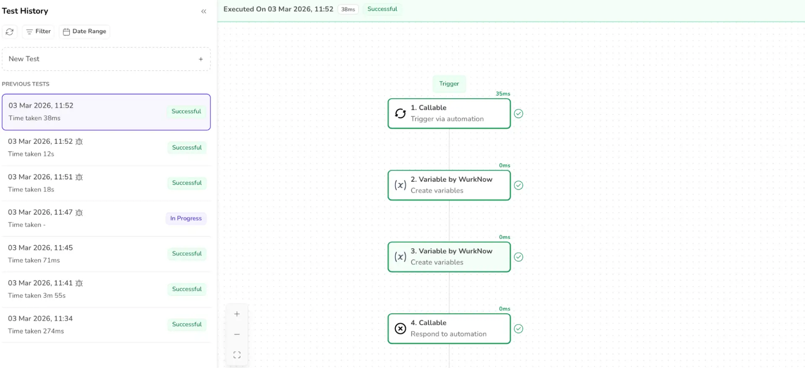

9. When Step over or Continue is clicked, “*This step is still processing”* message is displayed.

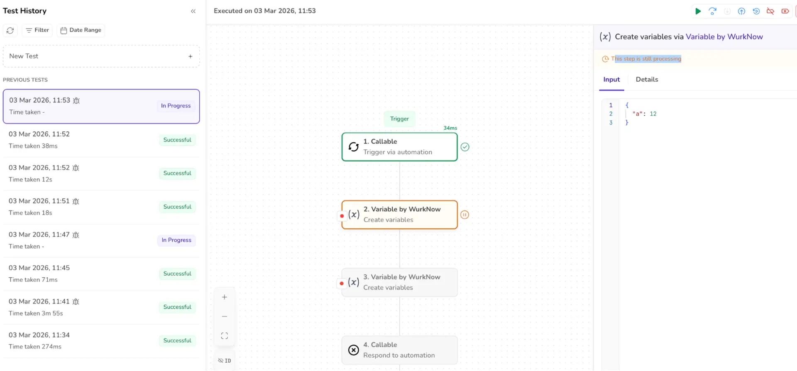

10. When callable automation is used, STEP INTO executes the child automation while the parent automation displays the loading indicator.

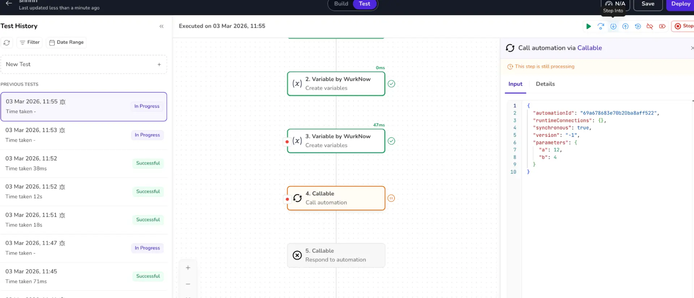

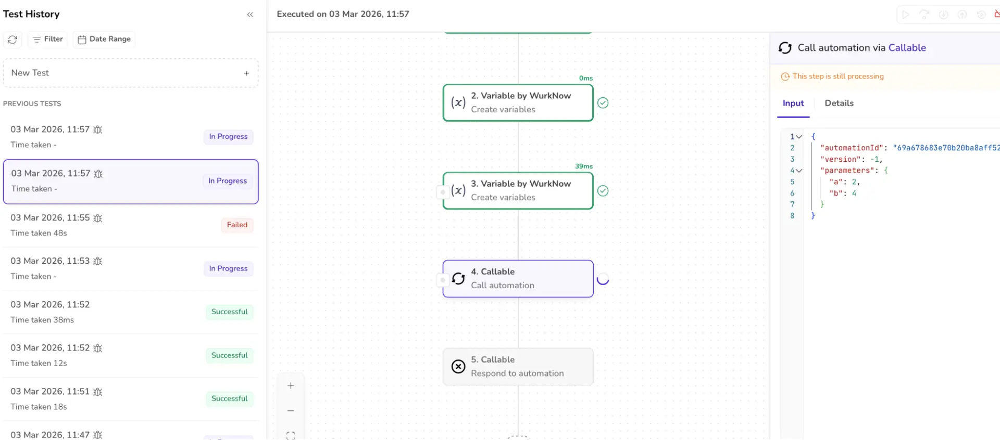

The child automation can be viewed and run in a new window. By clicking the CONTINUE DEBUGGING button, we can view the child automation.

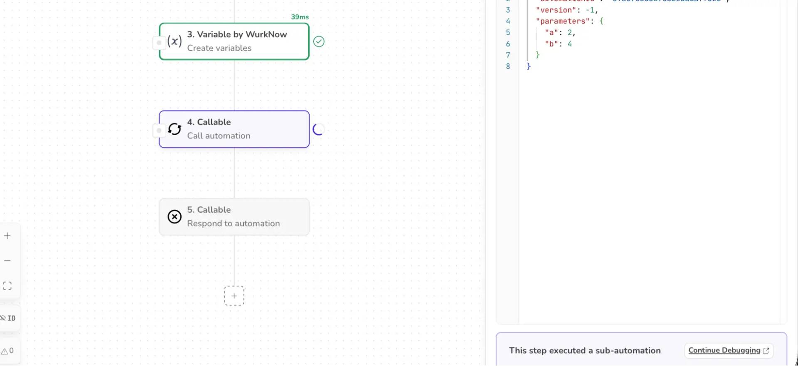

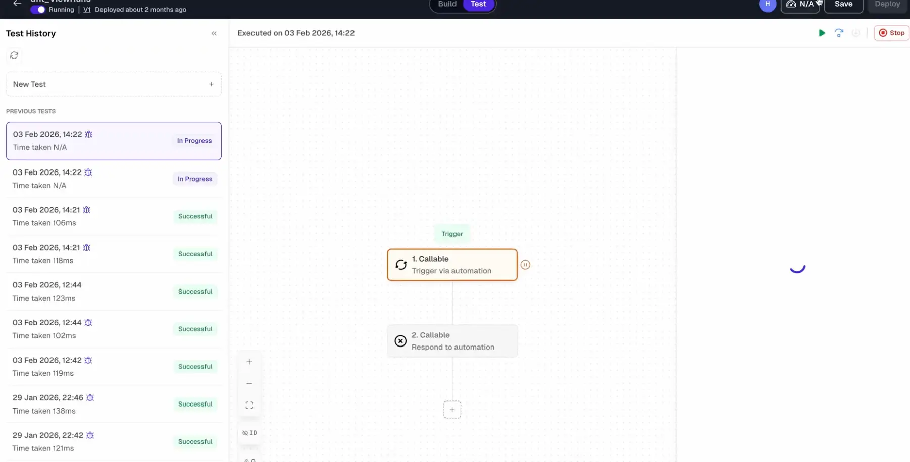

11. When the *STOP* button is clicked, the workflow is cancelled and the nodes go into the disabled state. The “CANCELLED” text appears in the history.

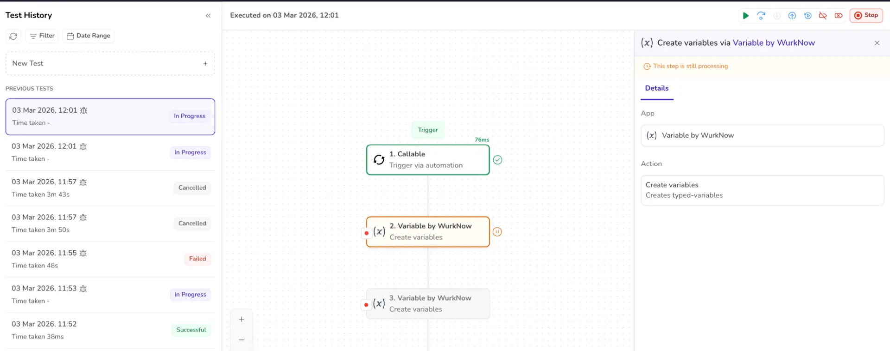

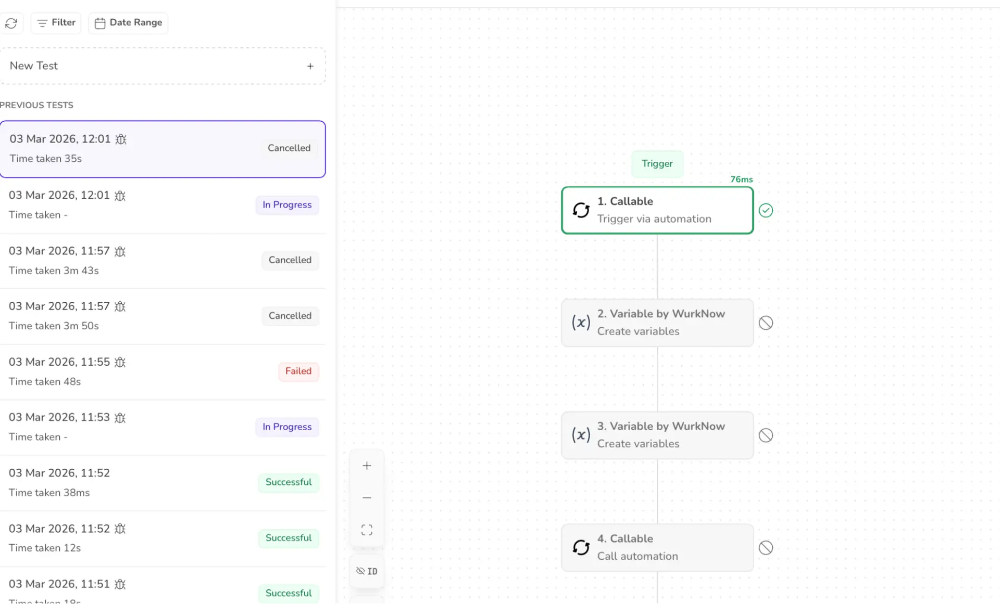

12. When the execution is successful, the *“SUCCESSFUL”* message is displayed in the history.

## Use Cases

**Finding bugs**

- Stop execution where the output goes wrong
- Inspect variables to see where values change unexpectedly
- Catch off-by-one errors, null values, or incorrect logic.

**Understanding code behaviour**

- Learn how unfamiliar or legacy code works
- Trace execution flow step by step
- See which functions are actually called (vs. which you *think* are)

**Debugging loops and iterations**

- Pause inside loops to:
- Track iteration counts
- Inspect how variables evolve
- Detect infinite or skipped loops

**Verifying function calls and parameters**

- Check whether a function is called
- Confirm arguments passed are correct
- Validate return values

##
