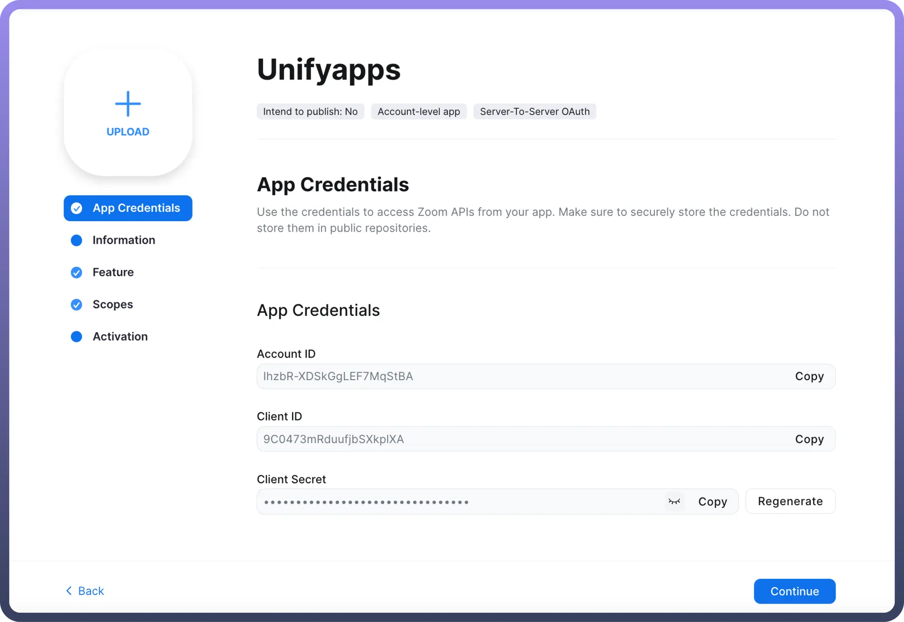
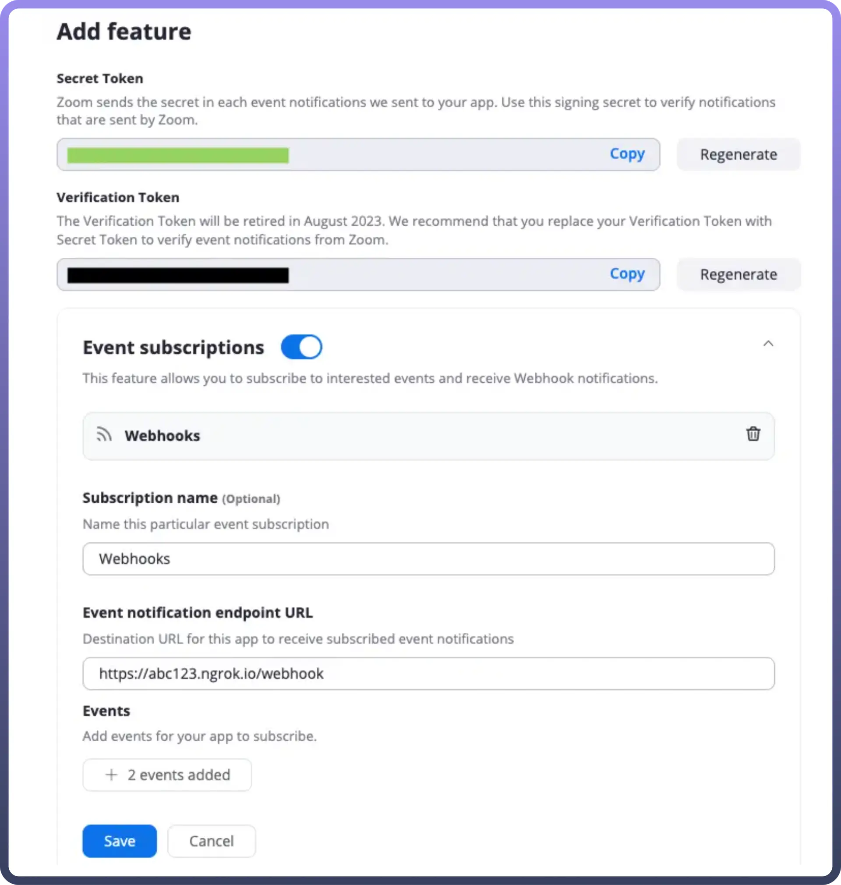

# Zoom

Source: https://www.unifyapps.com/docs/unify-automations/zoom
Section: automations

---

Zoom provides a comprehensive platform for **video conferencing** and **collaboration**. It offers a simple yet powerful way to connect people remotely, facilitating seamless communication and teamwork across geographical boundaries. Zoom supports various types of meetings, from casual catch-ups to formal presentations and large-scale webinars. Its intuitive interface and robust features allow users to share screens, record sessions, and integrate with other tools, making it an essential tool for remote work and virtual team collaboration.

Integrating your application with Zoom revolutionizes virtual communication, facilitating seamless **video conferencing**, **collaboration**, and **webinar hosting**.

## Authentication

Ensure you have the following information ready for a seamless integration process:

- `Connection Name`: Select a descriptive name for your connection, like "MyAppzoomIntegration". This helps in easily identifying the connection within your application or integration settings.
- `Authentication Type`: Zoom supports Client Credentials for authentication. This method ensures secure access to Zoom's functionalities and data.
- `OAuth/Client Credentials`:
  - Go to the [**Zoom App Marketplace**](https://marketplace.zoom.us/). Click Develop in the dropdown menu in the top-right corner of the page and select Build Server-to-Server App.
  - Add a name for your app and click `Create`.
  - On the left navigation menu, within the App credentials section your account ID, client ID and client secret would be visible.
  - `Information`: Add information about your app, such as a short description, company name, and developer contact information (name and email address are required for app activation).
  - `Features`: within the Add feature section, you'll have the secret token required for authentication.
  - `Scopes`: Add any scopes that are needed for your app.Scopes define the API methods this app is allowed to call, and thus which information and capabilities are available on Zoom. Choose Add Scopes to search for and add scopes. Scopes requirement for each (action/trigger) in Zoom:

| Action Name | Scopes Required |
|---|---|
| `Transcript Completed (Trigger)` | Recording:read, phone_recording:read:admin, cloud_recording:read:list_recording_files:admin, cloud_recording:read:list_recording_files, cloud_recording:read:list_recording_files:master Meeting:read:list_meetings:admin, Meeting:read:participant:admin,  meeting:read:meeting:admin |
| `Get a Meeting (Action)` | Meeting:read, Meeting:read:admin, Meeting:read:meeting, Meeting:read:meeting:admin |
| `Get past meeting details (Action)` | Meeting:read:admin, Meeting:read |
| `Get past meeting participants (Action)` | Meeting:read:admin, Meeting:read, Meeting:read:list_past_participants, Meeting:read:list_past_participants:admin |
| `List all meetings
(Action)` | Meeting:read,
Meeting:read:admin, Meeting:read:list_meetings, Meeting:read:list_meetings:admin |
| `List all recordings
(Action)` | Recording:read:admin, Recording:read, Cloud_recording:read:list_user_recordings, Cloud_recording:read:list_user_recordings:master, Cloud_recording:read:list_user_recordings:admin |

> **Note:** `user:read:list_users:admin` is the required scope for authenticating your app

- `Activation`: Your app should be activated. If your app is deactivated, existing tokens will no longer work.

  

## How to setup up Webhook in your Zoom App

1. `Click` on the zoom trigger in your automation and copy the webhook URL from the setup section.
2. `Login` into Zoom Marketplace and select the app that you have created.
3. Navigate to the “`Feature`” section in the left navigation menu
4. Under the general feature section, enable the “`Event Subscription`” toggle.
5. Provide the subscription name and select “`Webhook`” as method
6. In “`Event notification endpoint URL`”, provide the Webhook URL and click on the `validate` button.
7. In the Add event section, select the event for which you want to trigger your automation.
8. Now, Click on the “`Save`” button.

  

## Triggers

| **Triggers** | **Description** |
|---|---|
| `Meeting created` | Triggers every time when a meeting is created by one of your app users or account users in Zoom. |
| `Meeting deleted` | Triggers every time a meeting scheduled by one of your app users or account users, is deleted in Zoom. |
| `Meeting ended` | Triggers every time when a meeting host ends the meeting in Zoom. |
| `Recording completed` | Triggers when a recording of a meeting or webinar becomes available to view or download in Zoom. |
| `Recording deleted` | Triggers when a user permanently deletes a cloud recording in Zoom. |
| `Recording paused`
`Recording recovered` | Triggers every time when a recording is paused by one of your app's users or account users in Zoom. Triggers when a user recovers a recording from the trash in Zoom. |
| `Recording started` | Triggers when a recording is started by one of your app users or account users in Zoom. |
| `Recording stopped` | Triggers when a recording is stopped by one of your app users or account users in Zoom. |
| `Recording trashed` | Triggers when a user initially deletes a cloud recording in Zoom. |
| `Transcript completed` | Triggers when a transcript is completed in Zoom. |

## Actions

| **Actions** | **Description** |
|---|---|
| `Assign user to issue` | Use this action to Assign user to issue in Jira |
| `Create comment` | Use this action to create comment for issue in Jira |
| `Create issue` | Use this action to create an issue in Jira |
| `Create user` | Use this action to create a user in Jira |
| `Find users assignable to projects` | Use this action to find users assignable to projects in Jira |
| `Get changelogs` | Use this action to get changelogs for an issue from Jira |
| `Get comments` | Use this action to get comments for an issue from Jira |
| `Get issue details` | Use this action to get issue details from Jira |
| `Get issue type schemas` | Use this action to get all issue type schemes from Jira |
| `Get projects` | Use this action to get projects from Jira |
| `Get user` | Use this action to get user details from Jira |
| `Get user details by email` | Use this action to get user details by email from Jira |
| `Get user details by ID` | Use this action to get user details by ID from Jira |
| `Update comment` | Use this action to update comment for an issue in Jira |
| `Update issue` | Use this action to update issue in Jira |
| `Update attachment` | Use this action to upload attachment to an issue in Jira |
