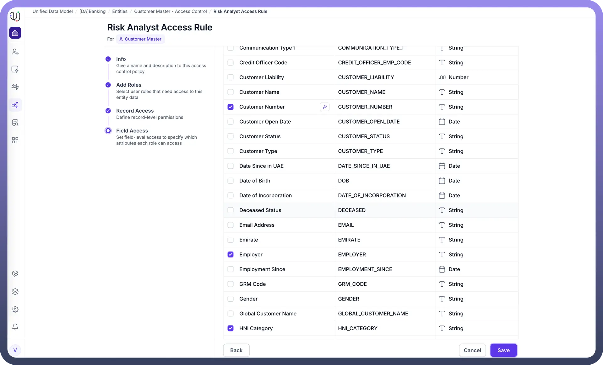
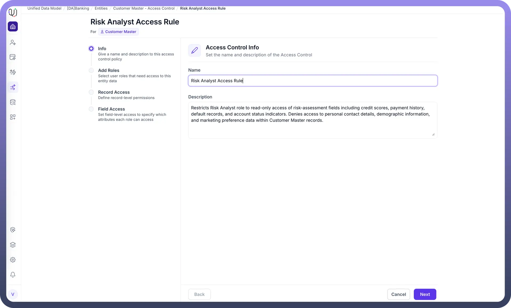

# Access Control

Source: https://www.unifyapps.com/docs/unify-data/access-control
Section: data

---

Access Control in the UnifyApps Unified Data Model (MDM) is powered by a **Role-Based Access Control (RBAC)** framework. This system ensures that users only see and interact with the data they are permitted to access. 
 Using RBAC, administrators can define roles, configure access policies, and apply granular controls at both the **record level** and **attribute (column) level**, ensuring strong data governance across the platform.

## **Key Concepts**

### **Roles**

A **Role** represents a set of permissions assigned to one or more users. Roles determine what actions a user can perform and what portions of the data model they can access. 
 Examples include: *Data Steward, Analyst, Sales User, Operations Viewer*, etc.

### **Access Control Policies**

An Access Control Policy defines **how much** of an Entity’s data a role is allowed to see or modify. Each policy consists of two components:

1. **Record-Level Filter** Controls which records a user can access. This allows row-level segmentation such as:
2. Record filters ensure that users see only the subset of data that applies to them.
3. **Column-Level Filter** Controls which fields (attributes) a user can view or edit. This is used to:
4. Column filters ensure that sensitive or restricted attributes remain protected.

## How Access Control Works

1. **Create a Role** Administrators define a role representing a category of users with similar responsibilities or access needs.
2. **Configure an Access Control Policy** For each policy, define:
3. **Assign the Policy to a Role** One or more access policies can be attached to a role. Users who are assigned that role inherit all applied policies.
4. **User Access Enforcement** When a user interacts with MDM:

## **Example Scenario**

**Role:** *Regional Sales Manager*
 **Record-Level Filter:** region == user.region 
 **Column-Level Filter:**

- Visible: name, email, purchase_history
- Hidden: credit_score, tax_identifier

This ensures sales managers can only view customers within their territory and cannot access sensitive financial attributes.

## **Benefits of RBAC in MDM**

- **Strong Data Governance** — Protects sensitive and regulated data.
- **Granular Control** — Row-level and column-level restrictions for maximum precision.
- **Scalable Administration** — Policies can be reused across multiple roles.
- **Consistent Enforcement** — Applied across UI, APIs, workflows, and reporting layers.
- **Compliance Ready** — Supports segmentation required for GDPR, HIPAA, SOC2, and internal audit controls.

## **Summary**

UnifyApps MDM provides a flexible, enterprise-grade RBAC system that enables precise data access management. By defining roles and attaching Access Control Policies with record-level and column-level filters, organizations can enforce secure, compliant, and contextual data visibility across users and teams.
