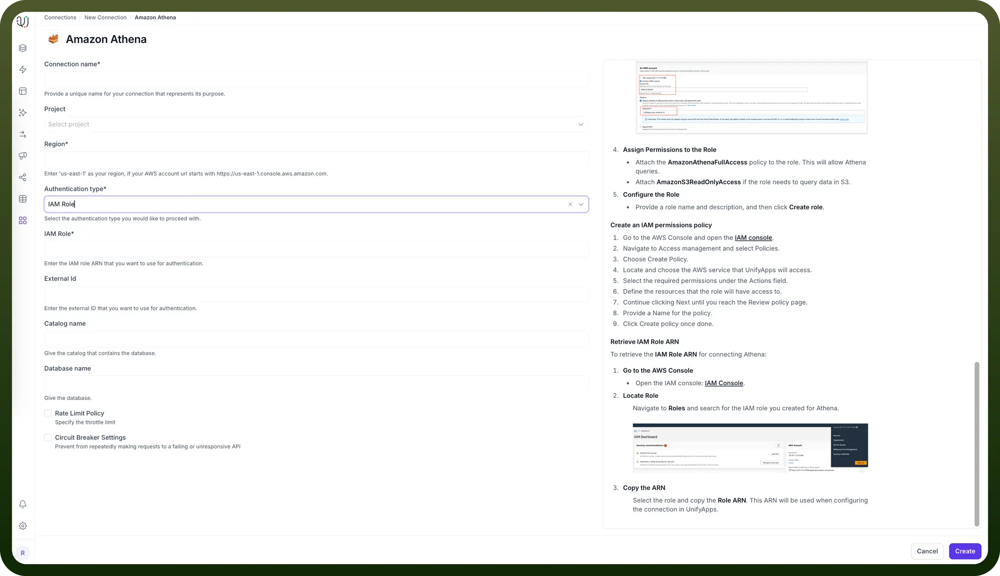
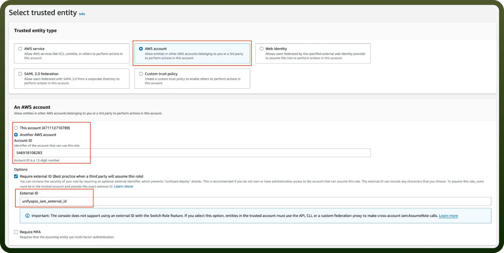
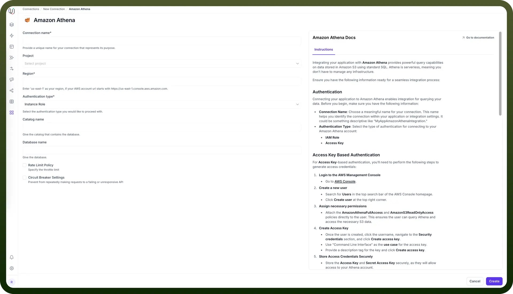
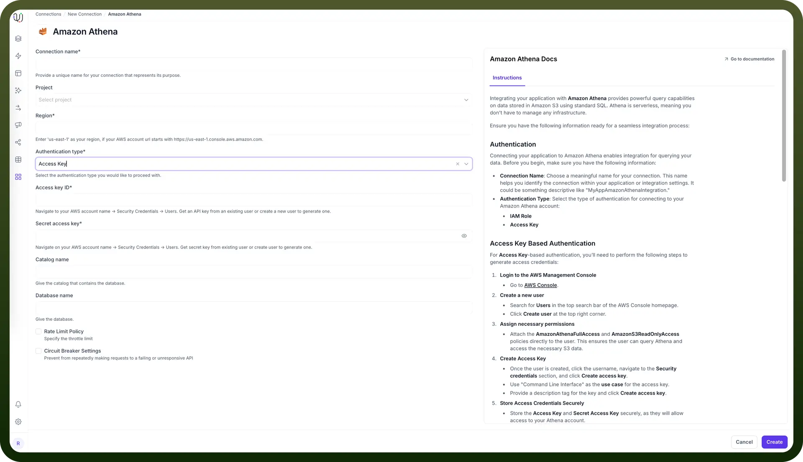
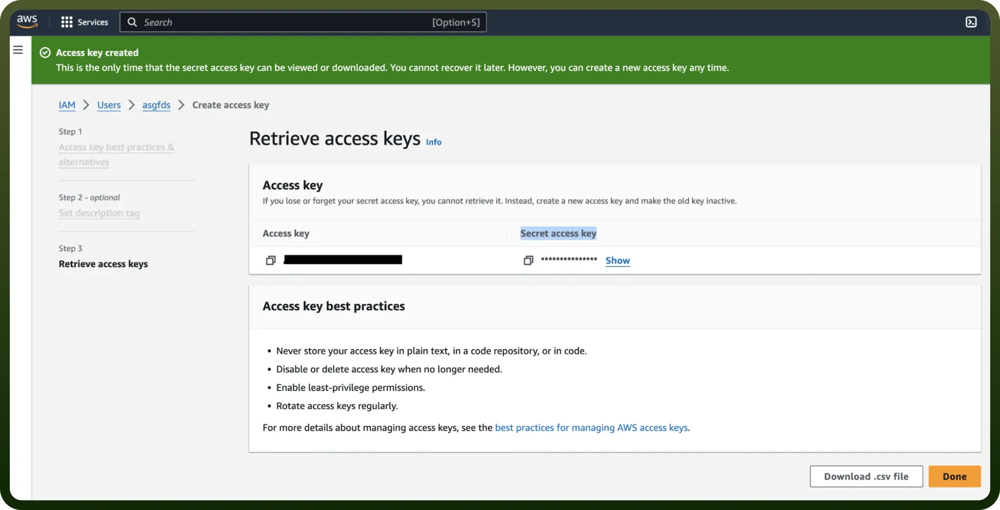
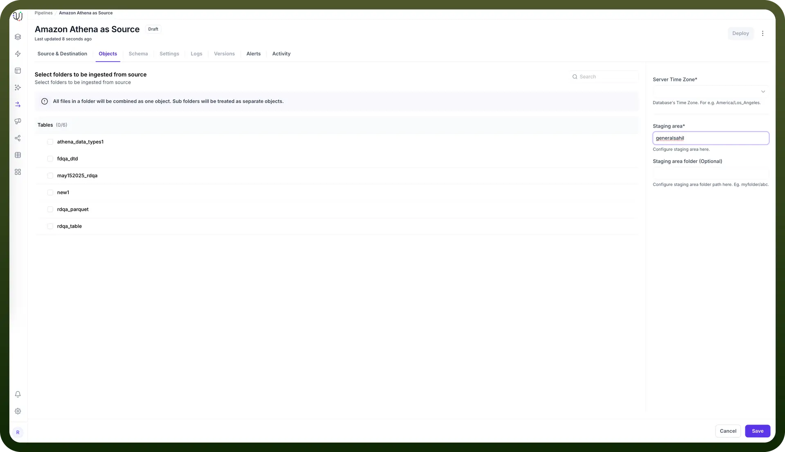
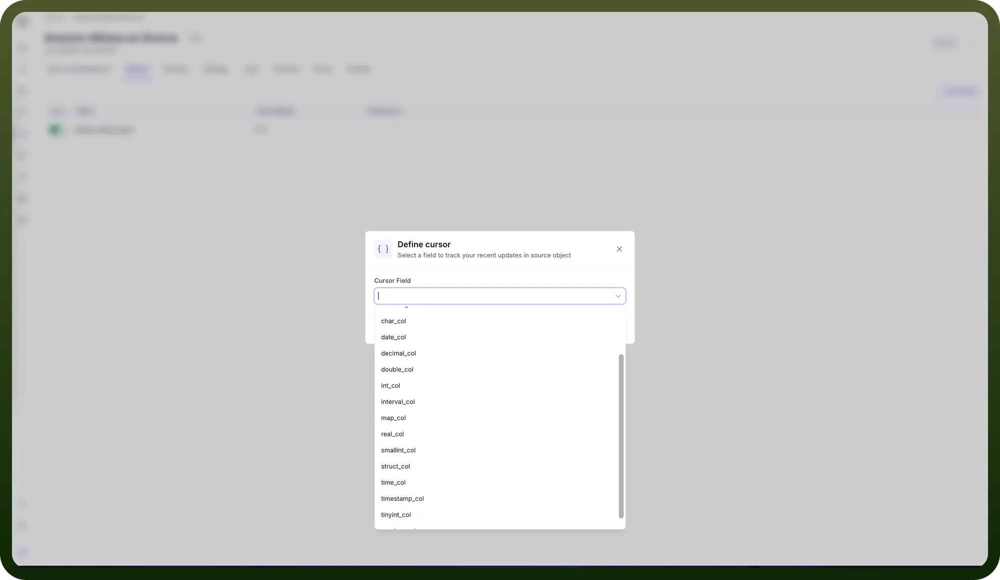

# Amazon Athena as Source

Source: https://www.unifyapps.com/docs/unify-data/amazon-athena-as-source
Section: data

---

UnifyApps enables seamless integration with Amazon Athena as a source for your data pipelines. This article covers essential configuration elements and best practices for connecting to Athena sources.

## Overview

Amazon Athena is a serverless, interactive query service that makes it easy to analyze data in Amazon S3 using standard SQL. UnifyApps provides native connectivity to extract data from Athena efficiently and securely, supporting both historical data loads and continuous data synchronization without requiring infrastructure management.

## Connection Configuration

| **Parameter** | **Description** | **Example** |
|---|---|---|
| `Connection Name`* | Descriptive identifier for your connection | "Production Athena Analytics" |
| `Project` | Optional project categorization | "Data Analytics Project" |
| `Region`* | AWS region where Athena service is located | "us-east-1" |
| `Authentication Type`* | Method of authentication | IAM Role or Instance Role |
| `Database Name`* | Name of your Athena database | "analytics_db" |
| `Server Time Zone`* | Database server's timezone | "UTC" |
| `Staging Area`* | S3 bucket for data staging | "s3://my-staging-bucket/" |

To set up an Athena source, navigate to the Connections section, click New Connection, and select Amazon Athena. Fill in the parameters above based on your AWS environment details.

## Authentication Methods

### IAM Role Authentication

For IAM Role-based authentication, follow these steps:

1. **Login to AWS Management Console**
  - Go to AWS Console
2. **Create an IAM Role**
  - Navigate to the IAM dashboard by searching **IAM**
  - Select `Roles` from the left-hand menu, and click `Create role`
3. **Configure Trusted Entity**
  - Under `Trusted entity type`, choose `AWS account`
  - Select `Another AWS account` and input the `UnifyApps AWS account ID` (contact UnifyApps support)
  - Check the `Require external ID` box and enter the `External ID` provided by UnifyApps
4. **Assign Permissions to the Role**
  - Attach the `AmazonAthenaFullAccess` policy to the role
  - Attach `AmazonS3ReadOnlyAccess` if the role needs to query data in S3
5. **Configure the Role**
  - Provide a role name and description, then click `Create role`
6. **Retrieve IAM Role ARN**
  - Navigate to `Roles` and search for the IAM role you created
  - Select the role and copy the `Role ARN` for use in UnifyApps configuration

Required connection fields:

- `IAM Role ARN`: The Amazon Resource Name of the IAM role
- `External ID`: The external ID provided by UnifyApps for secure role assumption

### Instance Role Authentication

For Instance Role-based authentication, configure as follows:

1. **Connection Configuration**
  - Select `Instance Role` as the authentication type
  - Provide the `Catalog name` that contains the database
  - Specify the `Database name` for your Athena database

Required connection fields:

- `Catalog name`: The catalog that contains the database
- `Database name`: The name of the database to connect to

### Access Key Authentication

For Access Key-based authentication, you'll need AWS access credentials:

1. **Create IAM User** (if not already available)
  - Navigate to IAM in AWS Console
  - Create a new user with programmatic access
  - Attach `AmazonAthenaFullAccess` and `AmazonS3ReadOnlyAccess` policies
2. **Generate Access Keys**
  - In the IAM user's Security credentials tab
  - Click `Create access key`
  - Securely store the Access Key ID and Secret Access Key

Required connection fields:

- `Access Key ID`: Your AWS access key identifier
- `Secret Access Key`: Your AWS secret access key

## Server Timezone and Staging Configuration

When adding objects from an Athena source, you'll need to configure two important settings:

**Server Time Zone**

- In the `Add Objects` dialog, find the Server Time Zone setting
- Select your Athena server's timezone (e.g., "UTC", "America/Los_Angeles")
- This ensures all timestamp data is normalized to UTC during processing, maintaining consistency across your data pipeline

**Staging Area**

- Configure an S3 bucket accessible by the same credentials used in the Athena connection
- The staging area is used for temporary data processing during extraction
- Ensure the bucket is in the same AWS region as your Athena service for optimal performance
- The staging area folder path should be specified (e.g., `s3://my-staging-bucket/athena-staging/`)

## Data Extraction Methods

UnifyApps uses specialized techniques for Athena data extraction:

**Historical Data (Initial Load)**

For historical data, UnifyApps uses a query-based approach:

- Data is extracted through SQL queries executed on Athena
- Query results are temporarily stored in the configured S3 output location
- The data is processed and loaded into the destination
- S3 staging objects are automatically cleaned up after successful processing

This method leverages Athena's serverless architecture and optimizes for cost-effective data extraction.

**Live Data (Incremental Updates)**

For ongoing changes, UnifyApps implements cursor-based polling:

- You must select a cursor field (typically a timestamp or sequential ID)
- The pipeline tracks the highest value processed in each run
- Subsequent runs query only for records with cursor values higher than the last checkpoint
- Recommended cursor fields are datetime columns that track record modifications

> **Note:** A validation error will be thrown if no cursor is configured when using `Historical and Live` or `Live Only` ingestion modes.

## Supported Data Types for Cursor Fields

| **Category** | **Supported Cursor Types** |
|---|---|
| `Numeric` | INT, INTEGER, BIGINT, TINYINT, SMALLINT |
| `String` | STRING, VARCHAR, CHAR (lexicographically ordered) |
| `Date/Time` | DATE, TIMESTAMP |

## Ingestion Modes

| **Mode** | **Description** | **Business Use Case** | **Requirements** |
|---|---|---|---|
| `Historical and Live` | Loads all existing data and captures ongoing changes | Data lake analytics with continuous synchronization | Valid cursor field required |
| `Live Only` | Captures only new data from deployment forward | Real-time dashboard without historical context | Valid cursor field required |
| `Historical Only` | One-time load of all existing data | Point-in-time analytics or compliance snapshot | No cursor field needed |

Choose the mode that aligns with your business requirements during pipeline configuration.

## CRUD Operations Tracking

When tracking changes from Athena sources:

| **Operation** | **Support** | **Notes** |
|---|---|---|
| `Create` | ✓ Supported | New record insertions are detected |
| `Read` | ✓ Supported | Data retrieval via full or incremental queries |
| `Update` | ✓ Supported | Updates are detected as new inserts with the updated values |
| `Delete` | ✗ Not Supported | Delete operations cannot be detected |

> **Note:** Due to Athena's query-based architecture, update operations appear as new inserts in the destination, and delete operations are not tracked. Consider this when designing your data synchronization strategy.

## Supported Data Types

| **Category** | **Supported Types** |
|---|---|
| `Integer` | TINYINT, SMALLINT, INT, INTEGER, BIGINT |
| `Decimal` | FLOAT, REAL, DOUBLE, DECIMAL(precision, scale) |
| `Date/Time` | DATE, TIME, TIMESTAMP, TIMESTAMP WITH TIME ZONE |
| `String` | CHAR, VARCHAR, STRING |
| `Boolean` | BOOLEAN |
| `Binary` | BINARY, VARBINARY |
| `Complex` | ARRAY, MAP, STRUCT, JSON, UUID, IPADDRESS |
| `Interval` | INTERVAL YEAR TO MONTH, INTERVAL DAY TO SECOND |

All standard Athena data types are supported, enabling comprehensive data extraction from various analytics workloads stored in S3.

## Prerequisites and Permissions

To establish a successful Athena source connection, ensure:

- Access to an active Amazon Athena service
- Network connectivity between UnifyApps and your AWS environment
- IAM permissions for Athena queries and S3 access
- S3 bucket for query results and staging
- Database user with the following minimum permissions:
  - `AmazonAthenaFullAccess` for Athena operations
  - `AmazonS3ReadOnlyAccess` for accessing S3 data

## Common Business Scenarios

**Data Lake Analytics**

- Extract processed analytics data from Athena queries on S3 data lakes
- Combine structured and semi-structured data analysis
- Configure appropriate cursor fields on partition columns

**Log Analytics Consolidation**

- Extract log analysis results from Athena
- Transform and combine with operational data
- Maintain continuous synchronization for monitoring dashboards

**Business Intelligence Enhancement**

- Extract aggregated datasets from Athena queries
- Combine with real-time operational data
- Create unified dashboards across data sources

## Best Practices

**Performance Optimization**

- Use partitioned tables in Athena for better query performance
- Schedule extractions during off-peak hours to optimize costs
- Use column pruning to extract only necessary fields
- Leverage Athena's columnar format advantages (Parquet, ORC)

**Cursor Selection**

- Prefer timestamp columns with last modified information
- Ensure chosen cursor fields are part of table partitions
- Use monotonically increasing fields for consistent ordering
- Avoid cursors on columns with many duplicate values

**S3 Configuration**

- Use the same AWS region for Athena, S3 data, and staging buckets
- Configure appropriate S3 bucket lifecycle policies
- Use VPC endpoints for enhanced security
- Optimize S3 file sizes for better query performance

**Query Optimization**

- Limit large table extractions with appropriate WHERE clauses
- Use partition pruning in your Athena queries
- Leverage Athena's query result caching when possible
- Monitor Athena query costs and optimize accordingly

**Cost Management**

- Monitor Athena query costs through AWS billing
- Use compressed file formats to reduce data scanned
- Implement appropriate data retention policies
- Consider using Athena workgroups for cost control

By properly configuring your Athena source connections and following these guidelines, you can ensure reliable, efficient data extraction while meeting your business requirements for data timeliness, completeness, and cost-effectiveness.

Amazon Athena's serverless architecture and S3 integration make it an excellent source for analytics-focused data pipelines, enabling you to query vast amounts of data without managing infrastructure.
