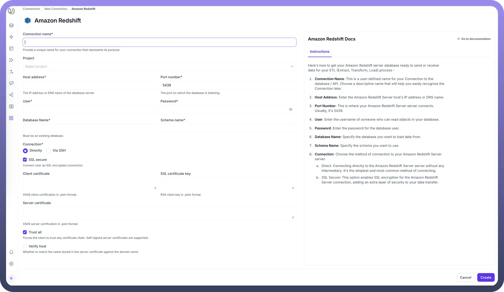

# Amazon Redshift as Destination

Source: https://www.unifyapps.com/docs/unify-data/amazon-redshift-as-destination
Section: data

---

UnifyApps enables seamless integration with Amazon Redshift as a destination for your data pipelines. This article covers essential configuration elements and best practices for connecting to Redshift destinations.

## Overview

Amazon Redshift is a fully managed, petabyte-scale data warehouse service optimized for analytics workloads. UnifyApps provides native connectivity to load data into Redshift clusters efficiently and securely, supporting both batch and real-time data loading scenarios.

## Connection Configuration

| **Parameter** | **Description** | **Example** |
|---|---|---|
| `Connection Name`* | Descriptive identifier for your connection | "Production Redshift Analytics" |
| `Host Address`* | Redshift cluster endpoint | "redshift-cluster.abc123xyz.us-east-1.redshift.amazonaws.com" |
| `Port Number`* | Database port | 5439 (default) |
| `User`* | Database username with write permissions | "unify_writer" |
| `Password`* | Authentication credentials | "********" |
| `Database Name`* | Name of your Redshift database | "analytics_db" |
| `Server Time Zone`* | Database server's timezone | "UTC" |
| `Connection`* | Method of connecting to the database | Direct or Via SSH |

To set up a Redshift destination, navigate to the Connections section, click New Connection, and select Amazon Redshift. Fill in the parameters above based on your Redshift environment details.

## Destination Settings Configuration



UnifyApps provides flexible configuration options for Redshift destinations through the Settings tab in Data Pipelines:

**Load Destination Interval**

The Load Destination Interval setting allows you to control how frequently data is loaded into your Redshift destination. This setting helps optimize performance and manage cluster costs by batching data loads at appropriate intervals based on your business requirements.

**Custom S3 Staging Bucket**

For enhanced control over your data loading process, you can configure a custom S3 bucket for staging:

- **S3 Bucket Connection:** Choose from your configured S3 bucket connections
- **Optional Path Specification:** Specify a custom path within the S3 bucket for staging files
- **Benefits:** Improved data governance, cost optimization, and compliance with organizational policies

This staging configuration is particularly useful for organizations with specific data residency requirements or those wanting to optimize cross-region data transfer costs.

## Data Loading Methods

UnifyApps uses specialized techniques for Redshift data loading:

**Staging-Based Loading**

For efficient data loading, UnifyApps implements a staging approach:

- Data is temporarily staged in Amazon S3 buckets
- Redshift COPY commands are used for high-performance bulk loading
- S3 staging objects are automatically cleaned up after successful processing
- This method optimizes for Redshift's architecture and maximizes cluster performance

**Batch Processing**

- Data is loaded in optimized batches to minimize cluster impact
- Configurable batch sizes based on data volume and performance requirements
- Automatic retry mechanisms for failed batch operations

## CRUD Operations Support

When loading data to Redshift destinations:

| **Operation** | **Support** | **Notes** |
|---|---|---|
| `Create` | ✓ Supported | New record insertions via COPY commands |
| `Read` | ✓ Supported | Data validation and quality checks |
| `Update` | ✓ Supported | Implemented via UPSERT operations |
| `Delete` | ✓ Supported | Conditional delete operations based on business logic |

> **Note:** Redshift's columnar architecture is optimized for `INSERT` operations. Updates and deletes are handled efficiently through staging and merge strategies.

## Supported Data Types

| **Category** | **Supported Types** |
|---|---|
| `Integer` | SMALLINT, INTEGER, BIGINT |
| `Decimal` | DECIMAL, REAL, DOUBLE PRECISION |
| `Date`/`Time` | DATE, TIME, TIMESTAMP, TIMESTAMPTZ, TIMETZ |
| `String` | CHAR, VARCHAR |
| `Boolean` | BOOLEAN |
| `Other` | SUPER, VARBYTE |

All standard Redshift data types are supported, enabling comprehensive data loading for various analytics workloads.

## Prerequisites and Permissions

To establish a successful Redshift destination connection, ensure:

- Access to an active Amazon Redshift cluster
- Network connectivity between UnifyApps and your Redshift cluster
- IAM permissions for S3 staging operations
- Database user with the following minimum permissions:

```
-- Grant data loading permissions
GRANT INSERT, UPDATE, DELETE ON ALL TABLES IN SCHEMA public TO unify_writer;
-- Grant table creation permissions
GRANT CREATE ON SCHEMA public TO unify_writer;
-- Grant temporary table permissions
GRANT TEMP ON DATABASE analytics_db TO unify_writer;
```

### Additional IAM Permissions for S3 Staging

```
{
    "Version": "2012-10-17",
    "Statement": [
        {
            "Effect": "Allow",
            "Action": [
                "s3:GetObject",
                "s3:PutObject",
                "s3:DeleteObject",
                "s3:ListBucket"
            ],
            "Resource": [
                "arn:aws:s3:::your-staging-bucket/*",
                "arn:aws:s3:::your-staging-bucket"
            ]
        }
    ]
}
```

## Common Business Scenarios

**Data Warehouse Loading**

- Load transformed data into dimensional and fact tables
- Support complex ETL/ELT processes with high-volume data
- Enable real-time data warehouse updates for analytics
- Implement slowly changing dimension (SCD) patterns

**Analytics and BI Integration**

- Populate data marts for business intelligence tools
- Load aggregated datasets for reporting dashboards
- Support self-service analytics with clean, structured data
- Enable cross-functional reporting across business units

**Data Lake to Data Warehouse Migration**

- Transform and load data from data lakes into structured warehouse
- Support hybrid architectures with both batch and streaming loads
- Enable advanced analytics on petabyte-scale datasets
- Implement data governance and quality controls

**Real-time Analytics**

- Load streaming data for near real-time analytics
- Support operational dashboards with fresh data
- Enable real-time business intelligence and monitoring
- Implement event-driven analytics workflows

## Best Practices

**Performance Optimization**

- **Load Destination Intervals:** Configure appropriate intervals for your use case to balance latency and throughput
- **Distribution Keys:** Ensure destination tables have optimal distribution keys for query performance
- **Sort Keys:** Use appropriate sort keys on frequently queried columns
- **Compression:** Leverage Redshift's automatic compression for storage optimization
- **VACUUM Operations:** Schedule regular VACUUM operations for optimal performance
- **Custom S3 Staging:** Use staging buckets in the same AWS region as your Redshift cluster

**Security Considerations**

- **Network Security:** Use VPC endpoints for secure S3 and Redshift communication
- **Encryption:** Enable encryption at rest and in transit for sensitive data
- **Access Control:** Implement least-privilege access principles for database users
- **Audit Logging:** Enable Redshift audit logging for compliance monitoring
- **S3 Security:** Secure staging buckets with appropriate bucket policies and IAM controls

**Cost Management**

- **Cluster Sizing:** Right-size your Redshift cluster for loading workloads
- **Reserved Instances:** Use reserved capacity for predictable workloads
- **Staging Optimization:** Configure S3 lifecycle policies for staging bucket cost control
- **Load Scheduling:** Schedule bulk loads during off-peak hours for cost optimization
- **Data Compression:** Leverage compression to reduce storage costs

**Data Governance**

- **Schema Management:** Maintain consistent schema designs and documentation
- **Data Lineage:** Document data flow and transformation processes
- **Quality Assurance:** Implement data validation and quality checks
- **Change Management:** Establish proper change control for schema modifications
- **Monitoring:** Set up comprehensive monitoring for pipeline health and performance

**Optimization Strategies**

- **Batch Sizing:** Optimize batch sizes based on data volume and cluster capacity
- **Parallel Loading:** Leverage Redshift's parallel processing capabilities
- **Staging Strategy:** Use appropriate staging strategies for different data patterns
- **Error Handling:** Implement robust error handling and retry mechanisms
- **Performance Monitoring:** Use Redshift performance insights for optimization

**Connection Management**

- **Connection Pooling:** Implement efficient connection pooling strategies
- **Timeout Configuration:** Set appropriate timeout values for large data loads
- **Health Monitoring:** Regular connection health checks and validation
- **Failover Strategy:** Implement failover mechanisms for high availability

## Data Loading Patterns

**Bulk Loading**

- High-volume initial data loads using `COPY` commands
- Optimal for historical data migration scenarios
- Supports complex data transformations during loading

**Incremental Loading**

- Delta-based loading to minimize processing overhead
- Support for change data capture (CDC) patterns
- Efficient handling of large, frequently changing datasets

**Real-time Streaming**

- Near real-time data loading for operational analytics
- Support for micro-batch processing patterns
- Integration with streaming data platforms

Amazon Redshift's columnar architecture and scalability make it an excellent destination for analytics-focused data pipelines. By following these configuration guidelines and best practices, you can ensure reliable, efficient data loading while optimizing for performance, security, and cost-effectiveness.
