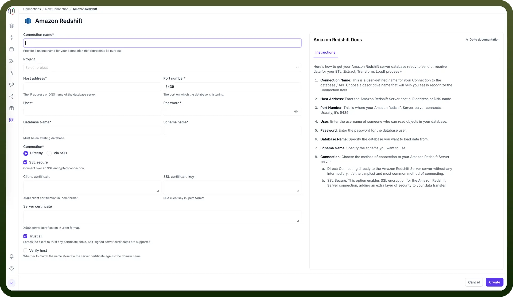
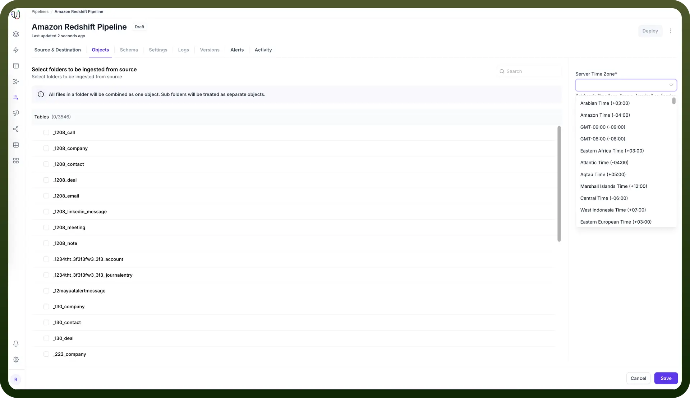
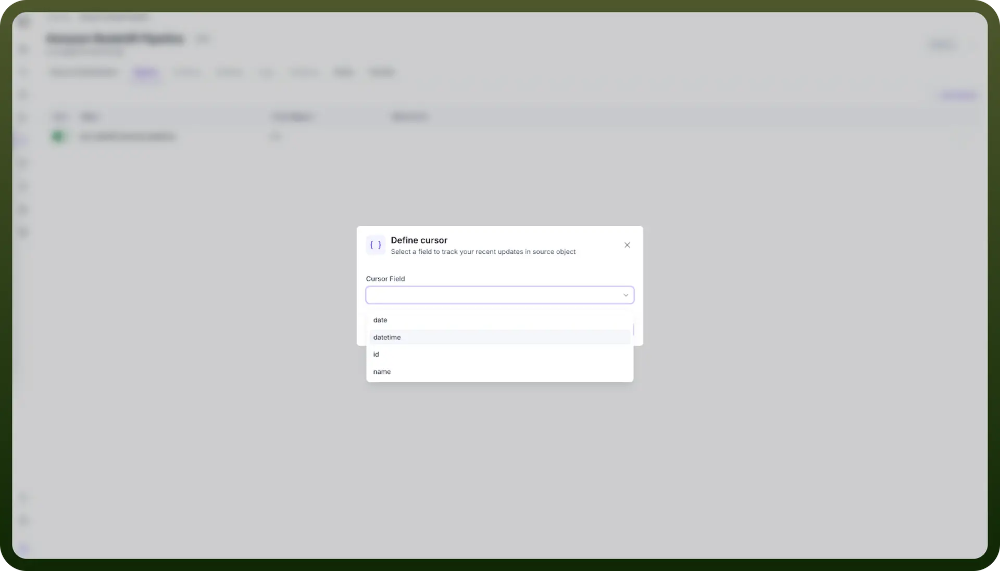
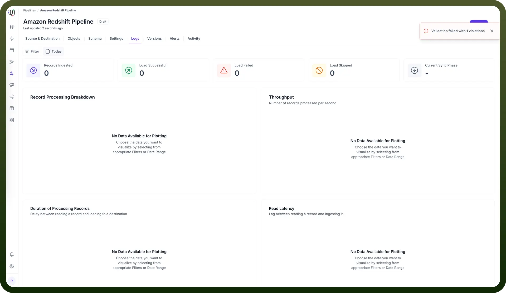

# Amazon Redshift as Source

Source: https://www.unifyapps.com/docs/unify-data/amazon-redshift-as-source
Section: data

---

UnifyApps enables seamless integration with Amazon Redshift as a source for your data pipelines. This article covers essential configuration elements and best practices for connecting to Redshift sources.

## Overview

Amazon Redshift is a fully managed, petabyte-scale data warehouse service optimized for analytics workloads. UnifyApps provides native connectivity to extract data from Redshift clusters efficiently and securely, supporting both historical data loads and continuous data synchronization.

## Connection Configuration

| `Parameter` | Description | Example |
|---|---|---|
| `Connection Name*` | Descriptive identifier for your connection | "Production Redshift Analytics" |
| `Host Address*` | Redshift cluster endpoint | "redshift-cluster.abc123xyz.us-east-1.redshift.amazonaws.com" |
| `Port Number*` | Database port | 5439 (default) |
| `User*` | Database username with read permissions | "unify_reader" |
| `Password*` | Authentication credentials | "********" |
| `Database Name*` | Name of your Redshift database | "analytics_db" |
| `Server Time Zone*` | Database server's timezone | "UTC" |
| `Connection*` | Method of connecting to the database | Direct or Via SSH |

To set up a Redshift source, navigate to the Connections section, click `New Connection`, and select `Amazon Redshift`. Fill in the parameters above based on your Redshift environment details.

## Server Timezone Configuration

When adding objects from a Redshift source, you'll need to specify the database server's timezone. This setting is crucial for proper handling of date and time values.

- In the Add Objects dialog, find the Server Time Zone setting
- Select your Redshift server's timezone

This ensures all timestamp data is normalized to UTC during processing, maintaining consistency across your data pipeline.

## Data Extraction Methods

UnifyApps uses specialized techniques for Redshift data extraction:

**Historical Data (Initial Load)**

For historical data, UnifyApps uses a snapshot-based approach:

1. Data is extracted in chunks from Redshift tables
2. These chunks are temporarily staged in Amazon S3
3. The data is processed and loaded into the destination
4. S3 staging objects are automatically cleaned up after successful processing

This method optimizes for Redshift's architecture and minimizes impact on your cluster performance.

**Live Data (Incremental Updates)**

For ongoing changes, UnifyApps implements [cursor-based polling](https://www.unifyapps.com/docs/unify-data/polling-cursor)

You must select a cursor field (typically a timestamp or sequential ID)

1. The pipeline tracks the highest value processed in each run
2. Subsequent runs query only for records with cursor values higher than the last checkpoint
3. Recommended cursor fields are datetime columns that track record modifications

> **Note:** Important: A validation error will be thrown if no cursor is configured when using "`Historical and Live`" or "`Live Only`" ingestion modes.

### Supported Data Types for Cursor Fields

| **Category** | **Supported Cursor Types** |
|---|---|
| `Numeric` | INTEGER, DECIMAL, SMALLINT, BIGINT |
| `String` | VARCHAR, CHAR (lexicographically ordered) |
| `Date/Time` | DATE, TIMESTAMP, TIMESTAMPTZ, TIME, TIMETZ |

### Ingestion Modes

| **Mode** | **Description** | **Business Use Case** | **Requirements** |
|---|---|---|---|
| `Historical and Live` | Loads all existing data and captures ongoing changes | Data warehouse migration with continuous synchronization | Valid cursor field required |
| `Live Only` | Captures only new data from deployment forward | Real-time dashboard without historical context | Valid cursor field required |
| `Historical Only` | One-time load of all existing data | Point-in-time analytics or compliance snapshot | No cursor field needed |

Choose the mode that aligns with your business requirements during pipeline configuration.

### CRUD Operations Tracking

When tracking changes from Redshift sources:

| **Operation** | **Support** | **Notes** |
|---|---|---|
| `Create` | ✓ Supported | New record insertions are detected |
| `Read` | ✓ Supported | Data retrieval via full or incremental queries |
| `Update` | ✓ Supported | Updates are detected as new inserts with the updated values |
| `Delete` | ✗ Not Supported | Delete operations cannot be detected |

> **Note:** Due to Redshift's architecture, update operations appear as new inserts in the destination, and delete operations are not tracked. Consider this when designing your data synchronization strategy.

### Supported Data Types

| **Category** | **Supported Types** |
|---|---|
| `Integer` | SMALLINT, INTEGER, BIGINT |
| `Decimal` | DECIMAL, REAL, DOUBLE PRECISION |
| `Date/Time` | DATE, TIME, TIMESTAMP, TIMESTAMPTZ, TIMETZ |
| `String` | CHAR, VARCHAR |
| `Boolean` | BOOLEAN |
| `Other` | SUPER, VARBYTE |

All standard Redshift data types are supported, enabling comprehensive data extraction from various analytics workloads.

## Prerequisites and Permissions

To establish a successful Redshift source connection, ensure:

- Access to an active Amazon Redshift cluster
- Network connectivity between UnifyApps and your Redshift cluster
- IAM permissions for S3 staging if in the same AWS account
- Database user with the following minimum permissions: `GRANT SELECT ON ALL TABLES IN SCHEMA public TO unify_reader;`

## Common Business Scenarios

**Analytics Data Consolidation**

- Extract processed analytics data from Redshift
- Combine with operational data for comprehensive reporting
- Configure appropriate cursor fields on timestamp columns

**Data Warehouse Migration**

- Extract schema and data from legacy Redshift clusters
- Transform and optimize for new target platforms
- Maintain continuous synchronization during migration

**Business Intelligence Enhancement**

- Extract aggregated datasets from Redshift
- Combine with real-time operational data
- Create unified dashboards across data sources

## Best Practices

| **Category** | **Recommendations** |
|---|---|
| `Performance` | Use distribution key columns as chunking fields where possible Schedule extractions during off-peak hours Use column pruning to extract only necessary fields |
| `Cursor Selection` | Prefer timestamp columns with last modified information Ensure chosen cursor fields are indexed Use monotonically increasing fields for consistent ordering |
| `S3 Configuration` | Use the same AWS region for Redshift and S3 staging Configure appropriate S3 bucket lifecycle policies Use VPC endpoints for enhanced security |
| `Query Optimization` | Limit large table extractions with appropriate WHERE clauses Avoid cursors on columns with many duplicate values Use sort key columns when possible for range queries |

By properly configuring your Redshift source connections and following these guidelines, you can ensure reliable, efficient data extraction while meeting your business requirements for data timeliness, completeness, and compliance.
