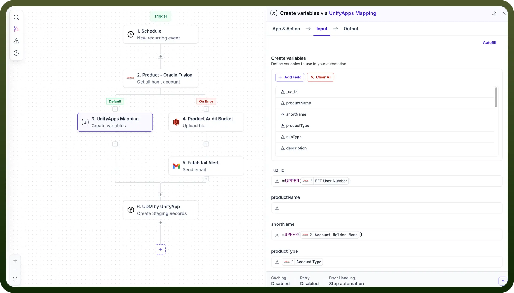

# Automations

Source: https://www.unifyapps.com/docs/unify-data/automations
Section: data

---

## **Overview**

UnifyApps MDM supports multiple ingestion methods for bringing data into your Unified Data Model (UDM). While **Pipelines** handle large, structured ETL-style loads, **Automations** offer a flexible way to sync data using custom logic.

Automations allow you to fetch data from any connected system, apply transformations or conditions, and then write that data into UDM. 
 **The key requirement:** the automation’s final step must use the **Create Staging Record** action from the **UDM by UnifyApps** node to ingest the actual record.

## **How Automations Fit Into Data Sync**

Automations are ideal when you need:

- Event-driven or scheduled data ingestion
- Conditional logic (update only certain records, skip inactive items, etc.)
- Data transformation before entering the UDM
- Light–medium volume syncs

The staging layer ensures all records pass through MDM’s governance rules: validation, matching, merging, and survivorship.

## **Setting Up a Data Sync Automation**

### **1. Create an Automation**

- Go to **Automations** and click **Create Automation**.
- Choose your trigger (Schedule, Webhook/Event, or Manual start).

This defines *how* and *when* your sync runs.

### **2. Fetch Data From Your Source**

Add steps to pull or receive data from systems such as:

- APIs
- Databases
- SaaS connectors
- Files or webhook payloads

You may loop through datasets or handle batches depending on the source.

### **3. Apply Transformations (Optional)**

Use automation steps to prepare the data:

- Field mapping
- Cleanup/normalization
- Conditional branching
- Enrichment from other systems

These steps let you shape the record before sending it into UDM.

### **4. Create the UDM Staging Record**

Finish the workflow by adding:

**Action:** *Create Staging Record*
 **Node:** *UDM by UnifyApps*

Provide:

- The target Entity
- The payload matching that Entity’s attributes

Once staged, the UDM engine performs all standard MDM processing.
