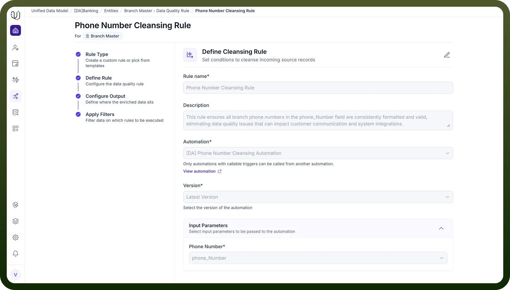

# Cleansing Rules

Source: https://www.unifyapps.com/docs/unify-data/cleansing-rules
Section: data

---

## **Definition**

Cleansing Rules (also known as Data Cleaning or Data Scrubbing) define how to identify, correct, and standardize inconsistent or erroneous data. These rules transform messy or incomplete records into clean, reliable, and analysis-ready datasets.

## **Purpose of Cleansing**

Cleansing Rules help achieve:

- **Duplicate Removal** – Identify and eliminate redundant records
- **Error Correction** – Fix typos, invalid characters, and formatting issues
- **Standardization** – Apply consistent formats (dates, phone numbers, codes, casing, etc.)
- **Missing Data Handling** – Apply strategies for null or incomplete values
- Cross-Field Consistency Checks
- **Normalization** – Convert values into standard forms
- **Outlier Handling** – Detect and clean anomalous or extreme data points
- **Usability Improvements** – Ensure data is consistent and ready for downstream operations**Cleansing Rule Types in UnifyApps**UnifyApps supports multiple cleansing rule categories, such as:
- Deduplication
- Standardization
- Data Type Correction
- Null Handling
- Whitespace & Character Cleanup
- Outlier Detection **Implementation Method****Automation-Based Cleansing (iPaaS Layer)**All cleansing logic in UnifyApps is implemented through automation workflows in the iPaaS layer. This allows cleansing to be defined as a structured, multi-step sequence that supports:
- Conditional logic
- Pattern cleaning and normalization
- Merging or updating corrected records
- Integrating external services for advanced validation
- Real-time or scheduled execution **Example Workflow**A cleansing workflow might:This ensures that only corrected, standardized data moves forward in the system.
  1. Trigger when a new or updated record enters the system.
  2. Apply a Character Cleanup rule (e.g., stripping non-numeric characters from a phone number).
  3. Apply a Standardization rule to convert the value into a required format (e.g., E.164).
  4. Map the output to the corresponding entity field..
