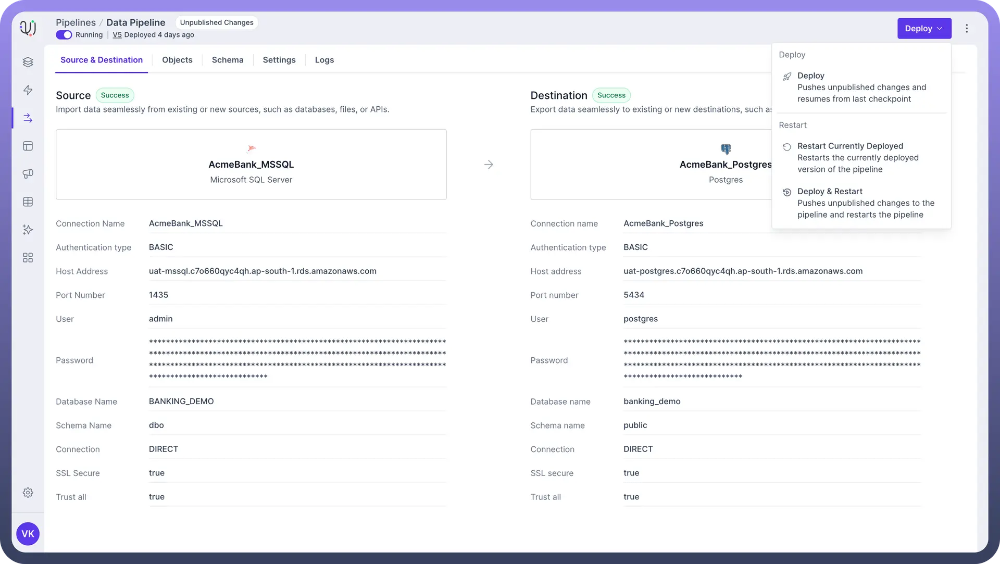

# Create your first Data Pipeline

Source: https://www.unifyapps.com/docs/unify-data/create-your-first-data-pipeline
Section: data

---

Data pipelines are essential tools for efficiently **moving** and **transforming** data between **different systems**. Whether you're migrating from one database to another or integrating data from multiple sources, understanding how to create a data pipeline is crucial.

This article will walk you through the process of **creating your first data pipeline** using UnifyData.

We'll cover each step in detail, from setting up your **source** and **destination** to deploying your pipeline.

