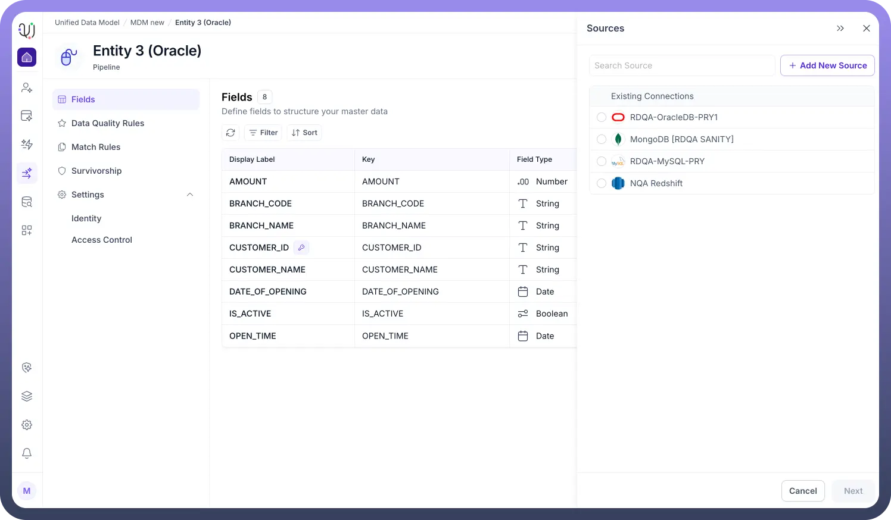
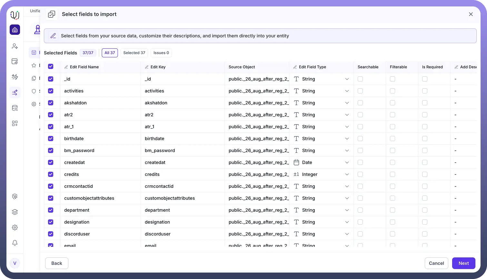

# Creating Entity Fields

Source: https://www.unifyapps.com/docs/unify-data/creating-entity-fields
Section: data

---

**Overview**

Once an Entity is established within the UnifyApps Base MDM, the next critical step is defining its schema through Fields.

Fields represent the specific attributes of your business object (e.g., customer_id, email, transaction_date).

Properly configuring these fields is essential, as they dictate not only how data is stored but also how it can be searched, filtered, and validated across your data pipelines and applications.

**Import Field Strategies**

When building complex entities, manually creating dozens of fields can be inefficient. UnifyApps provides the Import Fields feature to accelerate schema generation through three distinct methods:

**Import from Sources**

This method allows you to clone the schema directly from a connected external system (e.g., Snowflake, Salesforce, SAP).

- Select a configured connection from the **Sources** list.
- The system retrieves the metadata from the external object.
- You can select exactly which fields to map, ensuring your internal Entity perfectly mirrors the source of truth. **Upload File (CSV/XLS)**Ideal for migrating legacy data definitions or bulk-creating fields from a spreadsheet.

  

- Upload a standard .csv or .xlsx file.
- The platform parses the header row to suggest Field Keys and Labels automatically. **Suggest Fields (Template Library)**For standard industry objects (like "Customer" or "Product"), you can use the Suggest Fields option.This accesses a template library to populate your entity with best-practice schema definitions, saving time on initial setup. **Selecting Fields to Import** After choosing a source or file to import fields from, the **Select Fields to Import** step lets you review and adjust the fields before adding them to your Entity.**What You Can Do in This Step****Choose which fields to include** Select or deselect any fields from the source object. Only the checked fields will be created in your Entity.**Rename fields** You can modify the Field Name or Field Key to match your preferred naming conventions.**Update data types** Each field’s type (String, Number, Integer, etc.) can be changed if needed. **Enable search and filters** Mark fields as **Searchable** or **Filterable** to make them usable in queries and lists across the platform.**Set required fields** Toggle **Is Required** for fields that must always have a value.**Add descriptions** Optionally document the purpose or meaning of each field.**Why This Step Matters**This review screen ensures the imported metadata aligns with your internal data standards, giving you full control over how the Entity’s schema is created.

  

  
