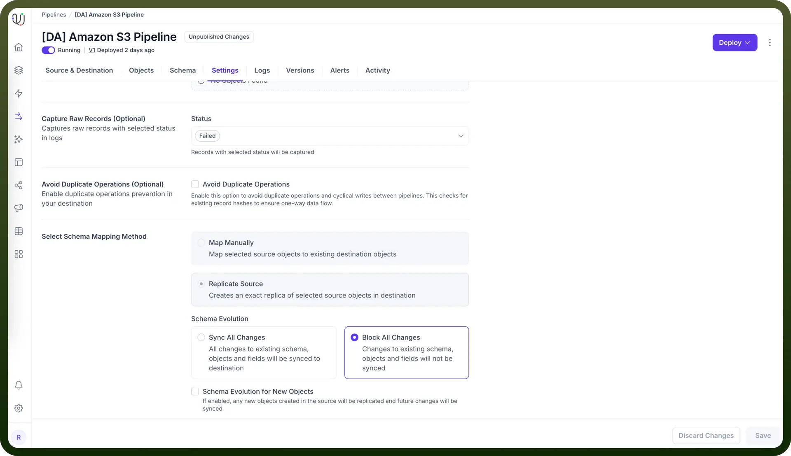

# Data-Sync by Avoid Duplicate Operations Setting

Source: https://www.unifyapps.com/docs/unify-data/data-sync-by-avoid-duplicate-operations-setting
Section: data

---

Avoid Duplicate Operations allows UnifyApps data pipelines to prevent redundant processing of the same records when implementing cyclical or looped pipeline architectures. This setting creates unique hashes of records and actions to maintain data integrity and prevent duplicative operations during migration processes.

## Duplicate Prevention for Cyclical Pipeline Architectures

When configured, UnifyApps implements a hash-based verification system that enables:

- **One-way data flow** even in bidirectional pipeline configurations
- **Record-level duplicate detection** for high-precision control
- **Resource optimization** by preventing redundant processing

## Configuring Avoid Duplicate Operations in Pipeline Settings



To enable duplicate prevention in your UnifyApps data pipeline:

1. Go to the `Settings` tab.
2. Under the `Avoid Duplicate Operations (Optional)` section, check the box to enable the feature.
3. Save your pipeline configuration.

## How Duplicate Prevention Works: Example

Let's walk through a simple example to demonstrate how the duplicate prevention works during data synchronization:

**Example: Bidirectional Synchronization Between Systems**

**Initial Configuration: Day 1**

- Oracle Database A contains customer records
- PostgreSQL Database B needs to maintain synchronized customer data
- Pipeline 1: Oracle → PostgreSQL
- Pipeline 2: PostgreSQL → Oracle (for updates made in PostgreSQL)

**Day 1: Without Duplicate Prevention**

```
Customer record updated in Oracle
Pipeline 1 copies record to PostgreSQL
Pipeline 2 sees "new" record in PostgreSQL
Pipeline 2 copies record back to Oracle
Pipeline 1 sees "updated" record in Oracle
...infinite loop continues...
```

**Day 1: With Duplicate Prevention Enabled**

```
Customer record updated in Oracle
Pipeline 1 creates hash of record+operation and copies to PostgreSQL
Pipeline 2 detects matching hash for record+operation
Pipeline 2 skips processing this record
Loop terminates properly
```

**Day 3: Data Changes in Both Systems**

Two days later, records are updated independently in both systems:

**Updated Data:**

- Oracle: Customer #1001 phone updated to 555-1234
- PostgreSQL: Customer #1002 address updated to "123 Main St"

**Day 3: Synchronization with Duplicate Prevention**

```
Pipeline 1 runs:
- Processes Customer #1001 changes, creates hash, updates PostgreSQL
- Detects Customer #1002 was already processed (has hash), skips
Pipeline 2 runs:
- Processes Customer #1002 changes, creates hash, updates Oracle
- Detects Customer #1001 was already processed (has hash), skips
```

Notice the key behaviors:

- Each record change is processed exactly once
- Changes flow properly in both directions
- Duplicate processing is avoided through hash verification
- Synchronization completes without infinite loops

## Practical Use Cases for Avoid Duplicate Operations

1. **Multi-System Data Synchronization** When maintaining data consistency across multiple databases: `System A ⟷ System B ⟷ System C` Without duplicate prevention, a change in System A could ping-pong between systems indefinitely.
2. **Change Data Capture with Loopback Verification** For CDC processes that include verification workflows: `1. Capture changes in source system 2. Apply to target system 3. Verify changes in target match source 4. Update status in source system`
3. **Master Data Management with Multiple Sources of Truth** When combining multiple authoritative data sources: `CRM System → MDM Hub ← ERP System`Changes from both systems flow into the hub without creating duplicate updates.
4. **ETL Processes with Validation Loops** For complex ETL workflows with validation steps: `Extract → Transform → Load → Validate → Update Source Status`The final status update doesn't trigger re-extraction of the same records.

By implementing the Avoid Duplicate Operations setting, you ensure data integrity across complex pipeline architectures while preventing the resource waste and potential data corruption caused by infinite processing loops. This feature is especially crucial for bidirectional synchronization scenarios or any data pipeline implementation that might create circular data flows.
