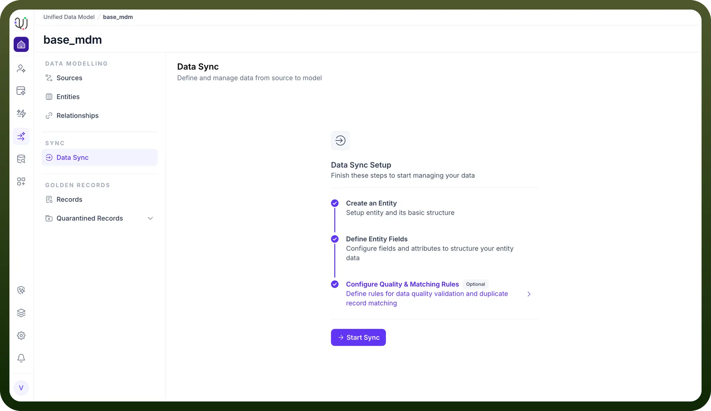

# Data Sync

Source: https://www.unifyapps.com/docs/unify-data/data-sync
Section: data

---

## **Overview**

Data Sync is the operational bridge that connects your external data sources to your internal Unified Data Model (UDM).

While Entities and Relationships define the structure of your data, the Data Sync process handles the movement and ingestion of actual records.

This module ensures that your Golden Records are continuously populated and updated by fetching data through defined extraction pathways.

## **The Setup Checklist**

Before data ingestion can begin, the system enforces a logical dependency chain. The Data Sync Setup dashboard provides a visual progress tracker to ensure your model is ready for data.

You must complete the following stages:

1. **Create an Entity:** Establish the basic object identity.
2. **Define Entity Fields:** Configure the schema attributes to hold the incoming data.
3. **Configure Quality & Matching Rules (Optional):** Define how the system should handle duplicates and validation during the sync process.

  

## **Sync Methods**

Once the setup is complete, clicking Start Sync opens the "New Sync" modal, offering two distinct architectural approaches for fetching data:

**1. Pipelines (ETL)**

- **Definition:** "Fetch data from source using pipelines".
- **Use Case:** This is the standard Extract, Transform, Load approach. It is ideal for high-volume, scheduled data transfer where you need to map source fields to destination fields and apply standard transformations.

**2. Automations (Workflow)**

- **Definition:** "Leverage automations to fetch data to this model".
- **Use Case:** This method utilizes the workflow engine to ingest data. It is suitable for complex scenarios requiring conditional logic, API orchestration, or event-driven updates that go beyond simple data mapping.
