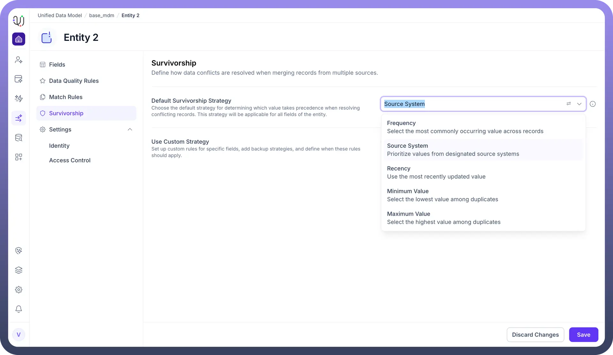

# Default Survivorship Strategy

Source: https://www.unifyapps.com/docs/unify-data/default-survivorship-strategy
Section: data

---

## **Overview**

The Default Survivorship Strategy establishes the baseline governance logic for your Entity.

It determines which value takes precedence when resolving conflicting records across the entire object.

This global setting is automatically applied to all fields of the entity, ensuring a consistent approach to data mastery without requiring you to configure rules for every individual attribute manually.

## **Configuration Options**

When configuring the default strategy, you can select from several deterministic algorithms depending on your business needs:

### **1. Source System (Trust-Based)**

This is the most common strategy for organizations with a clear hierarchy of trusted systems (e.g., "ERP is always right").

When selected, you must define a Source Priority Sequence.

- **Priority Ordering:** You rank your connected sources (e.g., sap_connection_new , Mahrishi_snowflake ) in order of trust.
- **Logic:** The system checks the highest-priority source first. If it contains a value, that value wins. If it is empty, the system falls back to the next source in the sequence.

### **2. Recency (Time-Based)**

This strategy prioritizes the "freshness" of data.

The system compares the updated_at timestamps of the conflicting records and selects the value from the record that was most recently modified.

Use Case: Ideal for rapidly changing data points like "Last Interaction Date" or "Current Balance."

### **3. Frequency (Consensus-Based)**

This strategy relies on statistical majority.

The system analyzes all available records and selects the most commonly occurring value.

Use Case: Useful when aggregating data from many third-party sources where data quality varies, allowing the "crowd" to determine the truth.

### **4. Minimum / Maximum Value**

These strategies select the lowest or highest numerical value among the duplicates.

Use Case: Specific scenarios like retaining the "First Created Date" (Minimum) or "Highest Credit Score" (Maximum).
