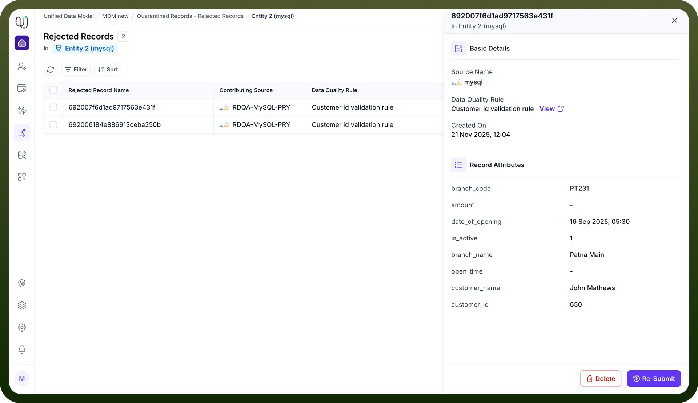

# Delete records

Source: https://www.unifyapps.com/docs/unify-data/delete-records
Section: data

---

## **Overview**

Not all rejected records are worth saving. In many cases, data entering the quarantine area is simply "noise"—such as test data, duplicate entries created by system glitches, or malformed records that are missing critical identifiers.

The Delete function allows Data Stewards to permanently purge this irrelevant data from the UnifyApps environment.

Regularly cleaning up these records is essential for maintaining a manageable workspace and ensuring that metrics like "Pending Review" reflect only actionable items.

## **The Deletion Process**

Deleting a record is typically the final step after a review confirms that the data cannot or should not be remediated.

1. **Selection & Review** Navigate to the Rejected Records list for a specific entity. Select a record from the list to open the detailed Basic Details sidebar. Review the Record Attributes and Data Quality Rule violation to confirm the data is indeed invalid (e.g., a record where amount is null and *customer_name* is gibberish).
2. **Execution** Once confirmed, locate the action buttons at the bottom of the sidebar. Click the Delete button (outlined in red). This action removes the record from the Rejected Records queue.

## **Impact of Deletion**

**• Soft Removal:** This marks the record as DELETED and removes it removes it from the UI but is still accessible via audits

**• Metric Updates:** Deleting a record immediately decrements the Total Rejected Records and Pending Review counters on the main dashboard, helping you track your progress toward zero errors.
