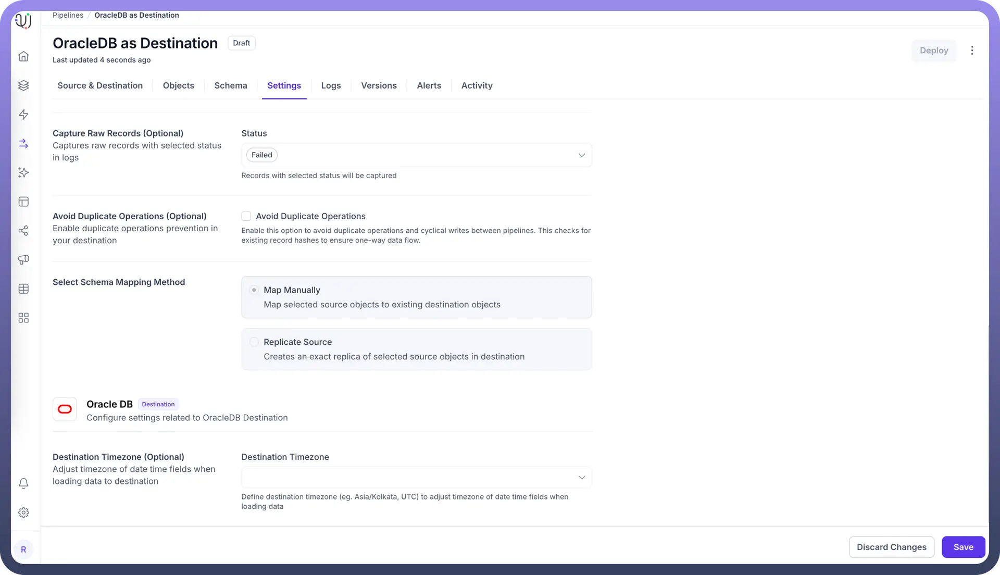

# Destination Timezone Setting for OracleDB as Destination

Source: https://www.unifyapps.com/docs/unify-data/destination-timezone-setting-for-oracledb-as-destination
Section: data

---

The Destination Timezone setting in UnifyApps data pipelines allows automatic adjustment of date and time fields when loading data into OracleDB. This feature ensures temporal data consistency across systems with different timezone configurations, particularly important when migrating between databases located in different geographical regions.

## Understanding Timezone Management in Data Migration

When transferring data with datetime fields to OracleDB destinations, timestamp values can be affected by:

- Source and destination servers in different geographical locations
- Systems configured with different timezone settings
- Applications requiring specific local time representations
- Regulatory requirements for time-sensitive data

## Configuring Destination Timezone for OracleDB

To configure timezone adjustment for your OracleDB destination:

1. Navigate to the `Settings` tab in your pipeline
2. Locate the `Destination Timezone (Optional)` section
3. Select or enter the appropriate timezone identifier (e.g., Asia/Kolkata, UTC)
4. Save your pipeline configuration

## How Timezone Adjustment Works: Example

Let's examine how the timezone setting affects datetime fields during data migration:

**Example: Financial Transaction System Migration**

**Initial Scenario:**

- Source database in New York (America/New_York timezone)
- OracleDB destination in Mumbai (Asia/Kolkata timezone)
- Transaction timestamps must reflect local time in Mumbai

**Day 1: Without Timezone Adjustment**

Transaction recorded in source: 2025-05-07 14:00:00 (New York time)

Migrated to OracleDB without adjustment: 2025-05-07 14:00:00

Actual Mumbai time when transaction occurred: 2025-05-08 00:30:00

**Day 1: With Timezone Adjustment to Asia/Kolkata**

Transaction recorded in source: 2025-05-07 14:00:00 (New York time)

Pipeline applies +10:30 hour adjustment

Migrated to OracleDB with adjustment: 2025-05-08 00:30:00 (Mumbai time)

Notice the key differences:

- Without adjustment, timestamps remain in source timezone (incorrect for Mumbai operations)
- With adjustment, timestamps correctly reflect Mumbai local time
- Consistency maintained for reporting and regulatory requirements

## Technical Implementation Details

The timezone adjustment process applies to:

- `DATE` data types
- `TIMESTAMP` data types
- `TIMESTAMP WITH TIMEZONE` data types
- `TIMESTAMP WITH LOCAL TIMEZONE` data types

The conversion logic follows these steps:

1. Read original timestamp value from source
2. Identify source timezone information (if available)
3. Convert timestamp to destination timezone
4. Apply the adjusted value when writing to OracleDB

## Practical Use Cases for Destination Timezone Setting

1. **Global Financial Systems** For banking applications with regulatory time-sensitive requirements:
  - Stock trades executed in multiple markets
  - Payment processing timestamps for multi-region operations
  - End-of-day financial reconciliation across international boundaries
2. **Healthcare Data Management** For medical systems where precise timing is critical:
  - Patient medication administration records
  - Laboratory test result timestamps
  - Clinical trial data collected across multiple sites
3. **Logistics and Supply Chain** For tracking shipments and inventory across regions:
  - Warehouse receipt and dispatch timestamps
  - Customs clearance timing records
  - Delivery confirmation timestamps
4. **Multi-region Customer Service Operations** For maintaining consistent customer interaction records:
  - Support ticket creation and resolution timestamps
  - Customer communication history
  - Service level agreement (SLA) monitoring

## Timezone Configuration Best Practices

1. **Standardize on a Single Timezone Strategy** Choose one of these approaches consistently:
  - Store all timestamps in UTC and convert for display only
  - Store timestamps in local time with explicit timezone information
  - Store timestamps in the business's primary operational timezone
2. **Document Timezone Conventions** Maintain clear documentation about:
  - Timezone used in each system
  - Conversion rules applied during data migration
  - How applications should interpret timestamp data
3. **Test with Cross-Timezone Data** Verify your configuration with:
  - Timestamps spanning DST transitions
  - Data from multiple international sources
  - Edge cases near midnight and date boundaries
4. **Consider Related Systems** Evaluate impact on:
  - Reporting systems that consume Oracle data
  - APIs that expose timestamp information
  - Analytics platforms processing temporal data

By properly configuring the Destination Timezone setting for your OracleDB pipeline, you ensure that all date and time information maintains its proper context when migrated across different geographic regions. This preserves data integrity for time-sensitive operations and ensures consistent temporal reporting across your entire data ecosystem.
