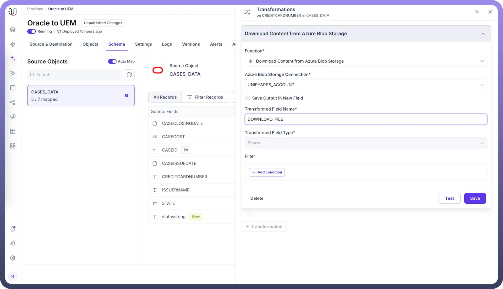
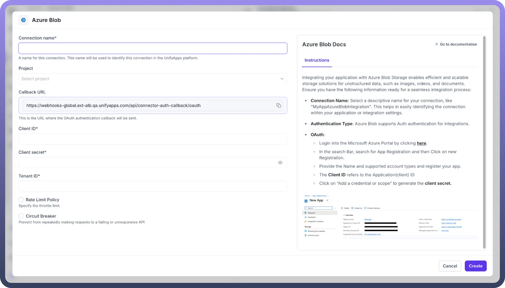
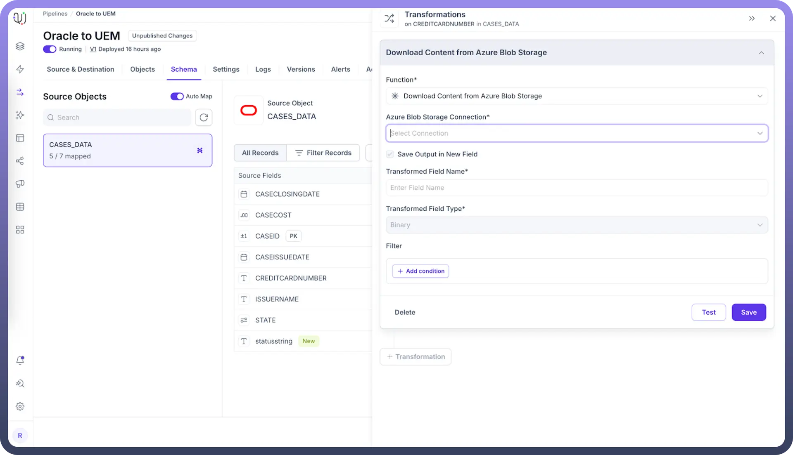

# Download Content from Azure Blob Storage

Source: https://www.unifyapps.com/docs/unify-data/download-content-from-azure-blob-storage
Section: data

---

The Download Content from Azure Blob Storage transformation enables you to retrieve files directly from an Azure Blob Storage container into your destination. This powerful feature allows for seamless integration of external data stored in Azure Blob Storage into your data processing workflows.

## Why Use Download Content from Azure Blob Storage?

- **Data Integration:** Incorporate external data stored in Azure Blob Storage into your workflows.
- **Automation:** Streamline the process of fetching data from cloud storage.
- **Scalability:** Handle large files and datasets stored in Azure Blob Storage efficiently.
- **Real-time Processing:** Access up-to-date data directly from Azure Blob Storage for timely analysis.

## Applying Download Content from Azure Blob Storage Transformation

Follow these steps to apply the Download Content from Azure Blob Storage transformation:

1. Select "`Download Content from Azure Blob Storage`" from the list of available transformations.
2. Configure the Azure Blob Storage Connection (details below).
3. Specify the input field containing the blob file path.
4. Enter the name for the new field that will contain the downloaded content.
5. Click "`Save`" to apply the transformation.

  

## Download Content from Azure Blob Storage Configuration

Two main components are required for this transformation:

1. **Azure Blob Storage Connection** You can either choose an existing Azure Blob Storage connection or create a new one. To create a new connection, you can refer to the connector documentation for Azure Blob Storage.

  

2. **Transformed Field Name Purpose**: Specifies the name of the new field that will contain the downloaded file in binary format. **Example**: "downloaded_content" or "blob_file_data"

  

## Input and Output

**Input**: The transformation requires an input field containing the full Azure Blob Storage path to the file you want to download.

**Output**: The downloaded file is stored in binary format in the newly created field specified by the Transformed Field Name.

## Best Practices for Download Content from S3

- **Security:** Use Azure AD identities and Managed Identities when possible, instead of storage account keys. Consider Shared Access Signatures (SAS) with appropriate time limitations for temporary access.
- **Access Tiers:** Be aware of which access tier (Hot, Cool, Archive) your blobs are stored in, as this affects retrieval time and costs.
- **Error Handling:** Implement robust error handling to manage cases where blobs are not found, access is denied, or when dealing with throttling limits.
- **Performance:** Consider file size and frequency of downloads to optimize performance. Use the appropriate storage redundancy option (LRS, ZRS, GRS) based on your data availability needs.
- **Data Governance:** Maintain clear documentation of which storage accounts, containers, and blobs are being accessed by your transformations. Leverage Azure tags for better resource organization.

> **Note:** Regularly audit your Azure Blob Storage access patterns and permissions to ensure compliance with your organization's security policies and cost optimization practices.
