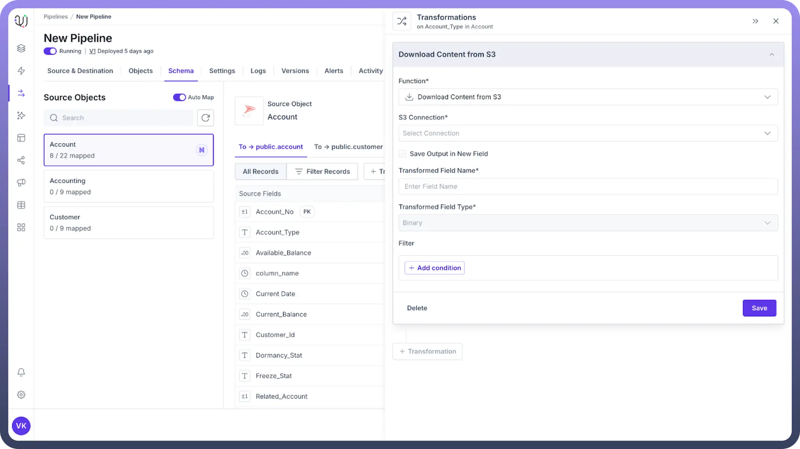
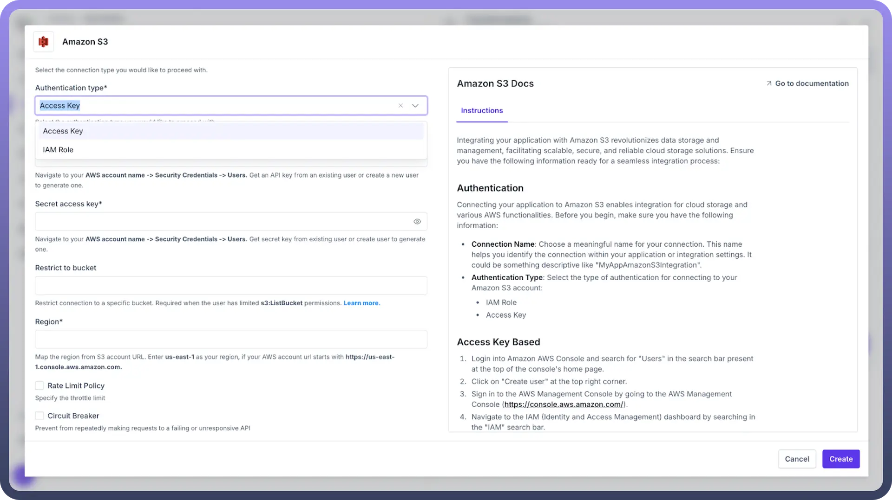
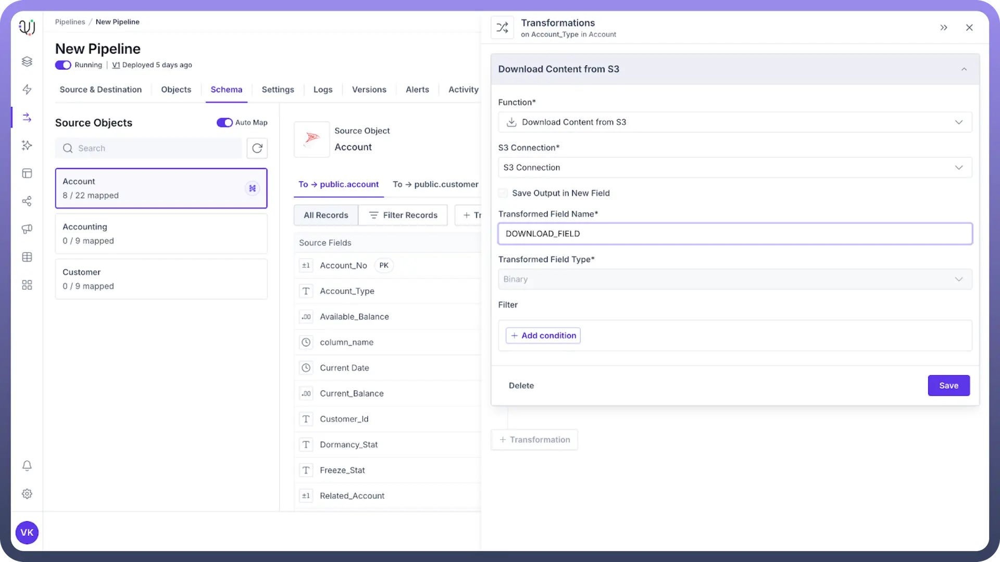

# Download Content from S3

Source: https://www.unifyapps.com/docs/unify-data/download-content-from-s3-transformation
Section: data

---

## Overview

The Download Content from S3 transformation enables you to retrieve files directly from Amazon S3 buckets into your destination system. This powerful feature seamlessly integrates external data stored in AWS S3 into your data processing workflows, enhancing your data pipeline capabilities.

## Key Benefits

- **Simplified Data Integration**: Incorporate external data stored in S3 directly into your workflows without manual downloads
- **Workflow Automation**: Eliminate manual steps by automatically fetching data from cloud storage
- **Enterprise Scalability**: Process large files and datasets stored in S3 efficiently
- **Real-time Data Access**: Retrieve the most current data directly from S3 for timely analysis and decision-making
- **Flexible Implementation**: Works with various file formats including CSV, JSON, XML, images, and more

## Setup Instructions

**Prerequisites**

- AWS account with appropriate S3 bucket access permissions
- S3 bucket containing the files you need to access
- Destination system configured to receive the downloaded content

**Configuration Steps**

1. From your transformation dashboard, select "`Download Content from S3`"
2. Configure the S3 connection (see details below)
3. Specify the input field containing the S3 file path
4. Enter a name for the new field that will contain the downloaded content
5. Set any optional parameters such as error handling preferences
6. Test the connection with a sample file path
7. Click "`Save`" to apply the transformation

## Configuration Details

1. **S3 Connection** You need to configure how your system connects to Amazon S3: **Security Best Practice**: Use IAM roles with temporary credentials rather than long-term access keys whenever possible. **Note:** Check the documentation for Amazon S3 connector [here](https://www.unifyapps.com/docs/unify-automations/amazon-s3).

  

  - **Use Existing Connection**: Select a previously configured S3 connection
  - **Create New Connection**: Set up a new connection with the following:
    - AWS Access Key ID and Secret Access Key (or use IAM role-based authentication)
    - AWS Region (e.g., us-east-1, eu-west-1)
    - Optional endpoint configuration for S3-compatible storage
    - Connection timeout settings
2. **Input Configuration**
  - `Source Field`: The field containing the S3 object path (e.g., "s3://bucket-name/folder/file.csv")
  - `Path Format`: Choose between full URI format or separate bucket/key components
3. **Output Configuration**

  

  - **Transformed Field Name**: The name of the new field that will store the downloaded content
  - **Output Format**: Binary
  - **Include Metadata**: Option to include S3 object metadata in a separate field

## Example Use Cases

### Data Analysis Pipeline

`S3 Files` → `Download Content from S3` → `Parse CSV` → `Analysis Setup` → `Dashboard`

Download raw survey data from S3, transform it into structured format, then analyze trends.

### Media Processing Workflow

`S3 Image Storage` → `Download Content from S3` → `Image Processing` → `CDN Upload`

Retrieve images from S3, apply transformations or optimizations, then distribute to users.

### Document Management System

`Document Upload` → `S3 Storage` → `Download Content from S3` → `Text Extraction` → `Searchable Database`

Store documents in S3, then retrieve and extract text to make content searchable.

## Performance Considerations

- **File Size**: Large files (>100MB) may require longer processing times and more memory
- **Concurrency**: Set appropriate limits when downloading multiple files simultaneously
- **Bandwidth**: Consider network throughput between your environment and AWS
- **Costs**: Be aware of AWS data transfer costs, especially for cross-region transfers
- **Caching**: Implement caching strategies for frequently accessed files

## Best Practices

- **Security**:
  - Use principle of least privilege when configuring S3 access permissions
  - Encrypt sensitive data both in transit and at rest
  - Regularly rotate credentials if using access keys
- **Performance**:
  - Consider file size and download frequency to optimize resource usage
  - Implement pagination for large directory listings
  - Use S3 Transfer Acceleration for faster cross-region downloads
- **Data Governance**:
  - Maintain audit logs of all S3 access activities
  - Document which S3 buckets and files are accessed by your transformations
  - Set up alerts for unusual access patterns
- **Reliability**:
  - Implement robust error handling and retry mechanisms
  - Configure appropriate timeouts based on expected file sizes
  - Consider regional availability when designing critical pipelines

## Troubleshooting

| **Issue** | **Possible Cause** | **Resolution** |
|---|---|---|
| `Access Denied` | Insufficient IAM permissions | Review and update IAM policy |
| `Slow Downloads` | Large file size or network constraints | Enable S3 Transfer Acceleration or consider regional proximity |
| "`File Not Found`" | Incorrect path or deleted object | Verify path format and object existence |
| `Memory Errors` | File too large for processing environment | Increase memory allocation |
