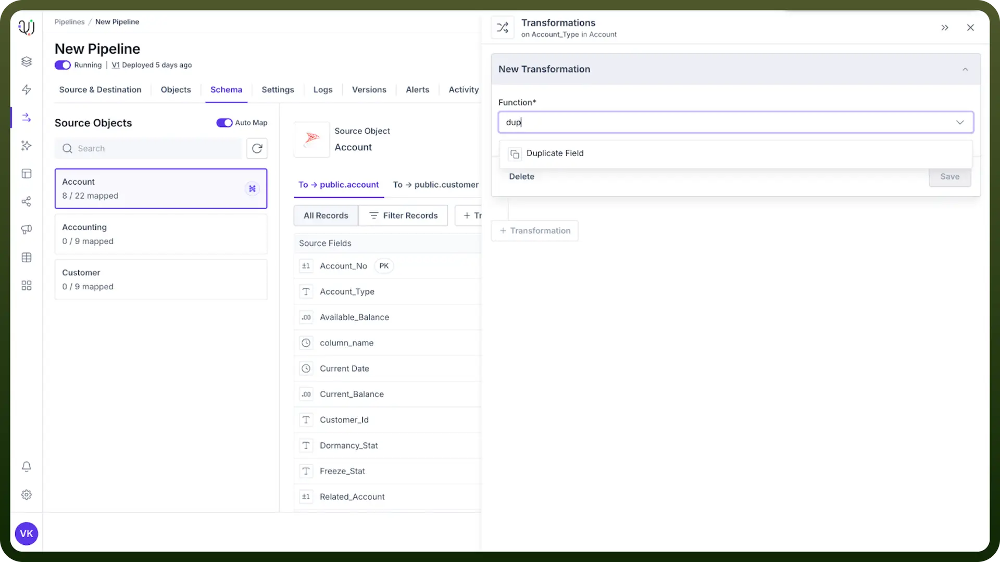
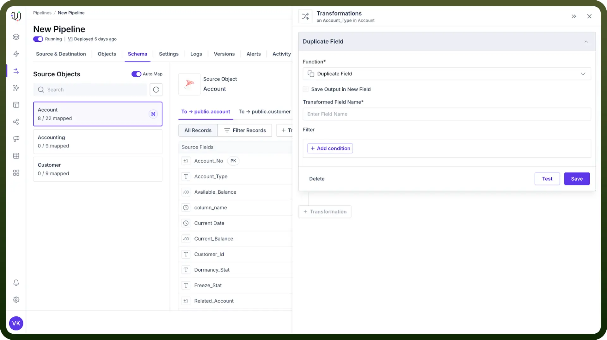

# Duplicate Field

Source: https://www.unifyapps.com/docs/unify-data/duplicate-field-transformation
Section: data

---

## Overview

The Duplicate Field transformation creates an exact replica of an existing field as a new transient field with the same value. This powerful yet simple transformation serves as a foundation for complex data mapping and manipulation strategies without affecting your original data.

## Key Benefits

- **Enable Multiple Mappings:** Map the same data to multiple destination fields while preserving the original source
- **Preserve Original Data:** Maintain an unmodified copy while performing transformations on the duplicate
- **Facilitate Validation:** Keep original values for comparison and verification against transformed data

## How to Apply a Duplicate Field Transformation?

1. Navigate to the transformation panel in your data pipeline
2. Select "`Duplicate Field`" from the available transformations
3. Specify a clear, descriptive name for the new transient field
4. Click "`Save`" to apply the transformation.

  

## Implementation Example

**Original Field**: customer_email
**Duplicate Field**: customer_contact_email

This creates a new field `customer_contact_email` that contains the same values as `customer_email`, allowing you to use the email for multiple purposes in your workflow.

## Best Practices

- **Use Descriptive Naming:** Choose names that clearly indicate the duplicate field's purpose (e.g., original_field_for_validation)
- **Document Data Lineage:** Maintain records of duplicated fields to easily trace data flow
- **Consider Performance:** While duplicating fields has minimal performance impact, extensive duplication may affect memory usage in large datasets
- **Audit Field Usage:** Regularly review duplicate fields to ensure they remain necessary to your data pipeline.
