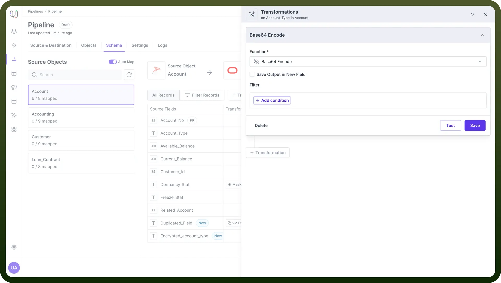
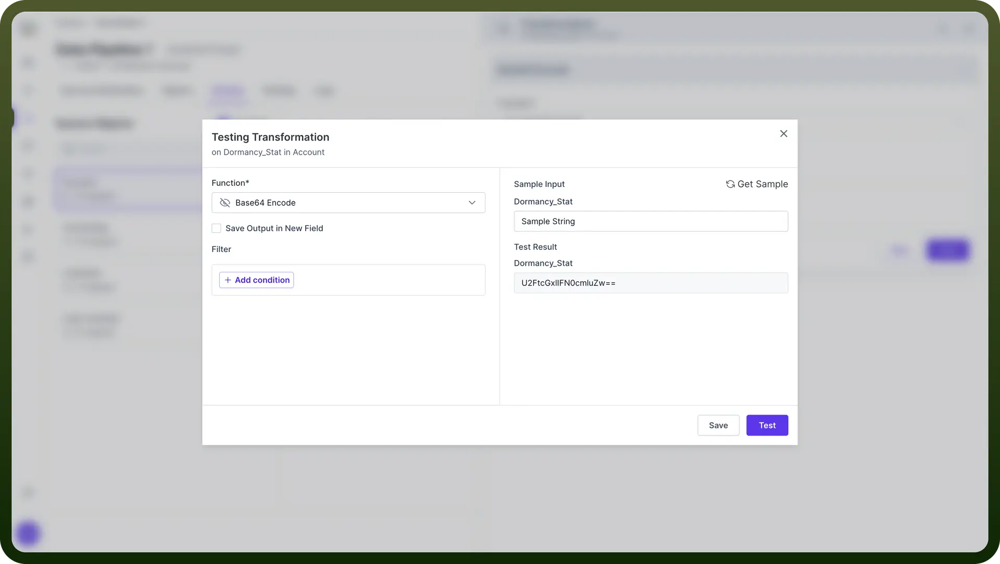
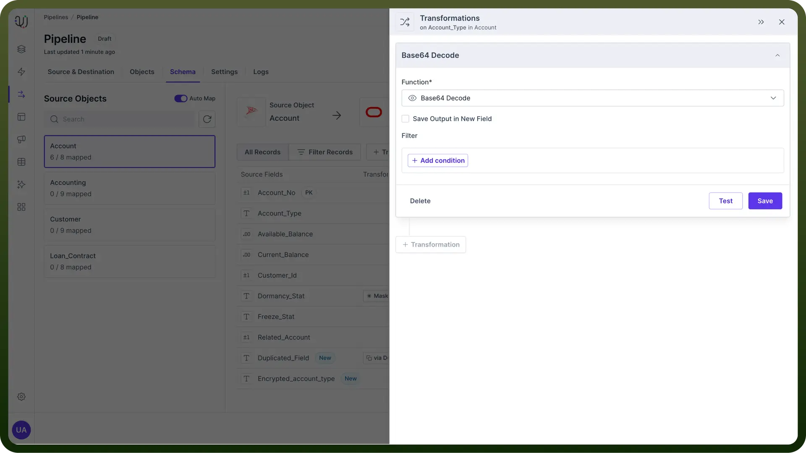
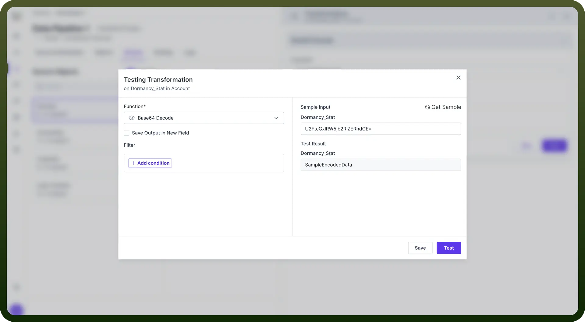

# Encoding

Source: https://www.unifyapps.com/docs/unify-data/encoding
Section: data

---

## Introduction to Base64

Base64 is a binary-to-text encoding scheme that represents binary data in an ASCII string format.

It's widely used for encoding binary data that needs to be stored and transferred over media designed to handle textual data. This encoding helps ensure that the data remains intact without modification during transport.

> **Note:** Base64 is particularly useful when you need to **embed binary data** in places where text is expected, such as email attachments or certain parts of web protocols.

## Base64 Encode

**Purpose**

The Base64 Encode transformation converts binary or text data into a Base64-encoded ASCII string.

This is useful for:

- Safely **transmitting** binary data over text-based protocols.
- **Storing** binary data in text-based systems.
- **Embedding** binary data in XML or JSON.

**Application**

To apply the Base64 Encode transformation:

1. Select the source field containing the data to be encoded.
2. Choose "`Base64 Encode`" from the list of available transformations.
3. Apply the transformation.

> **Note:** When encoding large amounts of data, be aware that Base64 encoding increases the data size by approximately 33%, as it represents 3 bytes of data with 4 ASCII characters.

**Testing the Transformation**

After applying the transformation, you can test it to verify the results. The system will display:

- The original input data.
- The Base64-encoded output.

**Example**:

- **Input**: "Sample String"
- **Output**: "U2FtcGxlIFN0cmluZw=="

## Base64 Decode

**Purpose**

The Base64 Decode transformation converts Base64-encoded ASCII strings back into their original binary or text form.

This is essential for:

- **Retrieving** original data from Base64-encoded sources.
- **Processing** data that has been transmitted or stored in Base64 format.

**Application**

To apply the Base64 Decode transformation:

1. Select the source field containing the Base64-encoded data.
2. Choose "`Base64 Decode`" from the list of available transformations.
3. Apply the transformation.

> **Note:** Always ensure that the input for Base64 decoding is a valid Base64-encoded string. Invalid input can lead to errors or corrupted data.

**Testing the Transformation**

After applying the transformation, you can test it to verify the results. The system will display:

- The Base64-encoded input.
- The decoded output.

**Example**:

- **Input**: "U2FtcGxlIFN0cmluZw=="
- **Output**: "Sample String"

## Best Practices

1. **Data Validation**: Always validate that your input is appropriate for the transformation you're applying.
2. **Error Handling**: Implement robust error handling to manage cases where decoding fails due to invalid input.
3. **Performance Considerations**: Be mindful of the performance impact when encoding/decoding large volumes of data.
4. **Security Awareness**: Remember that Base64 is not a form of encryption and does not provide any security benefits..

> **Note:** If you're working with very large datasets, consider streaming the encoding/ decoding process to manage memory usage efficiently.
