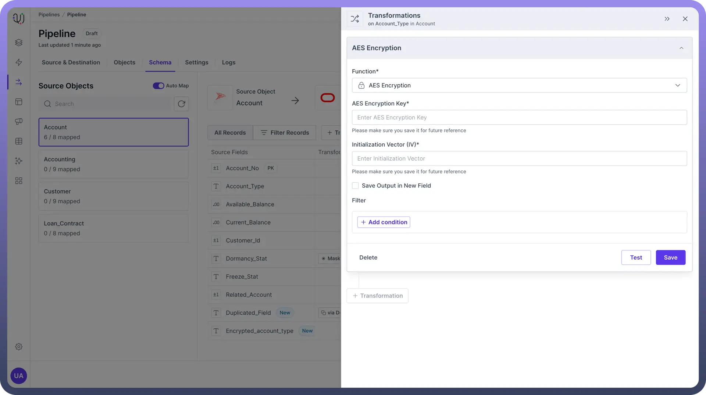
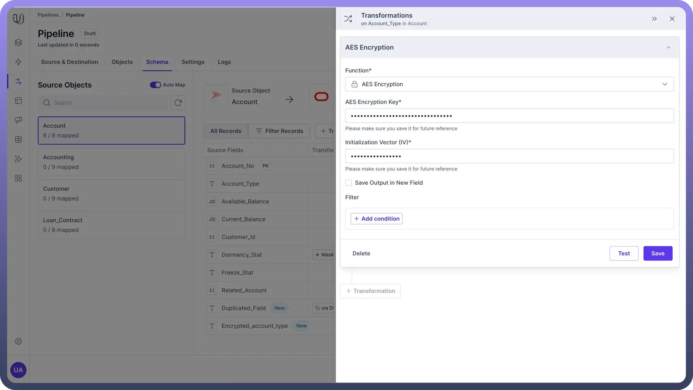
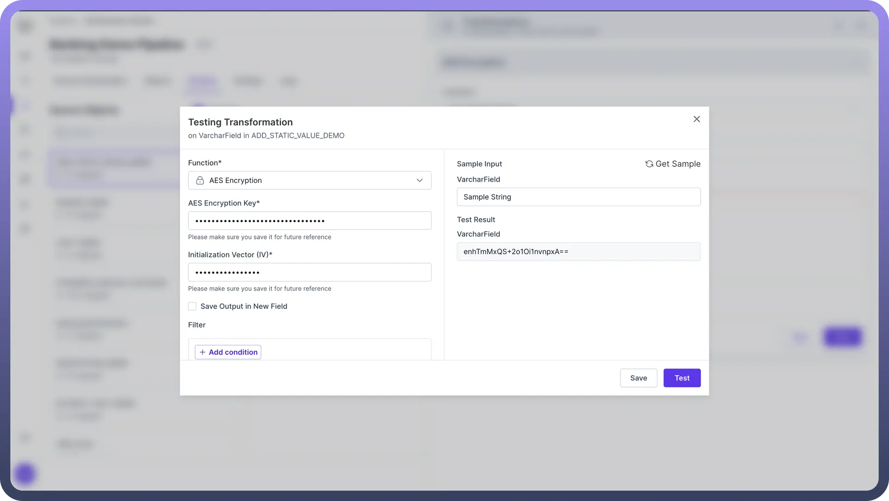
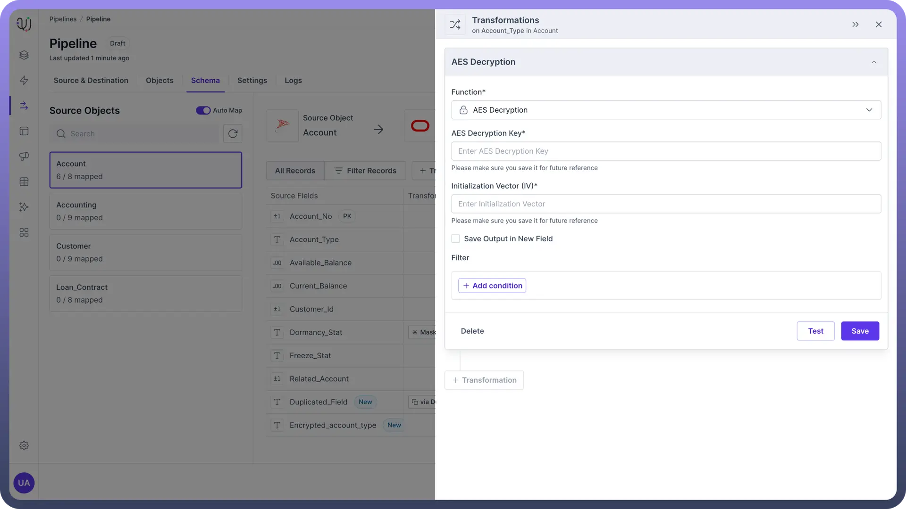
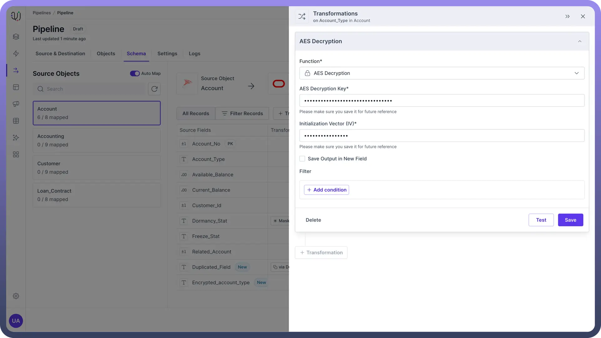
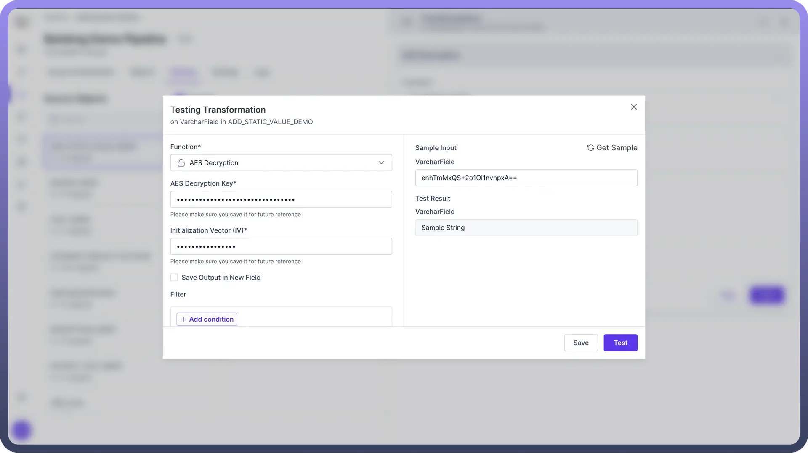

# Encryption

Source: https://www.unifyapps.com/docs/unify-data/encryption
Section: data

---

AES (**Advanced Encryption Standard**) is a symmetric encryption algorithm widely used to **secure data**. It encrypts data using the same key for both encrypting and decrypting, making it essential to keep the key secret.

This guide will walk you through using AES encryption and decryption transformations to protect sensitive data, such as PII (Personally Identifiable Information).

## AES Encryption

AES encryption allows you to secure any field with a 256-bit encryption key.

"AES Encryption method is crucial for protecting sensitive information from unauthorized access."

### Steps to Apply Encryption

1. **AES Encryption Key**:
  - This is the 256-bit encryption key required to encrypt the data.
  - **Example**: 6b71RouelDY2xLFfy1x0oYXq3oUDkfuc. **Note:** Generate a strong key using a reliable cryptographic tool and store it securely. Do **not** hard-code the key in your application code.
2. **Initialization Vector (IV)**:
  - An IV is a 128-bit value used with the encryption key to enhance security.
  - **Example**: d4QaIQMb8RbOG5ai.

### Testing Encryption

After applying the encryption transformation, test it to ensure it is working correctly.

You should compare the encrypted output with expected values to verify the encryption process.

**Example:** Encrypting a customer's social security number before storing it in a database:

- **Input**: Sample String
- **Encrypted Output**: enhTmMxQS+2o1Oi1nvnpxA==

  

## AES Decryption

AES decryption uses the same symmetric algorithm to convert encrypted data back to its original form.

"Decryption is essential for retrieving and using the original data."

### Steps to Apply Decryption

1. **AES Decryption Key**:
  - Enter the 256-bit encryption key used for encryption.
  - **Example**: 6b71RouelDY2xLFfy1x0oYXq3oUDkfuc. **Note:** The key must match the one used during encryption for successful decryption.
2. **Initialization Vector (IV)**:
  - Provide the same 128-bit IV used during encryption.
  - **Example**: d4QaIQMb8RbOG5ai.

### Testing Decryption

After applying the decryption transformation, test it to ensure it is working correctly.

You should compare the decrypted output with the original data to verify the decryption process.

**Example:** Decrypting a customer's social security number to verify identity:

- **Encrypted Input**: enhTmMxQS+2o1Oi1nvnpxA==
- **Decrypted Output**: 123-45-6789

## Best Practices

- **Key Management**: Implement a secure key management system to handle encryption keys. This may involve using key management services (KMS) provided by cloud providers.
- **Regular Audits**: Regularly audit your encryption and decryption processes to ensure they comply with security standards and best practices.
