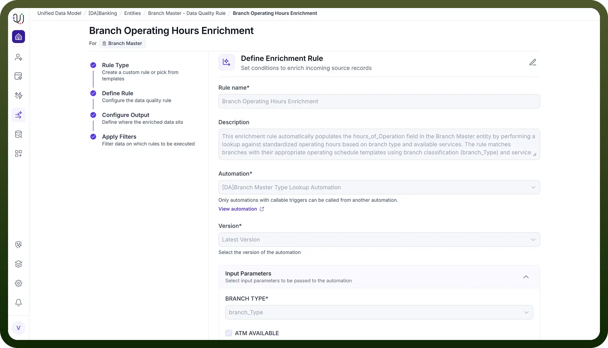

# Enrichment Rules

Source: https://www.unifyapps.com/docs/unify-data/enrichment-rules
Section: data

---

**Aggregation-Based Enrichment**

Enrichment Rules in UnifyApps enhance or augment incoming data by adding missing attributes, deriving new values, or pulling information from external systems. These rules can be configured using several enrichment strategies:

- Static Value Enrichment
- Lookup-Based Enrichment
- Formula-Based Enrichment
- External API Enrichment
- Conditional Enrichment **Implementation Method** **Automation-Based Enrichment (iPaaS Layer)** All enrichment logic in UnifyApps is executed through workflow automations in the iPaaS layer. This approach supports simple to highly complex enrichment scenarios through:
- Conditional branching
- Multi-step enrichment sequences
- Integration with external APIs or reference systems

Transformation and mapping of enriched attributes to target fields 
**Example Workflow**
 A typical enrichment workflow might:

1. Trigger when a new or updated record enters the system.
2. Execute a Lookup-Based or API-based rule to fetch additional details.
3. Map the enriched values to the target object’s fields using the workflow editor.
4. Continue processing, store the enriched record, or trigger further actions.

**Real-Time Enrichment**

Through API-triggered automations, enrichment can also occur **in real time**, ensuring immediate augmentation when records are created or updated. 
**Common Enrichment Rule Types**

**Enrichment Type**

**Description**

**Example**

**Demographic Enrichment**

Adds customer demographic data

Age, income bracket, education level

**Geographic Enrichment**

Adds location-based information

Coordinates, region, timezone, market area

**Behavioral Enrichment**

Adds user behavior metrics

Purchase frequency, engagement score

**Temporal Enrichment**

Adds time-based calculations

Age of record, days since last activity

**Hierarchical Enrichment**

Adds parent-child relationship data

Company → Division → Department structure

**Statistical Enrichment**

Adds calculated aggregates

Average order value, total lifetime value

**Classification Enrichment**

Adds categorization labels

Risk level, customer tier, product category

**Standardization Enrichment**

Adds normalized formats

Country code standardization, case normalization
