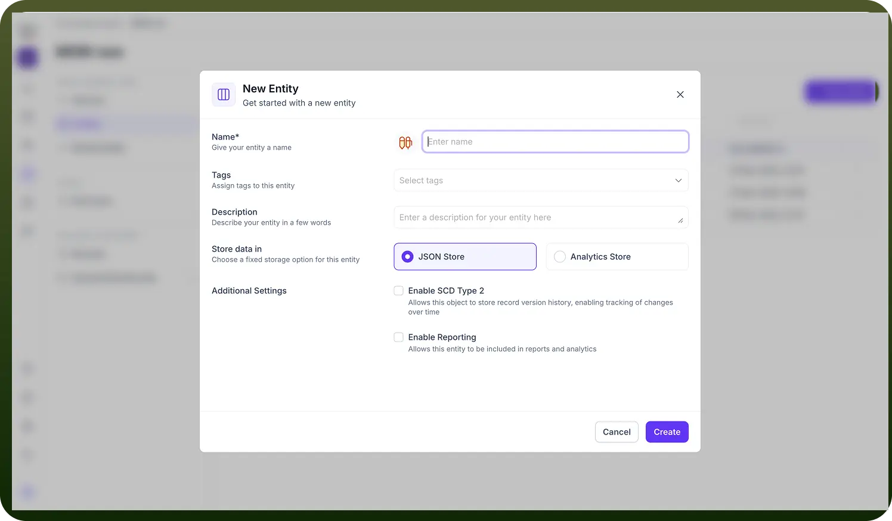
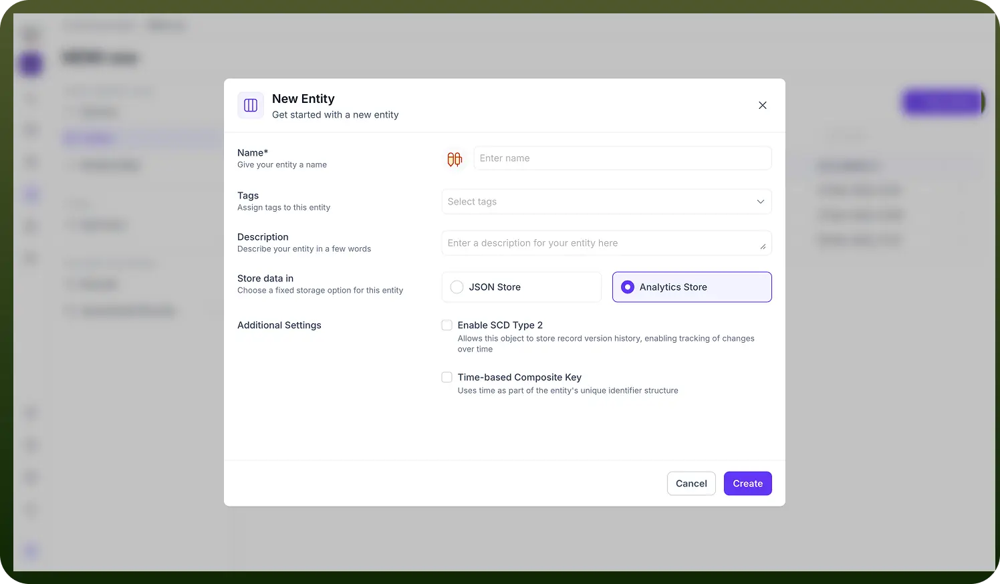

# Entity Storage Types

Source: https://www.unifyapps.com/docs/unify-data/entity-storage-types
Section: data

---

When initializing a new Entity in the UnifyApps Unified Data Model, one of the most critical architectural decisions is selecting the appropriate Storage Type.

This setting determines the underlying database technology used to persist your records, influencing not only how data is stored but also the performance characteristics for querying, reporting, and historical tracking.

The "Store data in" configuration is a fixed option—once an entity is created, its storage architecture cannot be fundamentally altered, making it essential to understand the distinct capabilities of each type. 
**1. JSON Store**
 The JSON Store is the default storage mechanism designed for flexibility and agility. It is optimized for handling semi-structured data where schemas may evolve rapidly or where data density varies significantly between records. 
 Ideal Use Cases: 
 • operational data objects (e.g., Customer Profiles, Product Catalogs). 
 • Scenarios requiring frequent schema updates without downtime. 
 • Managing complex, nested data structures often found in modern APIs.

**Available Configuration Settings:**

When JSON Store is selected, the platform exposes specific "Additional Settings" tailored to operational management:

**• Enable SCD Type 2:** Checking this box activates Slowly Changing Dimensions Type 2. This critical MDM feature allows the object to store full record version history. Instead of overwriting old data when an update occurs, the system creates a new version, preserving the historical state. This is vital for audit trails and compliance tracking.

**• Enable Reporting:** This setting flags the entity for inclusion in the downstream analytics and reporting layer. This makes it so that a replica of the data is available in Starrocks as well for high speed access. 
**2. Analytics Store**
 The Analytics Store is engineered for high-performance data processing and heavy analytical workloads. It is structurally optimized for read-heavy operations, aggregations, and time-series analysis. 
 Ideal Use Cases: 
 • High-volume transaction logs (e.g., POS transactions, System Events). 
 • Time-series data (e.g., IoT sensor readings, Clickstream data). 
 • Scenarios where query speed on massive datasets is the primary KPI.

**Available Configuration Settings:**

The Analytics Store offers specialized settings that differ from the JSON store to support its performance-driven mandate:

**• Enable SCD Type 2:** Like the JSON store, this enables historical versioning. However, in an analytics context, this is often used to track state changes over time for trend analysis rather than just auditing.

**• Time-based Composite Key:** This is a unique feature of the Analytics Store. It configures the system to use "time" as a fundamental component of the entity's unique identifier structure. 
**Why this matters:** By partitioning data based on time, the database can retrieve specific time windows (e.g., "last 24 hours" or "Q1 2024") exponentially faster than standard indexing methods. This is essential for event-driven architectures where data is naturally chronological.

By aligning your storage choice with the intended lifecycle of the data—whether it is an evolving customer record (JSON) or a massive stream of immutable events (Analytics)—you ensure your UnifyApps pipeline remains performant and scalable.
