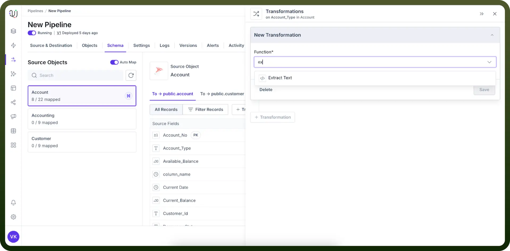
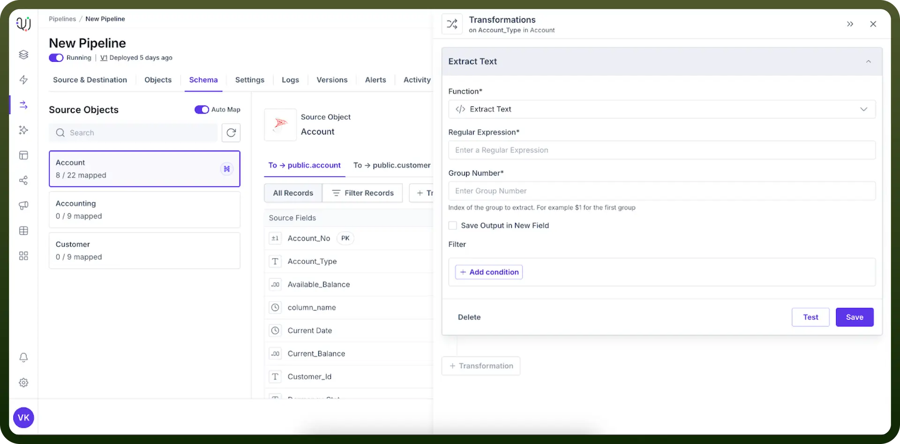
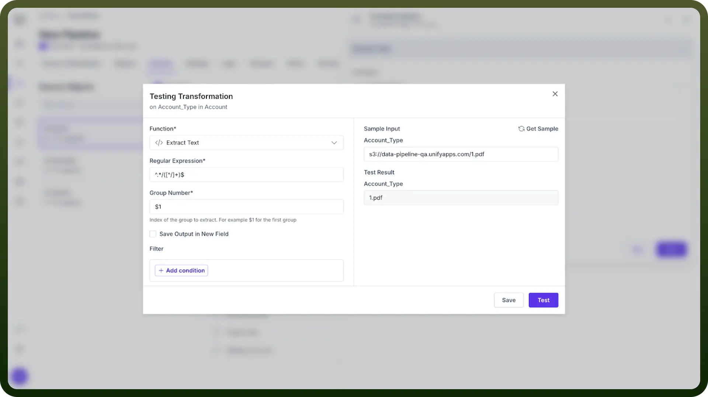

# Extract Text

Source: https://www.unifyapps.com/docs/unify-data/extract-text
Section: data

---

Extract Text is a powerful transformation that allows you to isolate specific parts of a string using regular expressions. This process is crucial for parsing complex text data, extracting meaningful information, and preparing data for further analysis or processing.

## Why Use Text Extraction?

- **Data Parsing**: Extract specific information from structured text.
- **Data Cleaning**: Isolate relevant parts of messy or inconsistent data.
- **Information Retrieval**: Pull out key details from larger text blocks.
- **Data Transformation**: Prepare data for further processing or analysis. **Note:** Before implementing text extraction, analyze your data to identify common patterns and structures that can be targeted with regular expressions.

## Applying Extract Text Transformation

Follow these steps to apply the Extract Text transformation:

1. Select "`Extract Text`" from the list of transformations.
2. Enter the "`Regular Expression`" that matches your target text pattern.
3. Specify the "`Group Number`" to extract the desired part of the match.
4. Click "`Save`" to apply the transformation. **Note:** Test your regular expressions on a sample of your data to ensure they capture the intended information accurately.

  

## Extract Text Configuration

Two key components are required for text extraction:

1. **Regular Expression Purpose**: Extracts the filename from a complete file path by capturing only the text that appears after the final slash. **Pattern**: ^.*/([^/]+)$ **Example**: When applied to s3://data-pipeline-qa.unifyapps.com/1.pdf, this pattern captures 1.pdf **How It Works**: **Result**: Only the filename is extracted, without any directory information.
  - ^.* matches everything from the start of the string
  - / matches the last forward slash in the path
  - ([^/]+) captures one or more characters that are not a slash
  - $ ensures we match to the end of the string
2. **Group Number Purpose**: Identifies which portion of the matched text to extract when your pattern contains multiple capturing groups. **Format**: Enter $1 for the first group, $2 for the second group, and so on. **Example**: If your regex ([A-Z]+)-([0-9]+) matches INV-12345:
  - $0 returns the entire match: INV-12345
  - $1 returns just the first group: INV
  - $2 returns just the second group: 12345

> **Note:** Use regex testing tools to visualize and refine your pattern matching before applying it to your data.

## Testing the Transformation

After configuring the extraction:

1. Enter sample text in the "`Test Transformation`" field.
2. Click the "`Test`" button to see the extracted output.
3. Verify that the correct portion of the text is extracted.

> **Note:** Test with various input formats to ensure your extraction works across different data variations.

## Best Practices for Text Extraction

- **Specificity**: Create regular expressions that are as specific as possible to avoid false matches.
- **Flexibility**: Account for potential variations in your data format.
- **Documentation**: Clearly comment your regular expressions to explain their purpose and logic.
- **Error Handling**: Implement fallback options for cases where the extraction fails.

> **Note:** Regularly review and update your extraction patterns as your data sources or formats may change over time.
