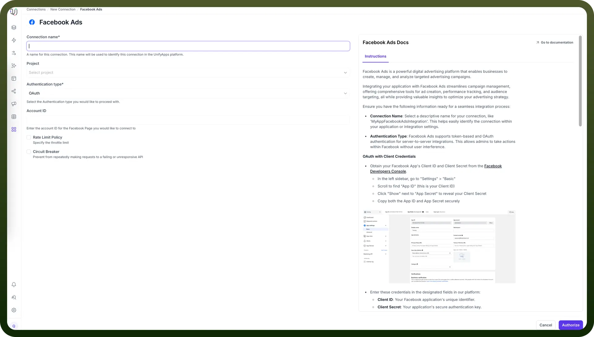
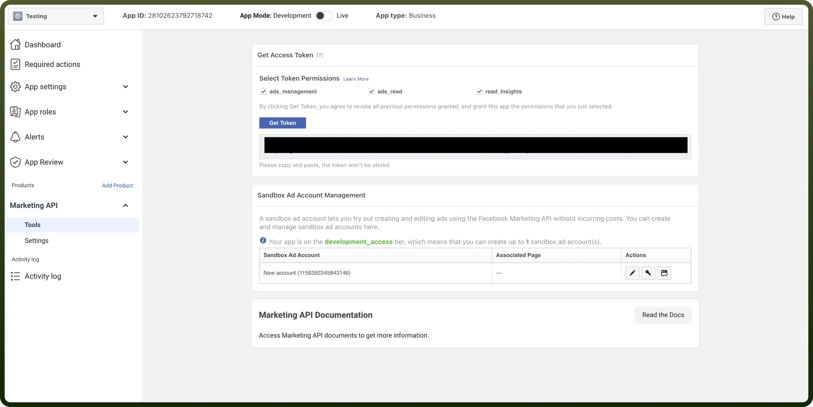
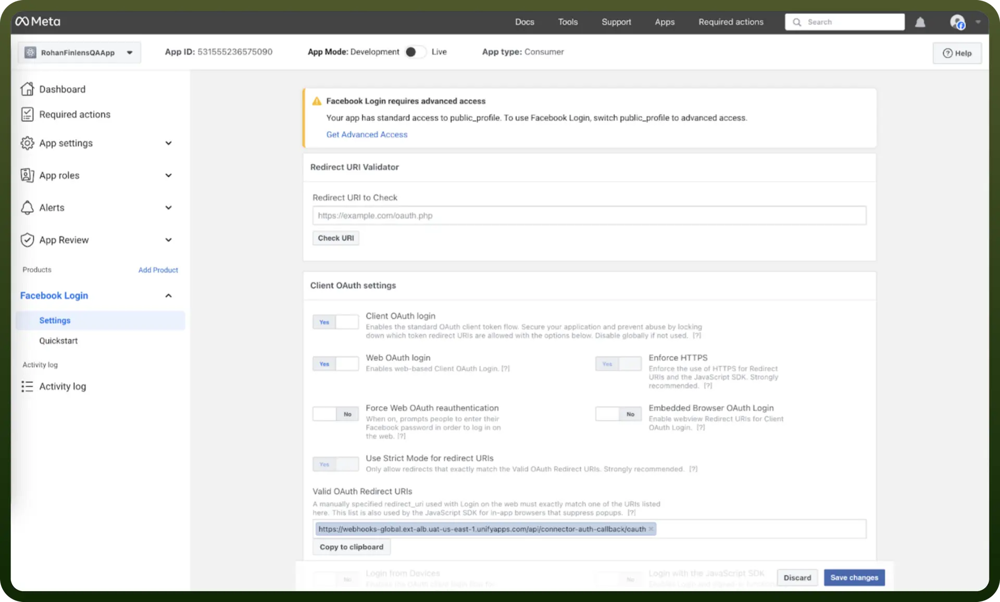
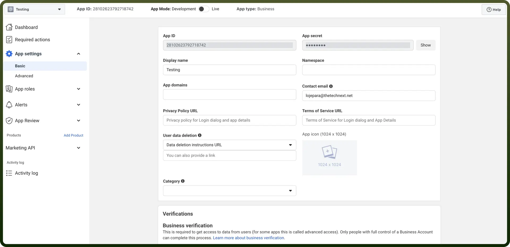
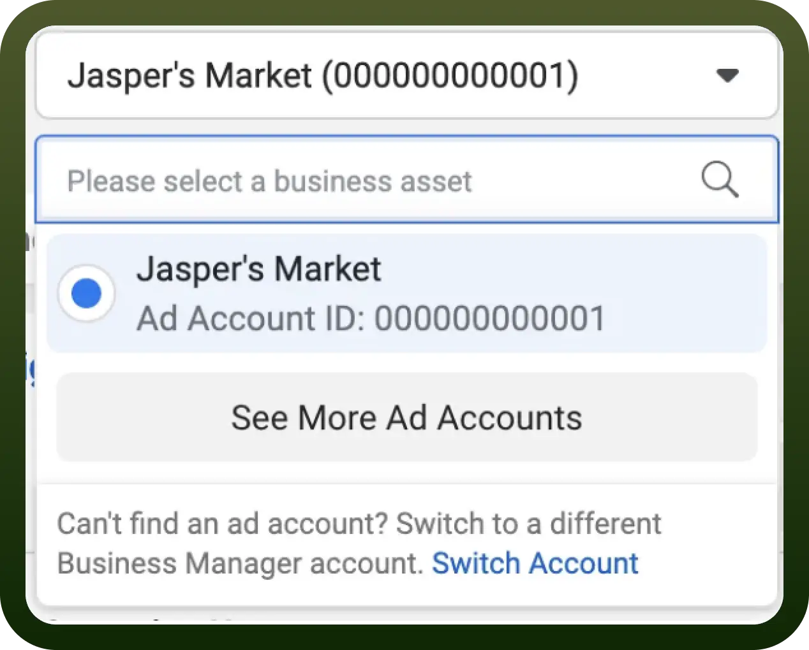

# Facebook Ads as Source

Source: https://www.unifyapps.com/docs/unify-data/facebook-ads-as-source
Section: data

---

UnifyApps enables seamless integration with Facebook Ads as a source for your data pipelines. This article covers essential configuration elements and best practices for connecting to Facebook Ads sources.

## Overview

Facebook Ads is a powerful digital advertising platform that enables businesses to create, manage, and analyze targeted advertising campaigns. UnifyApps provides native connectivity to extract data from Facebook Ads efficiently and securely, supporting both historical data loads and continuous data synchronization.

## Connection Configuration

| **Parameter** | **Description** | **Example** |
|---|---|---|
| `Connection Name`* | Descriptive identifier for your connection | "MyAppFacebookAdsIntegration" |
| `Account ID` | Facebook Ads account identifier (without "act_" prefix) | "123456789012345" |

### Authentication Methods

UnifyApps supports three authentication methods for Facebook Ads:

#### 1. Token Authentication

| **Parameter** | **Description** | **Example** |
|---|---|---|
| `User Token`* | Facebook Page token | "EAABZCz..." |

**How to obtain a User Token:**

1. Log into your Facebook Developers Console
2. Navigate to your App's settings
3. Go to the '`Tools & Support`' section and select '`Graph API Explorer`'
4. Click '`Generate Access Token`'
5. Select the required permissions for Facebook Ads:
  - `ads_management`
  - `ads_read`
  - `business_management`
6. Copy the generated token

#### 2. OAuth Authentication

| **Parameter** | **Description** | **Example** |
|---|---|---|
| `Account ID` | Facebook Ads account identifier (without "act_" prefix) | "123456789012345" |

**How to set up OAuth authentication:**

- Log into your Facebook Developers Console
- Add the "`Facebook Login`" product to your app
- Go to the Facebook Login Setting Section
- Enter the Valid OAuth Callback URL
- Save Changes

#### 3. OAuth with Client Credentials

| **Parameter** | **Description** | **Example** |
|---|---|---|
| `Account ID` | Facebook Ads account identifier (without "act_" prefix) | "123456789012345" |
| `Client ID`* | OAuth application client identifier | "123456789012345" |
| `Client Secret`* | OAuth application client secret | "abcdef1234567890abcdef1234567890" |

**How to obtain Client ID and Client Secret:**

1. In the Facebook Developers Console, go to "`Settings`" > "`Basic`"
2. Scroll to find "`App ID`" (this is your Client ID)
3. Click "`Show`" next to "`App Secret`" to reveal your Client Secret
4. Copy both the App ID and App Secret securely

**How to find your Account ID:**

1. Go to Ads Manager
2. Your ad account ID number is shown above the search and filter bar in the account drop-down menu
3. Alternatively, find the number in your browser's address bar (look for act= in the URL)

> **Note:** When entering the Account ID in UnifyApps, do not include the "act_" prefix. Only enter the numeric portion of the ID.

## Supported Entities

UnifyApps can extract data from the following Facebook Ads entities:

| **Entity** | **Description** | **Common Use Cases** |
|---|---|---|
| `AdCreatives` | Creative content of ads | Creative performance analysis, content optimization |
| `AdInsights` | Performance metrics and analytics | ROI measurement, campaign effectiveness |
| `Ads` | Individual ad units | Ad-level performance tracking, A/B testing analysis |
| `AdSets` | Collection of ads with shared settings | Audience targeting analysis, budget allocation |
| `Campaigns` | Overall campaign structure | Campaign planning, cross-channel comparison |

## Data Synchronization Method

UnifyApps implements reverse polling for all Facebook Ads entities:

- Retrieves most recent data first, then works backward
- Optimized for time-sensitive advertising data
- Ensures newest performance metrics are prioritized in the synchronization process

## CRUD Operations Tracking

When tracking changes from Facebook Ads sources:

| **Operation** | **Support** | **Notes** |
|---|---|---|
| `Create` | ✓ Supported | New record insertions are detected |
| `Read` | ✓ Supported | Data retrieval via Facebook Ads API |
| `Update` | ✓ Supported | Updates are detected as new inserts with the updated values |
| `Delete` | ✗ Not Supported | Delete operations cannot be detected |

## Ingestion Modes

| **Mode** | **Description** | **Business Use Case** |
|---|---|---|
| `Historical and Live` | Loads all existing data and captures ongoing changes | Complete advertising analytics with continuous updates |
| `Live Only` | Captures only new data from deployment forward | Real-time campaign monitoring |
| `Historical Only` | One-time load of all existing data | Historical campaign analysis or reporting |

Choose the mode that aligns with your business requirements during pipeline configuration.

## Common Business Scenarios

**Advertising Performance Analysis**

- Extract campaign, ad set, and ad performance data
- Analyze metrics across different dimensions (demographics, placements, etc.)
- Identify highest and lowest performing ads

**Budget Optimization**

- Track spend versus performance across campaigns and ad sets
- Calculate cost per acquisition, ROAS, and other efficiency metrics
- Identify opportunities for budget reallocation

**Creative Performance Evaluation**

- Analyze which ad creatives generate the best engagement
- Compare performance across different creative approaches
- Identify creative elements that drive conversions

**Cross-Channel Marketing Integration**

- Combine Facebook Ads data with other marketing platform data
- Create unified marketing performance dashboards
- Analyze customer journey across multiple touchpoints

## Best Practices

| **Category** | **Recommendations** |
|---|---|
| `Performance` | Schedule extractions during off-peak hours Extract only necessary metrics and dimensions Use date range filters for large accounts |
| `Data Quality` | Maintain consistent naming conventions across campaigns Document custom conversions and events Consider attribution window settings when analyzing conversion data |
| `Security` | Use dedicated app credentials for integration Apply principle of least privilege for API access Regularly rotate tokens if using token-based authentication |
| `Monitoring` | Set up alerts for synchronization failures Monitor API quota usage Track data volume changes for anomaly detection |

## Limitations and Considerations

- **API Rate Limits**: Facebook enforces rate limits that may affect data extraction speed. UnifyApps implements optimized polling to work within these limits.
- **Data Retention**: Facebook may limit historical data access. Consider this when planning historical data extraction.
- **Attribution Windows**: Facebook's attribution model affects conversion reporting. Be aware of this when analyzing performance data.
- **Draft Items**: Items in draft state are not available through the API and will not be ingested.
- **API Changes**: Facebook regularly updates its API. UnifyApps adapts to these changes, but occasional adjustments may be necessary.

By properly configuring your Facebook Ads source connections and following these guidelines, you can ensure reliable, efficient data extraction while meeting your business requirements for advertising analytics and optimization.
