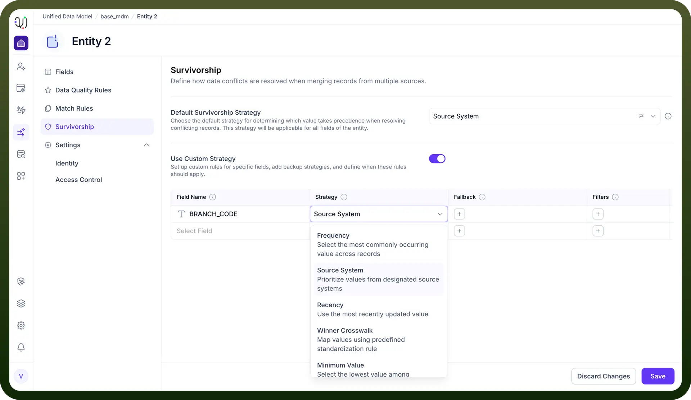
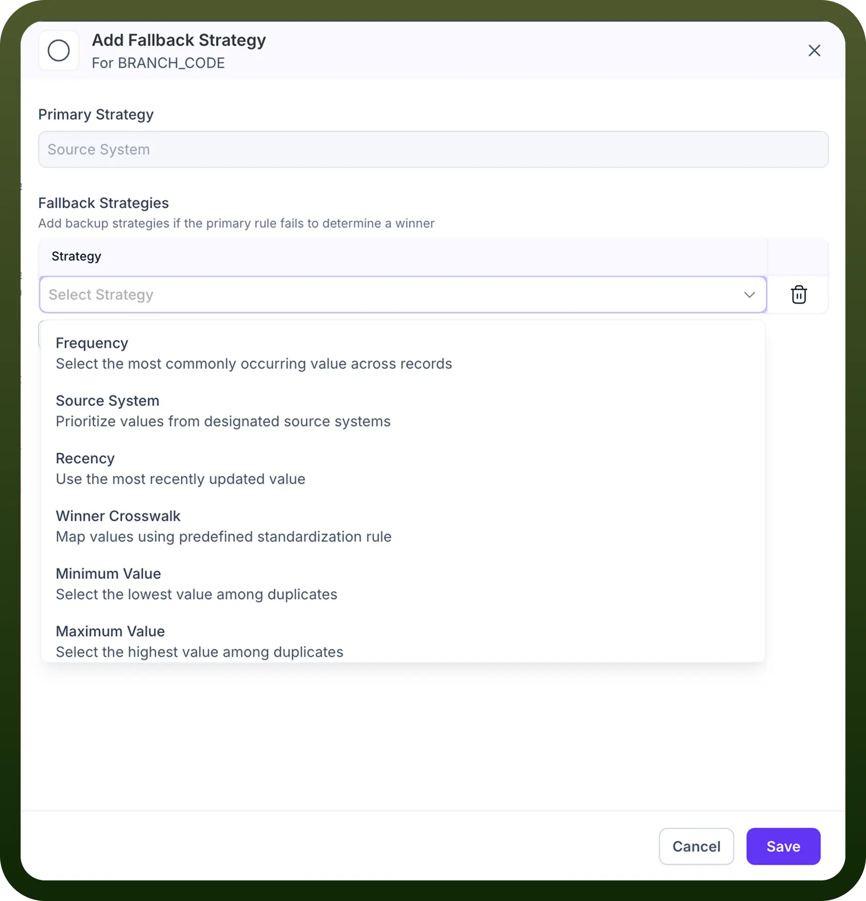
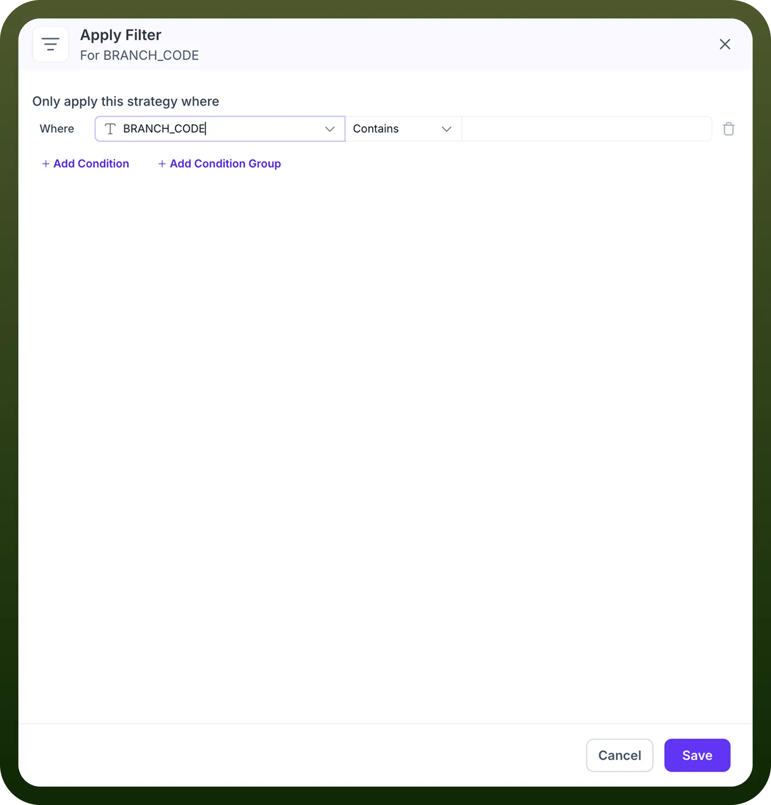

# Field Level Survivorship

Source: https://www.unifyapps.com/docs/unify-data/field-level-survivorship
Section: data

---

## Overview

While a default survivorship strategy establishes a baseline for an Entity, real-world data scenarios often require more precision. **Field Level Survivorship** allows you to override the global default and define specific "winning" logic for individual attributes. This granular control is essential for hybrid data models where different source systems are the "system of record" for different types of information (e.g., trusting the **HR System** for Employee ID but the **Active Directory** for Email Address).

Enabling Custom Strategies To begin configuring field-level rules, navigate to the **Survivorship** tab and toggle on the **Use Custom Strategy** switch. This action reveals the configuration table where you can map specific fields to distinct survivorship algorithms.

Configuration Components Defining a custom rule involves four key components:

1. **Primary Strategy For each field** (e.g., BRANCH_CODE), you must select the primary algorithm the system will use to determine the best value. The available strategies include:
- **Source System:** Priorities values based on the trustworthiness of the source connection (e.g., SAP > Snowflake).
- **Recency:** Selects the value with the most recent "Last Updated" timestamp.
- **Frequency:** Selects the value that appears most often across the duplicate records.**Min/Max Value:** Selects the lowest or highest numerical value available.

### **Fallback Strategies**

A Fallback Strategy acts as a safety net. It is a secondary rule that the system executes only when the Primary Strategy fails to determine a valid winning value.

### **When is a Fallback Triggered?**

The system automatically moves to the fallback logic in two specific scenarios:

1. **Null Values:** The primary strategy points to a record (e.g., from the highest-priority Source System), but that specific field is empty.
2. **Ties:** The primary strategy (e.g., Recency or Frequency) results in a tie between two or more values, and a tie-breaker is needed to resolve the conflict.

### **Configuration**

Clicking the (+) icon in the Fallback column opens the configuration modal.

You can layer multiple fallback strategies to create a "waterfall" of logic.

**Available Strategies:** The fallback menu offers the full suite of standard algorithms, including:

- **Frequency:** Select the most common value among the remaining candidates.
- **Recency:** Use the most recently updated value.
- **Min/Max Value:** Select the lowest or highest numeric value.

### **Filters**

Filters allow you to apply survivorship rules conditionally. Instead of enforcing a rule globally across all records, you can restrict specific logic to a defined subset of data.

### **Strategic Application**

This feature is critical for organizations with segmented data requirements.

For example, you may want to trust the US-ERP system for records where Country = USA, but trust the EU-CRM system for records where Country = France. Filters make this context-aware logic possible without creating separate entities.

### **Building a Filter**

Clicking the (+) icon in the Filters column launches the "Apply Filter" interface.

**1. Define Conditions:** You build logic statements using the format: Where [Field] [Operator] [Value].

- Example: Where BRANCH_CODE Contains 'NY'.

**2. Complex Logic:** You can chain multiple criteria together using Condition Groups to create sophisticated Boolean logic (AND/OR statements), ensuring the rule targets exactly the right data segment.

