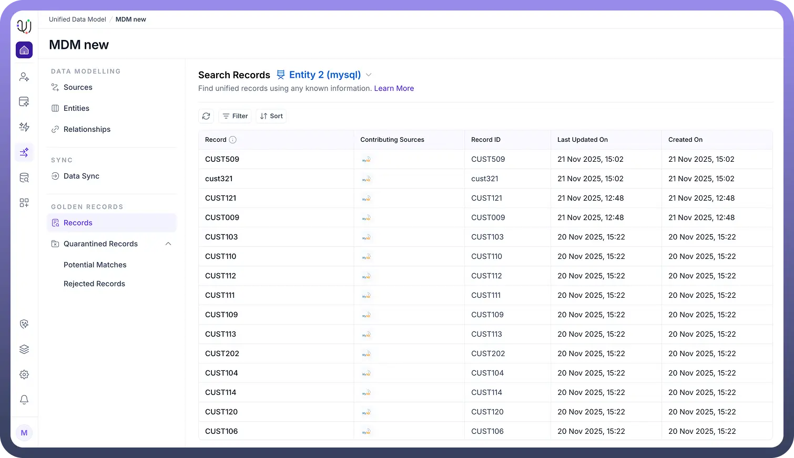

# Golden Records

Source: https://www.unifyapps.com/docs/unify-data/golden-records
Section: data

---

**Overview**

The Golden Record is the crown jewel of the Master Data Management (MDM) process.

It represents the single, trusted, and consolidated version of a data entity (such as a Customer, Product, or Asset) derived from multiple fragmented source systems.

After raw data passes through your defined Match Rules (deduplication) and Survivorship strategies (conflict resolution), the final output is stored here. This repository serves as the "Single Source of Truth" for your enterprise. 
**The Records Dashboard**

Navigating to the Records tab under the Golden Records section provides a comprehensive inventory of your unified data.

The dashboard offers a searchable and sortable view with critical metadata for every mastered entity:

- **Record Identity:** Displays the primary identifier (e.g., CUST509 , CUST121 ) and the display name.
- **Contributing Sources:** A vital visual indicator that uses icons (e.g., MySQL logo) to show exactly which external systems contributed data to this specific record.
- **Audit Timestamps:** Tracks the lifecycle of the record with **Created On** and **Last Updated On** columns, ensuring visibility into data freshness. **Detailed View & Data Lineage**Clicking on any individual record (e.g., CUST509) opens the 360-Degree View, which provides granular insights into the data's composition.This view is essential for understanding Data Lineage—knowing not just what the value is, but where it came from.

  

- **Field-Level Precision:** The interface lists every attribute (e.g., Value: 23000 , Value: Delhi Main ) alongside its specific **Contributing Source**.
- **Survivorship Audit:** This allows you to verify that your survivorship rules are working correctly. For example, you can see that the Branch Name ("Delhi Main") was pulled specifically from the mysql source at a specific timestamp ( 21 Nov 2025, 15:02 ).
