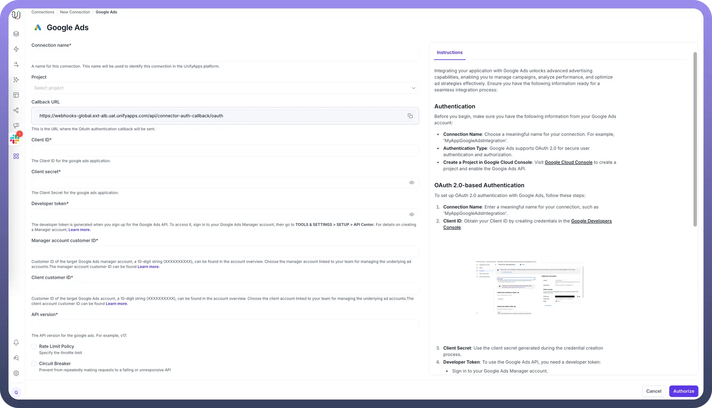
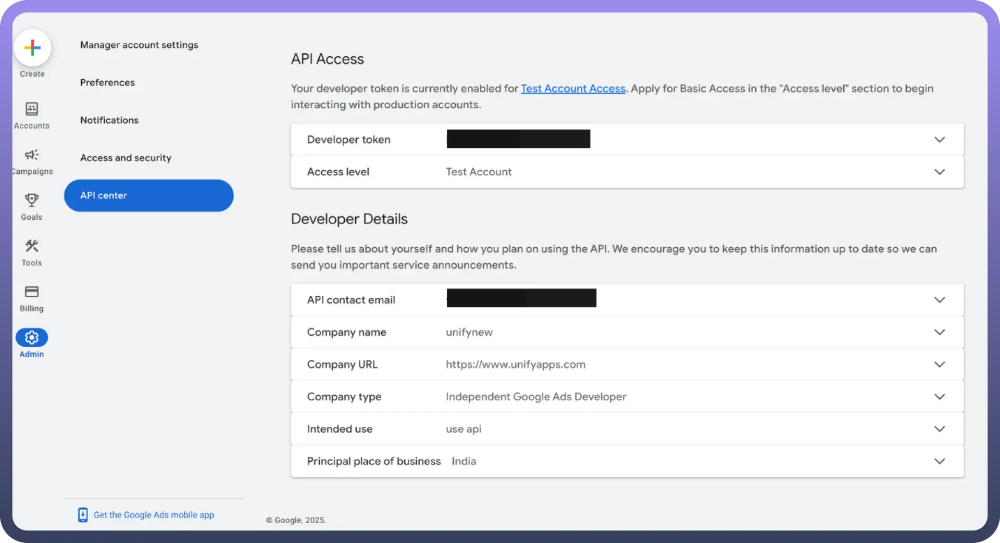
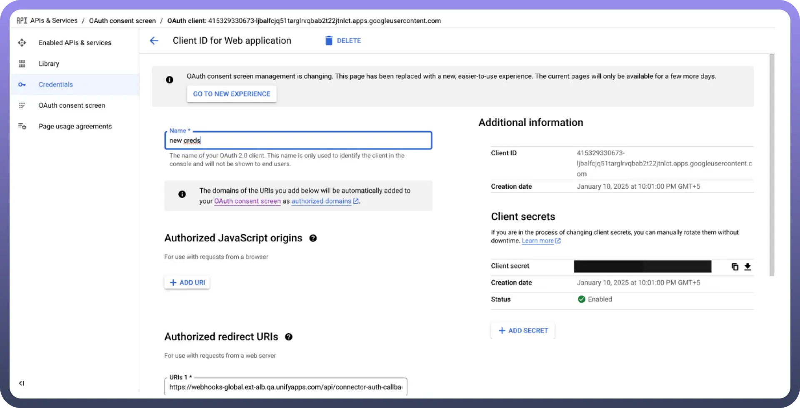

# Google Ads as Source

Source: https://www.unifyapps.com/docs/unify-data/google-ads-as-source
Section: data

---

UnifyApps enables seamless integration with Google Ads as a source for your data pipelines. This article covers essential configuration elements and best practices for connecting to Google Ads sources.

## Overview

Google Ads is a powerful online advertising platform that enables businesses to create and manage advertising campaigns across Google's advertising network. UnifyApps provides native connectivity to extract data from Google Ads efficiently and securely, supporting both historical data loads and continuous data synchronization.

| **Parameter** | **Description** | **Example** |
|---|---|---|
| `Connection Name`* | Descriptive identifier for your connection | "MyAppGoogleAdsIntegration" |
| `Callback URL` | OAuth authentication callback URL | "https://webhooks-global.ext-alb.uat.unifyapps.com/api/connector-auth-callback/oauth" |
| `Client ID`* | Client ID for the Google Ads application | "123456789-abcdefg.apps.googleusercontent.com" |
| `Client Secret`* | Authentication secret for the Google Ads application | "GOCSPX-abcdefghijklmnop" |
| `Developer Token`* | Token generated for Google Ads API access | "12ab34cd56ef78gh90ij" |
| `Manager Account Customer ID`* | Customer ID of the target Google Ads manager account | "1234567890" (10-digit string) |
| `Client Customer ID`* | Customer ID of the target Google Ads account | "0987654321" (10-digit string) |
| `API Version`* | Google Ads API version to use | "v17" |

## How to Obtain Google Ads Credentials

1. **Developer Token**:

  

  - Sign in to your Google Ads Manager account
  - Navigate to `TOOLS & SETTINGS` **>** `SETUP` **>** `API Center`
  - Create or copy your developer token
2. **Manager Account Customer ID**:
  - A 10-digit string (XXXXXXXXXX) found in the account overview
  - Choose the manager account linked to your team for managing the underlying ad accounts
3. **Client Customer ID**:
  - A 10-digit string (XXXXXXXXXX) found in the account overview
  - Choose the client account linked to your team for managing ad campaigns
4. **OAuth 2.0 Credentials**:

  

- Create a project in Google Cloud Console
- Enable the Google Ads API
- Create OAuth 2.0 credentials to obtain Client ID and Client Secret

## Supported Entities

UnifyApps can extract data from the following Google Ads entities:

| **Entity** | **Description** | **Common Use Cases** |
|---|---|---|
| `Ad Group` | Collection of ads with shared budget and targeting | Performance analysis by ad group, budget optimization |
| `Ad Group Ad` | Individual ads within an ad group | Creative performance analysis, A/B testing evaluation |
| `Campaign` | Overall advertising campaign structure | Campaign ROI measurement, cross-channel comparison |

## Data Synchronization Method

UnifyApps implements cursor-based pagination polling for all Google Ads entities:

- Efficiently handles large datasets with thousands of records
- Maintains proper ordering during incremental extraction
- Optimizes API usage by exponential back off to avoid rate limiting
- Ensures consistent data extraction across all entities

## CRUD Operations Tracking

When tracking changes from Google Ads sources:

| **Operation** | **Support** | **Notes** |
|---|---|---|
| `Create` | ✓ Supported | New record insertions are detected |
| `Read` | ✓ Supported | Data retrieval via Google Ads API |
| `Update` | ✓ Supported | Updates are detected as new inserts with the updated values |
| `Delete` | ✗ Not Supported | Delete operations cannot be detected |

> **Note:** Due to limitations in the Google Ads API, update operations appear as new inserts in the destination, and delete operations are not tracked. Consider this when designing your data synchronization strategy.

## Ingestion Modes

| **Mode** | **Description** | **Business Use Case** |
|---|---|---|
| `Historical and Live` | Loads all existing data and captures ongoing changes | Marketing analytics platform with continuous ad performance tracking |

## Common Business Scenarios

**Advertising Performance Analysis**

- Extract campaign, ad group, and ad performance data
- Calculate ROI across different marketing channels
- Identify top-performing ads and campaigns

**Budget Optimization**

- Track spend versus performance across campaigns
- Identify opportunities for budget reallocation
- Monitor cost per acquisition across different segments

**Cross-Channel Marketing Integration**

- Combine Google Ads data with social media advertising results
- Create unified marketing performance dashboards
- Analyze customer journey across multiple touchpoints

**Competitive Analysis**

- Track performance against industry benchmarks
- Monitor impression share and auction insights
- Identify market gaps and opportunities

## Best Practices

| **Category** | **Recommendations** |
|---|---|
| `Performance` | Schedule extractions during off-peak hours Extract only necessary metrics and dimensions Use date range filters for large accounts |
| `Data Quality` | Implement consistent naming conventions Maintain proper hierarchy mapping (`campaign` > `ad group` > `ad`) Track campaign IDs consistently across systems |
| `Security` | Use dedicated OAuth credentials Implement proper scoping for API access Regularly rotate client secrets |
| `Monitoring` | Set up alerts for synchronization failures Monitor API quota usage Track data volume changes for anomaly detection |

## Limitations and Considerations

- `API Quotas`: Google Ads enforces daily quota limits. Monitor usage to avoid disruptions.
- `Historical Data`: Google Ads typically limits historical data access to the past 3 years.
- `Update Detection`: Since updates appear as new records, implement business logic to handle duplicates.
- `Entity Relationships`: Maintain proper parent-child relationships (`campaign` > `ad group` > `ad`) in your data models.
- `Data Freshness`: Google Ads data may have up to 24-hour delay for certain metrics. Consider this for real-time reporting needs.

By properly configuring your Google Ads source connections and following these guidelines, you can ensure reliable, efficient data extraction while meeting your business requirements for advertising analytics and optimization.
