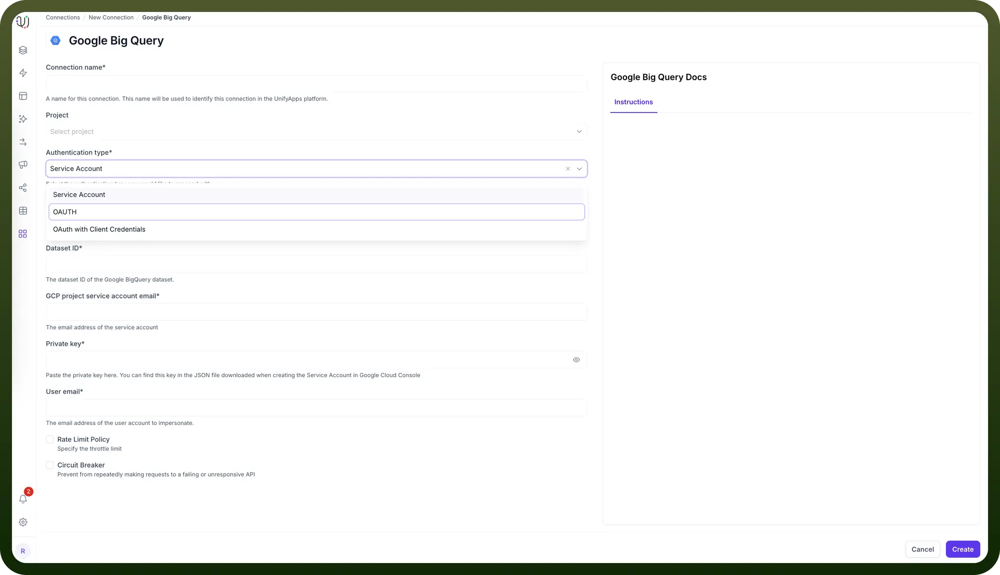
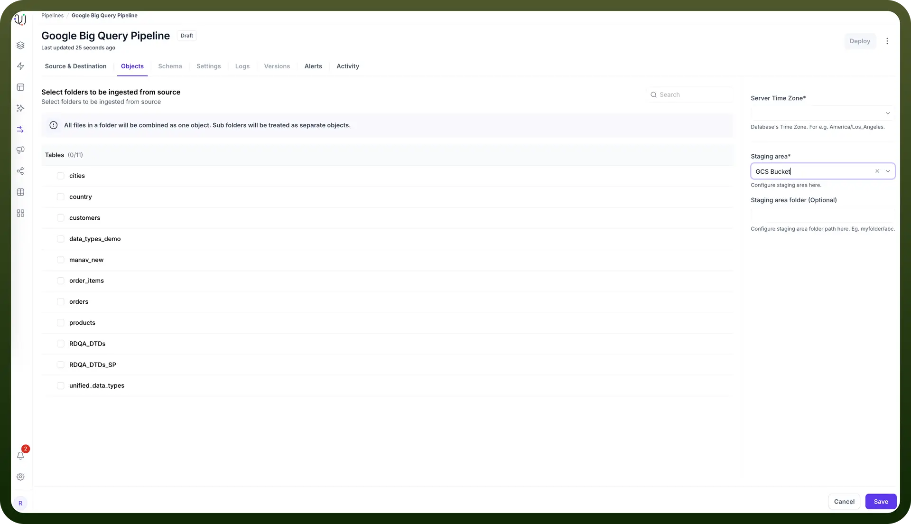

# Google BigQuery as Source

Source: https://www.unifyapps.com/docs/unify-data/google-bigquery-as-source
Section: data

---

UnifyApps enables seamless integration with Google BigQuery as a source for your data pipelines. This article covers essential configuration elements and best practices for connecting to BigQuery sources.

## Overview

Google BigQuery is a fully managed, serverless data warehouse that enables scalable analysis over petabytes of data. UnifyApps provides native connectivity to extract data from BigQuery efficiently and securely, supporting both historical data loads and continuous data synchronization.

## Connection Configuration

| **Parameter** | **Description** | **Example** |
|---|---|---|
| `Connection Name*` | Descriptive identifier for your connection | "Marketing Analytics BigQuery" |
| `Project` | Optional project categorization | "Data Warehouse Migration" |
| `Authentication Type*` | Method of authentication to BigQuery | OAuth, OAuth with Client Credentials, or Service Account |
| `Project ID*` | Google Cloud project identifier | "my-gcp-project-123456" |
| `Dataset ID*` | BigQuery dataset identifier | "marketing_analytics" |

Depending on the authentication method selected, additional parameters are required:

**OAuth Authentication**

- `Scopes*` - Required API access permissions:
  - View and manage your data across Google Cloud services
  - View and manage your data in Google BigQuery
  - Insert data into your Google BigQuery tables

**OAuth with Client Credentials**

- `Project ID*`
- `Dataset ID*`
- `Client ID*` - The client ID for the Google BigQuery application
- `Client Secret*` - The client secret for the Google BigQuery application
- `Scopes*`

**Service Account Authentication**

- `Project ID*`
- `Dataset ID*`
- `GCP Project Service Account Email*` - Email address of the service account
- `Private Key*` - Private key from the JSON file downloaded when creating the Service Account
- `User Email*` - Email address of the user account to impersonate

Optional configuration for all authentication methods:

- Rate Limit Policy - Specify throttle limit
- Circuit Breaker - Prevent repeated requests to failing or unresponsive API

## Server Timezone Configuration

When adding objects from a BigQuery source, you'll need to specify the database server's timezone. This setting is crucial for proper handling of date and time values.

- In the Add Objects dialog, find the Server Time Zone setting
- Select your BigQuery server's timezone

This ensures all timestamp data is normalized to UTC during processing, maintaining consistency across your data pipeline.

## Data Extraction Configuration

For Google BigQuery sources, you must specify a Google Cloud Storage (GCS) bucket for data staging:

1. During the object selection process, you'll be prompted to enter a GCS bucket name
2. This bucket is used to temporarily store data extracted from BigQuery
3. Ensure the service account or OAuth credentials have proper access to this bucket
4. Data is automatically cleaned up from the staging bucket after successful processing

## Data Extraction Methods

UnifyApps uses specialized techniques for BigQuery data extraction:

**Historical Data (Initial Load)**

For historical data, UnifyApps uses a snapshot-based approach:

1. Data is extracted from BigQuery tables to the specified GCS staging bucket
2. The data is processed and loaded into the destination
3. GCS staging objects are automatically cleaned up after successful processing

**Live Data (Incremental Updates)**

For ongoing changes, UnifyApps implements cursor-based polling:

1. You must select a cursor field (typically a timestamp or sequential ID)
2. The pipeline tracks the highest value processed in each run
3. Subsequent runs query only for records with cursor values higher than the last checkpoint
4. Recommended cursor fields are datetime columns that track record modifications

> **Note:** A validation error will be thrown if no cursor is configured when using "`Historical and Live`" or "`Live Only`" ingestion modes.

**Supported Data Types for Cursor Fields**

| **Category** | **Supported Cursor Types** |
|---|---|
| `Numeric` | INTEGER, INT64, NUMERIC, BIGNUMERIC |
| `String` | STRING (lexicographically ordered) |
| `Date/Time` | DATE, DATETIME, TIME, TIMESTAMP |

**Ingestion Modes**

| **Mode** | **Description** | **Business Use Case** | **Requirements** |
|---|---|---|---|
| `Historical and Live` | Loads all existing data and captures ongoing changes | Analytics platform migration with continuous synchronization | Valid cursor field required |
| `Live Only` | Captures only new data from deployment forward | Real-time dashboard without historical context | Valid cursor field required |
| `Historical Only` | One-time load of all existing data | Point-in-time analytics or compliance snapshot | No cursor field needed |

Choose the mode that aligns with your business requirements during pipeline configuration.

## CRUD Operations Tracking

When tracking changes from BigQuery sources:

| **Operation** | **Support** | **Notes** |
|---|---|---|
| `Create` | ✓ Supported | New record insertions are detected |
| `Read` | ✓ Supported | Data retrieval via full or incremental queries |
| `Update` | ✓ Supported | Updates are detected as new inserts with the updated values |
| `Delete` | ✗ Not Supported | Delete operations cannot be detected |

> **Note:** Due to BigQuery's architecture, update operations appear as new inserts in the destination, and delete operations are not tracked. Consider this when designing your data synchronization strategy

## Supported Data Types

| **Category** | **Supported Types** |
|---|---|
| `Boolean` | BOOL (aliases: BOOLEAN) |
| `Numeric` | INT64 (aliases: INT, SMALLINT, INTEGER, BIGINT, TINYINT, BYTEINT) NUMERIC (aliases: DECIMAL) BIGNUMERIC (aliases: BIGDECIMAL) FLOAT64 |
| `Date/Time` | DATE, DATETIME, TIME, TIMESTAMP, INTERVAL, RANGE |
| `String` | STRING |
| `Binary` | BYTES |
| `Complex` | ARRAY, STRUCT, GEOGRAPHY, JSON |

All standard BigQuery data types are supported, enabling comprehensive data extraction from various analytics workloads.

## Prerequisites and Permissions

To establish a successful BigQuery source connection, ensure:

- Access to an active Google Cloud project with BigQuery enabled
- Proper IAM permissions for the service account or OAuth credentials:
  - `bigquery.datasets.get`
  - `bigquery.tables.get`
  - `bigquery.tables.getData`
  - `bigquery.jobs.create`
  - `storage.objects.create` (for the GCS staging bucket)
  - `storage.objects.delete` (for cleanup)
- A GCS bucket for staging data extraction

## Common Business Scenarios

**Marketing Analytics Integration**

- Extract campaign performance data from BigQuery
- Configure cursor-based polling on last_updated timestamp fields
- Combine with CRM data for comprehensive customer journey analytics

**Machine Learning Data Pipeline**

- Extract training and validation datasets from BigQuery
- Set up appropriate partitioning for large tables
- Configure appropriate cursor fields for incremental model updates

**Financial Data Consolidation**

- Extract processed financial data from BigQuery
- Implement proper type handling for numeric precision
- Set up field-level transformations for standardized reporting

## Best Practices

| **Category** | **Recommendations** |
|---|---|
| `Performance` | Use partitioned tables when possible Leverage column selection to minimize data transfer Configure appropriate query timeouts for large extractions |
| `Cursor Selection` | Choose fields with high cardinality Use TIMESTAMP fields when available Ensure chosen cursor fields are included in partitioning or clustering keys |
| `GCS Configuration` | Use the same GCP region for BigQuery and GCS bucket Implement appropriate bucket lifecycle policies Use VPC Service Controls for enhanced security when needed |
| `Cost Optimization` | Schedule extractions to balance slot usage Use column pruning to reduce data processed Monitor and optimize query patterns to reduce bytes scanned |

By properly configuring your BigQuery source connections and following these guidelines, you can ensure reliable, efficient data extraction while meeting your business requirements for data timeliness, completeness, and compliance.
