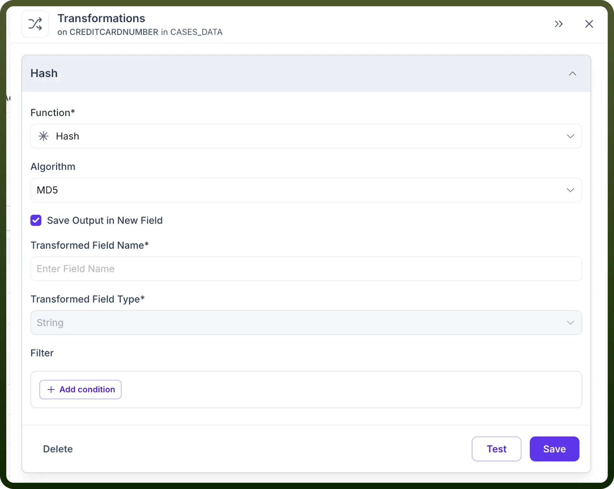
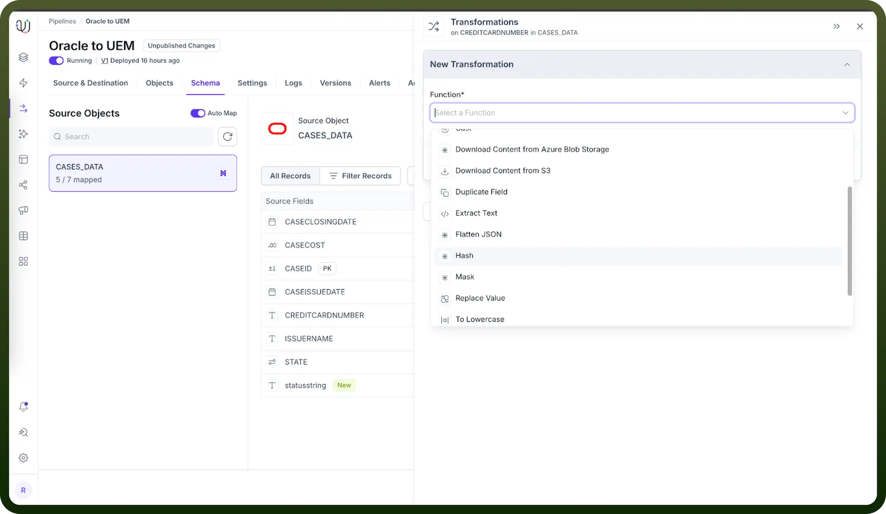

# Hashing

Source: https://www.unifyapps.com/docs/unify-data/hashing
Section: data

---

## Overview

UnifyApps Data Pipelines provides a hashing transformation function that converts string or binary data into a fixed-length string of characters using various cryptographic algorithms. You can use this transformation for data anonymization, creating unique identifiers, data validation, and ensuring data integrity throughout your pipelines.

## Supported Algorithms

UnifyApps Data Pipelines supports these hashing algorithms:

`MD5` - Creates a 128-bit (16-byte) hash value, typically expressed as a 32-character hexadecimal number

`SHA-2` - Delivers a more secure hash than MD5 through a set of advanced cryptographic hash functions

`CRC32` - Performs a cyclic redundancy check that generates a 32-bit hash value, commonly used for error detection

## Requirements and Limitations

Apply hashing only to string and binary source data types

Expect string data type outputs from all hash transformations

Remember that hash transformations work as one-way operations and cannot be reversed

Store the output in a new field or replace the existing field

## How to Configure Hash Transformations?

1. Go to the Schema tab in your Pipeline
2. Hover on the space between source and destination fields
3. Click on ***"***`Transform Field`***"***
4. Choose "Hashing" as the transformation type
5. Select your preferred algorithm **(**`MD5`**,** `SHA-2`**,** or `CRC32`**)**
6. Specify where to store the output (same field or new field)
7. Apply any additional filters if needed
8. Test and save your transformation

  

  

## Use Cases

1. **Data Anonymization** Hash sensitive data such as Personally Identifiable Information (PII) to anonymize it while maintaining referential integrity.**Example**: Hash customer email addresses before storing them in your data warehouse: **Input**: john.doe@example.com **Output** (MD5): 9e66d708a7803f24a2521a1d3487d127
2. **Creating Unique Identifiers** Generate consistent unique identifiers from multiple fields using hash transformations.**Example**: Create a unique case identifier by hashing a combination of name and timestamp: **Input**: "JohnDoe_2025-04-15T14:32:10" **Output** (SHA-2): 8f5e9c7b4a3d2e1f0c9b8a7d6e5f4c3b2a1d0e9f8c7b6a5d4e3f2c1b0a9d8e7f
3. **Data Validation and Integrity Checks** Validate that data remains unaltered during processing by implementing hashing.**Example**: Hash original source data and compare it with hashed records in the destination: **Input**: "Important financial transaction data" **Output** (CRC32): 2d8adaf2
4. **De-duplication of Records** Identify duplicate records by hashing relevant fields and comparing the resulting hash values.**Example**: Hash product descriptions to find duplicates despite minor formatting differences: **Input 1**: "Blue cotton t-shirt, size L" **Input 2**: "Blue Cotton T-Shirt, Size L" **Output** (both hash to the same value when normalized)

## Best Practices

1. **Choose the right algorithm:** Select MD5 for general purpose hashing with no security requirements Implement SHA-2 for applications requiring higher security Use CRC32 for simple integrity checks
2. **Combine with other transformations:** Add a salt (additional random data) before hashing sensitive data Normalize data before hashing to ensure consistency
3. **Performance considerations:** Benefit from faster processing with MD5 and CRC32, though they offer less security Get better security with SHA-2, but expect slower performance for very large datasets
