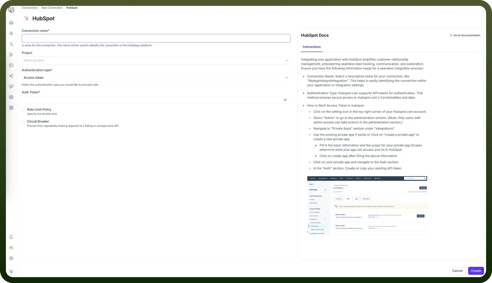

# Hubspot as Destination

Source: https://www.unifyapps.com/docs/unify-data/hubspot-as-destination
Section: data

---

UnifyApps enables seamless integration with Hubspot as a destination for your data pipelines. This article covers essential configuration elements and best practices for connecting to Hubspot destinations.

## Overview

HubSpot is a cloud-based CRM and marketing automation platform that centralizes customer, deal, and workflow management for sales, marketing, and service teams. Its modular Hubs offer specialized tools and real-time reporting. UnifyApps natively integrates with HubSpot, enabling secure, scalable data sync for enhanced analytics, automation, and customer insights.

## Connection Configuration

| **Parameter** | **Description** | **Example** |
|---|---|---|
| `Connection Name*` | Descriptive identifier for your connection | "MyAppHubSpotIntegration" |

### Authentication Methods

UnifyApps supports three authentication methods for HubSpot:

**1. Access Token Authentication**

| **Parameter** | **Description** | **Example** |
|---|---|---|
| `Auth Token*` | HubSpot API token | "pat-na1-abcdef-ghijkl-123456" |

**How to obtain an API Token:**

- Click on the settings icon in the top right corner of your HubSpot account
- Select "`Admin`" to go to the administration section *(Note: Only users with admin access can take actions in the administration section)*
- Navigate to "`Private Apps`" section under "`Integrations`"
- Use an existing private app or click on "`Create a private app`"
  - Fill in the basic information and the scope for your private app
  - Required scopes for UnifyApps: objects.read, objects.write
  - Click on "`Create app`"
- Click on your private app and navigate to the Auth section
- In the "`Auth`" section, create or copy your existing API token

**2. OAuth Authentication**

| **Parameter** | **Description** | **Example** |
|---|---|---|
| `Callback URL` | OAuth authentication callback URL | "https://webhooks-global.ext-alb.uat.unifyapps.com/api/connector-auth-callback/oauth" |

**How to set up OAuth authentication:**

- Create a HubSpot Developer account if you don't already have one
- Create a new app in the HubSpot Developer portal
- Configure the OAuth settings
- Add the callback URL from UnifyApps to your app's configuration
- Ensure your app has the required scopes: objects.read, objects.write

**3. OAuth with Client Config**

| **Parameter** | **Description** | **Example** |
|---|---|---|
| `Callback URL` | OAuth authentication callback URL | "https://webhooks-global.ext-alb.uat.unifyapps.com/api/connector-auth-callback/oauth" |
| `Client ID*` | OAuth application client identifier | "123456-abcdef-7890-ghijkl" |
| `Client Secret*` | OAuth application client secret | "abcdef-123456-ghijkl-7890" |

**How to obtain Client ID and Client Secret:**

1. Create a HubSpot Developer account if you don't already have one
2. Create a new app in the HubSpot Developer portal
3. Navigate to the Auth section of your app
4. Copy the Client ID and Client Secret
5. Ensure your app has the required scopes: objects.read, objects.write.

## Supported Entities

UnifyApps can extract data from the following HubSpot entities:

| **Entity** | **Description** | **Common Use Cases** |
|---|---|---|
| `Call` | Call activity records | Sales activity tracking, follow-up analysis |
| `Company` | Organization records | Account-based marketing, company hierarchy analysis |
| `Contact` | Individual contact records | Contact management, lead scoring, segmentation |
| `Deal` | Sales opportunity records | Pipeline analysis, revenue forecasting |
| `Email` | Email communications | Email engagement tracking, communication history |
| `LinkedIn Message` | LinkedIn communications | Social selling analysis, engagement tracking |
| `Meeting` | Scheduled meeting records | Meeting frequency analysis, engagement tracking |
| `Note` | Internal notes and annotations | Customer interaction history, internal communication |

## CRUD Operations

| Operation | Support | Notes |
|---|---|---|
| `Create` | ✓ Supported | New record insertions via COPY commands |
| `Update` | ✓ Supported | Implemented via UPSERT operations |
| `Delete` | ✓ Supported | Conditional delete operations based on business logic |

## Supported Datatypes

| **Category** | **Supported Types in HubSpot** |
|---|---|
| `Integer` | N/A (HubSpot uses a unified Number type) |
| `Decimal` | number (supports integer and floating-point values) |
| `Date/Time` | date (YYYY-MM-DD) and datetime (YYYY-MM-DDTHH:MM:SSZ) |
| `String` | string |
| `Boolean` | bool |

## Common Business Scenarios

1. **Marketing Performance Analysis**
  - Extract email, form, and campaign engagement data from HubSpot.
  - Analyze open rates, click-through rates, and conversion metrics across segments.
  - Identify top-performing channels and optimize future marketing spend.
2. **Sales Pipeline Intelligence**
  - Synchronize deals and deal stages with BI tools or data warehouses.
  - Measure deal velocity, conversion rates, and rep performance.
  - Forecast revenue and identify pipeline bottlenecks.
3. **Customer 360° View**
  - Enrich HubSpot contact and company records with external data (e.g., product usage, billing).
  - Combine HubSpot data with CRM, ERP, and support tools for a unified customer profile.
  - Enable personalized outreach based on behavioral and transactional data.
4. **Lead Scoring and Segmentation**
  - Export leads, attributes, and activity data to scoring models in your data warehouse.
  - Sync back calculated scores into HubSpot custom fields for smarter segmentation.
  - Drive marketing workflows with AI-driven lead quality indicators.
5. **Workflow Automation Enhancement**
  - Use synced external metrics (e.g., LTV, churn risk) to trigger HubSpot automations.
  - Route tickets, emails, or tasks dynamically based on customer behavior or lifecycle stage.
  - Automate nurture campaigns using unified data from marketing and sales systems.
6. **Support and Service Insights**
  - Extract ticket and interaction data from HubSpot’s Service Hub.
  - Monitor resolution times, ticket load, and CSAT trends across teams.
  - Correlate support effectiveness with product usage or customer health indicators.

## Best Practices

| **Category** | **Recommendations** |
|---|---|
| `Performance Optimization` | Use pagination (limit-offset or time-based) for large queriesFilter with date ranges for historical syncsUse batch API endpoints where available |
| `Security Considerations` | Use OAuth with granular scopesStore tokens securely and refresh periodicallyRestrict access based on need-to-know basis |
| `Cost Management` | Avoid excessive API calls by syncing only changed recordsThrottle requests to prevent hitting rate limitsPrioritize high-value entities (deals, contacts) |
| `Data Governance` | Document field mappings between HubSpot and external systemsUse custom properties with clear naming conventionsValidate field formats during sync |
| `Optimization Strategies` | Use lastmodifieddate for incremental syncsAvoid unnecessary updates to HubSpot to reduce API usageDeduplicate contacts using email or ID |
| `Connection Management` | Monitor API limits via HubSpot’s developer dashboardImplement retry with backoff for failed API callsAlert on token expiry or sync errors |
