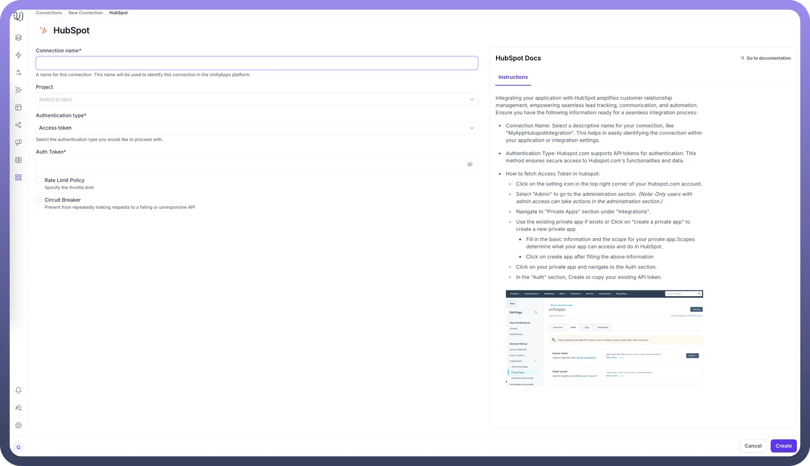
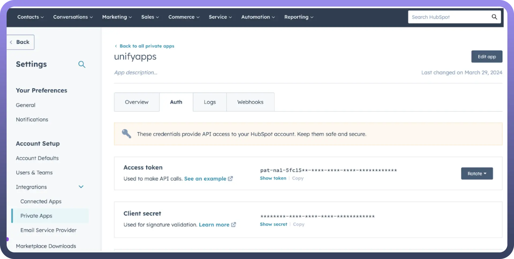

# Hubspot as Source

Source: https://www.unifyapps.com/docs/unify-data/hubspot-as-source
Section: data

---

UnifyApps enables seamless integration with HubSpot as a source for your data pipelines. This article covers essential configuration elements and best practices for connecting to HubSpot sources.

## Overview

HubSpot is a powerful customer relationship management (CRM) platform that helps businesses track leads, automate marketing, and manage customer communications. UnifyApps provides native connectivity to extract data from HubSpot efficiently and securely, supporting both historical data loads and continuous data synchronization.

## Connection Configuration

| **Parameter** | **Description** | **Example** |
|---|---|---|
| `Connection Name*` | Descriptive identifier for your connection | "`MyAppHubSpotIntegration`" |

### Authentication Methods

UnifyApps supports three authentication methods for HubSpot:

**1. Access Token Authentication**

| **Parameter** | **Description** | **Example** |
|---|---|---|
| `Auth Token*` | HubSpot API token | "`pat-na1-abcdef-ghijkl-123456`" |

**How to obtain an API Token:**

- Click on the settings icon in the top right corner of your HubSpot account
- Select "`Admin`" to go to the administration section

> **Note:** Only users with admin access can take actions in the administration section

- Navigate to "`Private Apps`" section under "`Integration`s"
- Use an existing private app or click on "`Create a private app`"
  - Fill in the basic information and the scope for your private app
  - Required scopes for UnifyApps: `objects.read, objects.write`
  - Click on "`Create app`"
- Click on your private app and navigate to the Auth section
- In the "`Auth`" section, create or copy your existing API token

**2. OAuth Authentication**

| **Parameter** | **Description** | **Example** |
|---|---|---|
| `Callback URL` | OAuth authentication callback URL | "`https://webhooks-global.ext-alb.uat.unifyapps.com/api/connector-auth-callback/oauth`" |

**How to set up OAuth authentication:**

- Create a HubSpot Developer account if you don't already have one
- Create a new app in the HubSpot Developer portal
- Configure the OAuth settings
- Add the callback URL from UnifyApps to your app's configuration
- Ensure your app has the required scopes: `objects.read, objects.write`

**3. OAuth with Client Config**

| **Parameter** | **Description** | **Example** |
|---|---|---|
| `Callback URL` | OAuth authentication callback URL | "`https://webhooks-global.ext-alb.uat.unifyapps.com/api/connector-auth-callback/oauth`" |
| `Client ID*` | OAuth application client identifier | "`123456-abcdef-7890-ghijkl`" |
| `Client Secret*` | OAuth application client secret | "`abcdef-123456-ghijkl-7890`" |

**How to obtain Client ID and Client Secret:**

1. Create a HubSpot Developer account if you don't already have one
2. Create a new app in the HubSpot Developer portal
3. Navigate to the Auth section of your app
4. Copy the Client ID and Client Secret
5. Ensure your app has the required scopes: `objects.read, objects.write`

## Supported Entities

UnifyApps can extract data from the following HubSpot entities:

| **Entity** | **Description** | **Common Use Cases** |
|---|---|---|
| `Call` | Call activity records | Sales activity tracking, follow-up analysis |
| `Company` | Organization records | Account-based marketing, company hierarchy analysis |
| `Contact` | Individual contact records | Contact management, lead scoring, segmentation |
| `Deal` | Sales opportunity records | Pipeline analysis, revenue forecasting |
| `Email` | Email communications | Email engagement tracking, communication history |
| `LinkedIn Message` | LinkedIn communications | Social selling analysis, engagement tracking |
| `Meeting` | Scheduled meeting records | Meeting frequency analysis, engagement tracking |
| `Note` | Internal notes and annotations | Customer interaction history, internal communication |

## Data Synchronization Method

UnifyApps implements forward polling for all HubSpot entities:

- Sequential data retrieval based on timestamp or ID
- Efficient for applications with chronological data creation
- Ensures consistent data extraction across all entities

## CRUD Operations Tracking

When tracking changes from HubSpot sources:

| **Operation** | **Support** | **Notes** |
|---|---|---|
| `Create` | ✓ Supported | New record insertions are detected |
| `Read` | ✓ Supported | Data retrieval via HubSpot API |
| `Update` | ✓ Supported | Updates are detected as new inserts with the updated values |
| `Delete` | ✗ Not Supported | Delete operations cannot be detected |

## Ingestion Modes

| **Mode** | **Description** | **Business Use Case** |
|---|---|---|
| `Historical and Live` | Loads all existing data and captures ongoing changes | CRM migration with continuous contact and deal synchronization |
| `Live Only` | Captures only new data from deployment forward | Real-time lead tracking and sales activity monitoring |
| `Historical Only` | One-time load of all existing data | CRM analysis or reporting snapshot |

Choose the mode that aligns with your business requirements during pipeline configuration.

## Common Business Scenarios

**Contact and Lead Management**

- Extract contact records with associated activities
- Create unified customer profiles by combining with other data sources
- Enable advanced segmentation and targeting

**Sales Pipeline Analysis**

- Extract deal records with stage history
- Track conversion rates across pipeline stages
- Forecast revenue based on deal data

**Marketing Performance Measurement**

- Analyze email engagement metrics
- Track lead sources and conversion paths
- Measure campaign effectiveness

**Customer Engagement Tracking**

- Monitor meeting and call activity
- Analyze communication frequency and patterns
- Identify engagement trends across customer lifecycle

## Best Practices

| **Category** | **Recommendations** |
|---|---|
| `Performance` | Schedule extractions during off-peak hours Start with critical entities before adding others Use incremental loading for high-volume entities |
| `Data Quality` | Maintain consistent property naming conventions Document custom properties and their meanings Regularly audit HubSpot data for completeness |
| `Security` | Use dedicated app credentials for integration Apply principle of least privilege for API access Regularly rotate API tokens if using token-based authentication |
| `Monitoring` | Set up alerts for synchronization failures Monitor API quota usage Track data volume changes for anomaly detection |

## Limitations and Considerations

- **API Rate Limits**: HubSpot enforces rate limits that may affect data extraction speed. UnifyApps implements optimized polling to work within these limits.
- **Data Retention**: HubSpot may have different retention policies for different data types. Consider this when planning historical data extraction.
- **Custom Properties**: HubSpot allows extensive customization of properties. Ensure your schema can accommodate these custom fields.
- **API Changes**: HubSpot regularly updates its API. UnifyApps adapts to these changes, but occasional adjustments may be necessary.
- **Required Scopes**: Ensure your authentication method has the objects.read and objects.write scopes enabled for all entities.

By properly configuring your HubSpot source connections and following these guidelines, you can ensure reliable, efficient data extraction while meeting your business requirements for CRM data integration and analysis.
