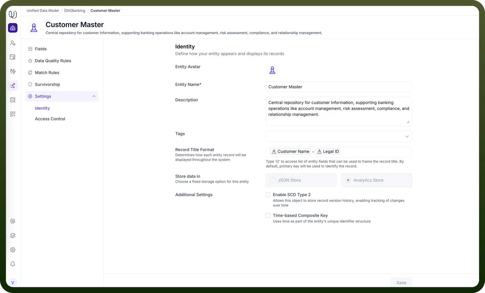

# Identity

Source: https://www.unifyapps.com/docs/unify-data/identity
Section: data

---

The **Entity Identity** settings provide descriptive and representational metadata for an entity within the Unified Data Model (UDM). These settings help define how the entity appears throughout the system but **do not alter structural or storage behavior**.

## **1. Overview**

The **Identity** tab displays key attributes associated with the entity, including:

- Entity avatar
- Entity name (read-only)
- Description and tags
- Record title format
- Display-only storage configuration and technical behaviors

These elements support discoverability, documentation, and consistent user experience across the platform.

## **2. Identity Fields**

### **Entity Avatar**

A visual icon used to represent the entity throughout the UDM interface. 
 This is the only visual identity component that can be modified directly in this screen.

### **Entity Name** ***(Read-Only)***

Displays the formal, system-defined name of the entity. 
 This field cannot be edited from the Identity page. 
 Example: **Customer Master**

**Note:** Entity Name is defined during entity creation or through model-level configurations.

### **Description**

A text field used to describe the purpose, behavior, and business context of the entity. 
 This field is editable and recommended for documentation and governance.

### **Tags**

Optional labels that help categorize and organize entities for easier filtering and search.

## **3. Record Title Format**

This editable section defines how individual records for the entity will appear within the UI. 
 Users can select visible fields to craft a meaningful, user-friendly record label.

**Note:** Customer Name – Legal ID

This does not affect underlying data structure—only the display representation.

## **4. Storage Settings** ***(Read-Only)***

The **Store data in** options—**JSON Store** and **Analytics Store**—indicate how the entity’s data is stored internally.

**These settings are display-only and cannot be modified within the Identity tab.**

They reflect the underlying model configuration determined when designing the entity outside this interface.

## **5. Technical Behavior Settings** ***(Read-Only)***

The following technical behaviors may appear in the Identity view, but **cannot be enabled or disabled** from this screen:

### **Enable SCD Type 2** ***(Display Only)***

Indicates whether Slowly Changing Dimension Type 2 versioning is active for the entity. 
 When enabled at the model level, the system maintains attribute-change history over time.

### **Time-based Composite Key** ***(Display Only)***

Shows whether the entity uses a composite identifier structure that incorporates time-based components.

These settings are controlled elsewhere in the modeling environment and are shown here strictly for informational purposes.

## **6. Saving Changes**

Users may edit:

- Avatar
- Description
- Tags
- Record Title Format

System-controlled attributes (name, storage type, SCD Type 2, composite key) cannot be modified here.

Click **Save** to apply changes to editable fields.
