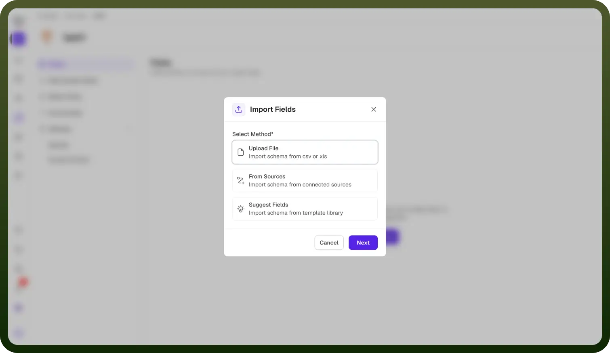
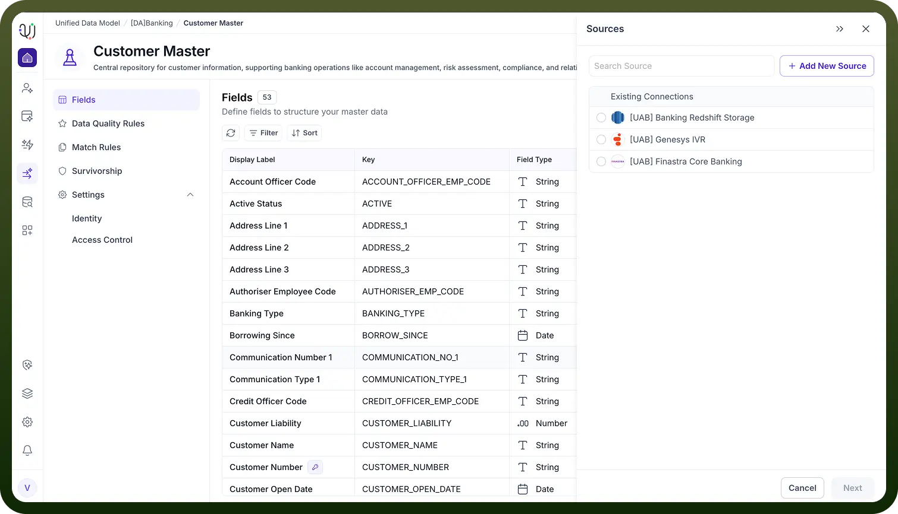

# Import Fields using Sources

Source: https://www.unifyapps.com/docs/unify-data/import-field-using-sources
Section: data

---

**Overview**

For organizations with established data warehouses or CRM systems, manually recreating schema definitions field-by-field is redundant and error-prone.

The Import Fields using Sources feature allows you to directly connect your new Entity to an existing external system.

By inspecting the metadata of the source system, UnifyApps can automatically replicate the schema, ensuring that your internal data model stays perfectly synchronized with your external "system of record" (SoR). 
**The Import Process**

This streamlined workflow consists of connecting to a source and selecting the relevant attributes to clone:

2.**Select a Connection**
 A Sources drawer will slide open, displaying a list of Existing Connections that have already been authenticated within your workspace. 
 You can search for a specific source using the search bar or select from the list. 

 As shown in the interface, supported connections can range from enterprise ERPs (e.g., sap_connection_new) to cloud data warehouses (e.g., Snowflake).3. **Establish New Connections**
 If the required source is not yet listed, you can click the + Add New Source button directly from this panel to configure a new integration on the fly without leaving the Entity Designer. 
**Benefits**
