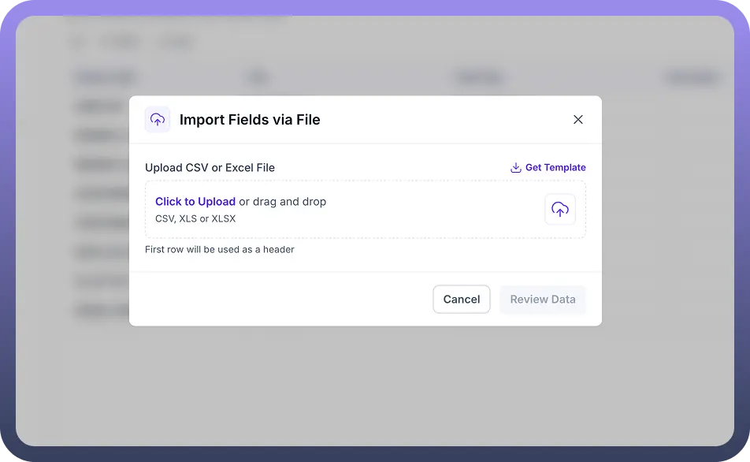

# Import Fields using CSV, XLS files

Source: https://www.unifyapps.com/docs/unify-data/import-fields-using-csv-xls-files
Section: data

---

**Overview**

For teams that manage data definitions in offline spreadsheets or are migrating legacy schemas where a direct API connection isn't feasible, the Upload File method is the optimal solution.

UnifyApps allows you to upload standard spreadsheet formats to bulk-create entity fields.

This feature parses the column headers of your file to automatically generate the corresponding Field Keys and Display Labels in the Entity Designer, significantly reducing the manual effort required to set up large data models.

**The Import Process**

1. **Initiate Import** From the Entity's Fields tab, click the Import Fields button located near the top right of the interface.
2. **Select File Method** In the "Import Fields" modal, select the first option: Upload File. As indicated by the description "Import schema from csv or xls," this method supports both standard comma-separated value files and Excel spreadsheets.

  

3. **File Preparation & Parsing** Before uploading, ensure your file is formatted correct ***fieldName******fieldType******label******description******primaryKey******required******searchable***field_1stringField 1This is a string field that contains field 1 dataFALSETRUEFALSEfield_2numberField 2This is a number field that contains field 2 dataFALSETRUEFALSEfield_3IntegerField 3This is a integer field that contains field 3 dataFALSETRUEFALSEfield_4numberField 4This is a number field that contains field 4 dataFALSETRUETRUEfield_5numberField 5This is a number field that contains field 5 dataFALSEFALSEFALSE**Use Cases**
  - **Legacy Migration:** Quickly recreating a database schema from an exported report of an older system.
  - **Offline Modeling:** allowing data architects to design the schema in Excel and upload it only when finalized.
  - **Bulk Updates:** Adding a large batch of new columns to an existing entity without manual click-throughs
