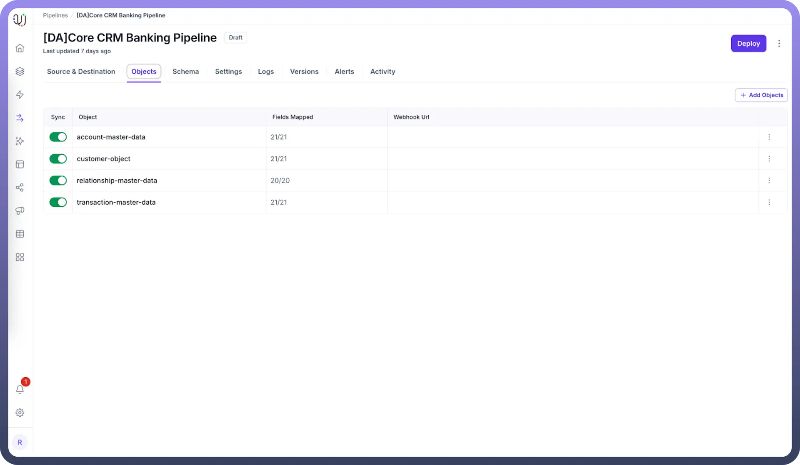
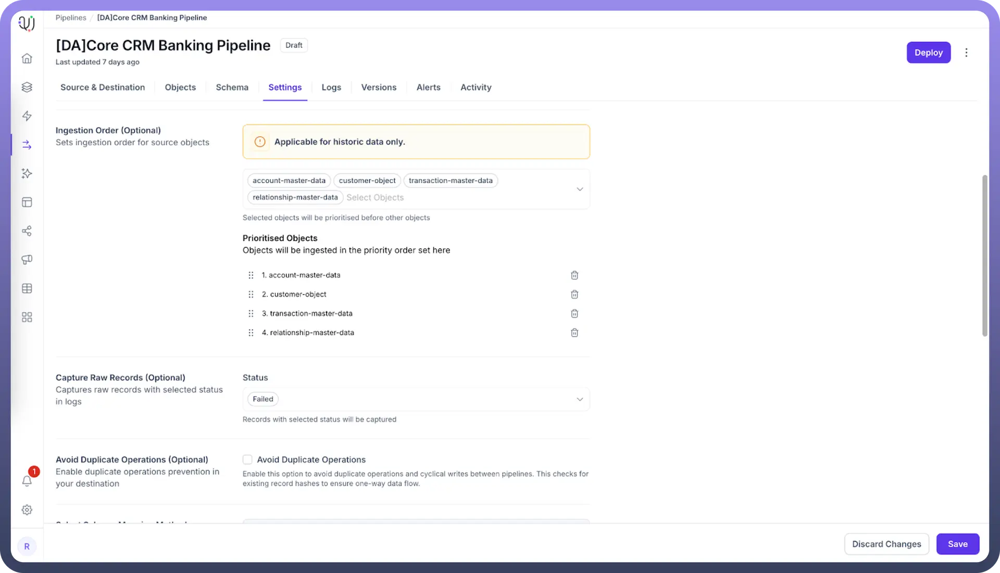

# Ingestion Order Setting for Priority-based Multi-entity Mapping

Source: https://www.unifyapps.com/docs/unify-data/ingestion-order-setting-for-priority-based-multi-entity-mapping
Section: data

---

Priority-based Multi-entity mapping allows UnifyApps data pipelines to process multiple source entities in a specific order, ensuring that dependencies between data sets are maintained during ingestion operations. This setting is only applicable to historical data processing.

## Ingestion Order Configuration for Data Dependencies

When configured, UnifyApps implements a priority-based system that enables:

- **Sequential processing** of interdependent data sources
- **Dependency resolution** for complex data relationships
- **Consistent data loading** patterns across pipeline executions

## Configuring Ingestion Order Settings in Pipeline Configuration

Lets say you have the below objects selected in the Objects Tab of your pipeline.

To enable priority-based ingestion ordering in your UnifyApps data pipeline:

1. Go to the `Settings` tab.
2. Under the `Ingestion Order (Optional)` settings, select the entities that require specific processing priorities.
3. Reorder the objects by clicking and dragging on the `Grab Handle` icon.
4. Assign numeric priority values to each entity (lower numbers = higher priority).
5. Save your pipeline configuration.

## How Ingestion Order Works

Let's walk through a simple example to demonstrate how ingestion order settings operate during data replication:

### Example: E-commerce Data Sources

**Source Entities - Initial Configuration**

| **Entity Name** | **Contains** | **Dependencies** |
|---|---|---|
| CUSTOMERS | Customer accounts | None |
| ORDERS | Customer purchase orders | Depends on CUSTOMERS |
| ORDER_ITEMS | Line items for each order | Depends on ORDERS |

**Day 1: Implementing Priority-based Ingestion**

With Ingestion Order settings enabled:

**Configured Ingestion Order (Priority-based)**

| **Entity Name** | **Priority** | **Processing Order** |
|---|---|---|
| CUSTOMERS | 1 | First |
| ORDERS | 2 | Second |
| ORDER_ITEMS | 3 | Third |

**Day 3: Adding a New Entity**

Two days later, a new PROMOTIONS entity is added to the source:

**Updated Source Entities**

| **Entity Name** | **Contains** | **Dependencies** |
|---|---|---|
| CUSTOMERS | Customer accounts | None |
| ORDERS | Customer purchase orders | Depends on CUSTOMERS |
| ORDER_ITEMS | Line items for each order | Depends on ORDERS |
| PROMOTIONS | Discount codes applied to orders | Depends on ORDERS |

**Day 3: Updated Ingestion Order**

When the pipeline configuration is updated:

**Updated Ingestion Order**

| **Entity Name** | **Priority** | **Processing Order** |
|---|---|---|
| CUSTOMERS | 1 | First |
| ORDERS | 2 | Second |
| PROMOTIONS | 3 | Third |
| ORDER_ITEMS | 4 | Fourth |

Notice the key adjustments:

- PROMOTIONS is inserted with priority 3
- ORDER_ITEMS is moved to priority 4 to respect the new dependency chain
- All entities maintain their proper processing sequence despite the addition

## Practical Use Cases for Ingestion Order

1. **Hierarchical Data Structures** When dealing with parent-child relationships: `-- First load departments SELECT * FROM departments; -- Then load employees that reference departments SELECT * FROM employees; -- Finally load employee_performance that references employees SELECT * FROM employee_performance;`
2. **Transactional Data with Lookups** For financial transactions with reference data: `-- First load account reference data SELECT * FROM accounts; -- Then load transaction headers SELECT * FROM transactions; -- Finally load transaction details SELECT * FROM transaction_line_items;`
3. **Event Sequence Processing** For time-series data that builds on previous events: `-- First load base customer profiles SELECT * FROM customers; -- Then load customer status changes SELECT * FROM customer_status_history; -- Finally load customer interactions SELECT * FROM customer_interactions;`

By implementing priority-based ingestion ordering, you ensure that interdependent historical data is processed in the correct sequence, preventing referential integrity issues and maintaining data consistency across your entire data pipeline process. Remember that this setting only applies to historical data loads and does not affect incremental or real-time data processing.
