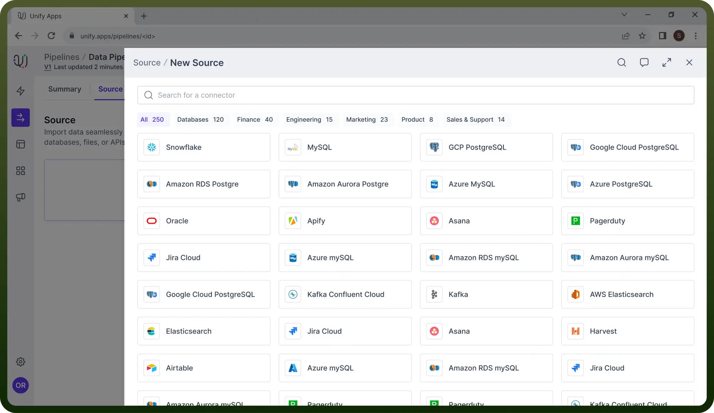
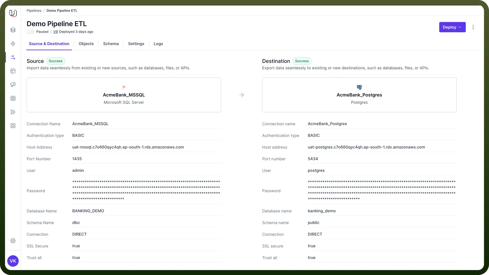
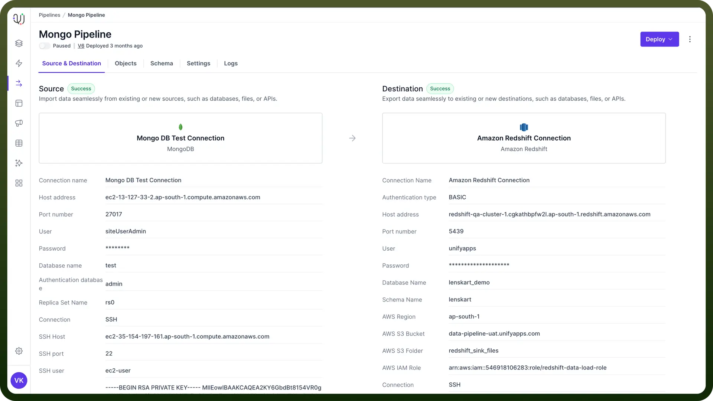
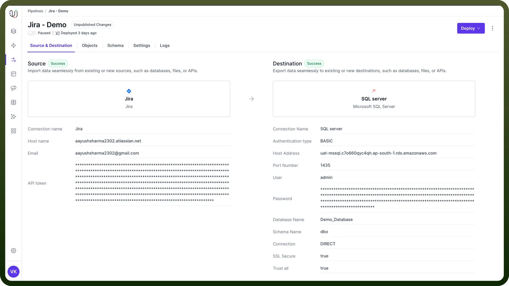
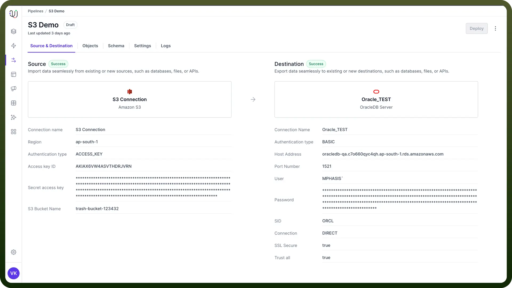
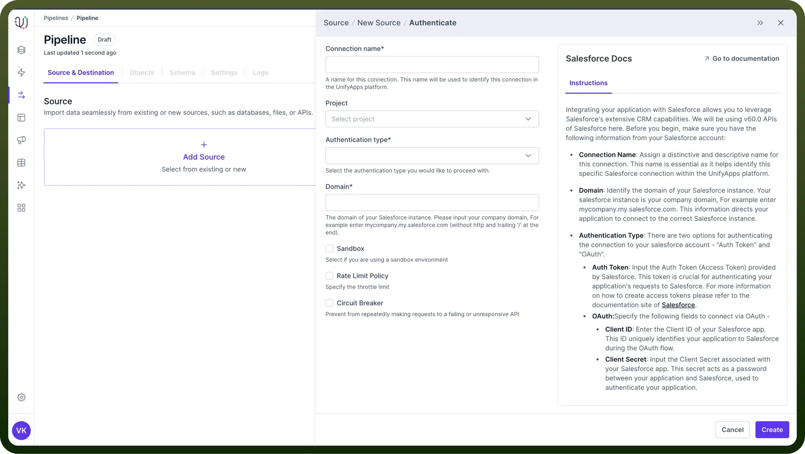

# Introduction to Data Pipeline Connectors

Source: https://www.unifyapps.com/docs/unify-data/introduction-to-data-pipeline-connectors
Section: data

---

Data pipeline connectors are essential components for integrating various databases/applications to data pipelines. This introduction will provide an overview of data pipeline connectors, their importance, and key features.

## Connection Types

UnifyData supports several connection types, allowing integration with various data sources:

1. **Relational Databases:** These include relational databases like MySQL, PostgreSQL, Oracle, and Microsoft SQL Server.

  

2. **NoSQL Databases:** These include connectors for NoSQL databases such as MongoDB, Cassandra, and Couchbase. This is useful for handling unstructured and semi-structured data that doesn't fit well in traditional relational database models.

  

3. **APIs and Web Services:** UnifyData utilizes RESTful APIs and SOAP web services to fetch data from various applications and online platforms. This enables real-time data integration from web-based services and applications.

  

4. **Data Lakes:** UnifyData allows connecting to data lakes such as Amazon Redshift and Snowflake. This allows for transferring data from multiple applications / databases to store in a data lake.

  

5. **File-based Systems:** These include connection to local file systems, FTP servers, SFTP locations and storage systems like Amazon S3. This enables processing of data stored in various file formats such as CSV, JSON, and XML, which are common for data exchange and storage.

## Steps to Set Up a Connection

1. **Select the Data Source**:
  - Browse through the list of available applications/databases.
  - Use the search function if needed to quickly find your desired data source.
  - Click on the data source you want to connect to.
2. **Fill Out the Connection Form**:
  - Once you've selected a data source, you'll be presented with a connection form specific to that source.
  - The form fields will vary depending on the type of data source. You may need to provide:
    - For databases: server address, port number, database name, username, password
    - For cloud services: account credentials, API keys, region information

      

    - For applications: OAuth credentials, endpoint URLs, authentication tokens
  - Fill out all required fields with accurate information.
  - Some forms may have optional fields for advanced configuration. Fill these out if needed for your specific use case.
3. **Save and Test Connection**:
  - Once the connection test is successful, you can save the connection.
  - Click the '`Create`' button to finalize the connection setup.
  - The new connection will now be available for use in your data pipeline.

## Best Practices

1. **Ensure Proper Access and Security**:
  - When connecting to external data sources, verify you have the necessary permissions and credentials.
  - Follow security best practices:
    - Use encrypted connections where possible
    - Implement proper access controls
2. **Regular Maintenance and Monitoring**:
  - Continuously monitor your connections and pipelines for performance and reliability.
  - Set up alerts for critical failures or performance degradation.
  - Regularly review and update your configurations to adapt to changes in data sources or business requirements.
