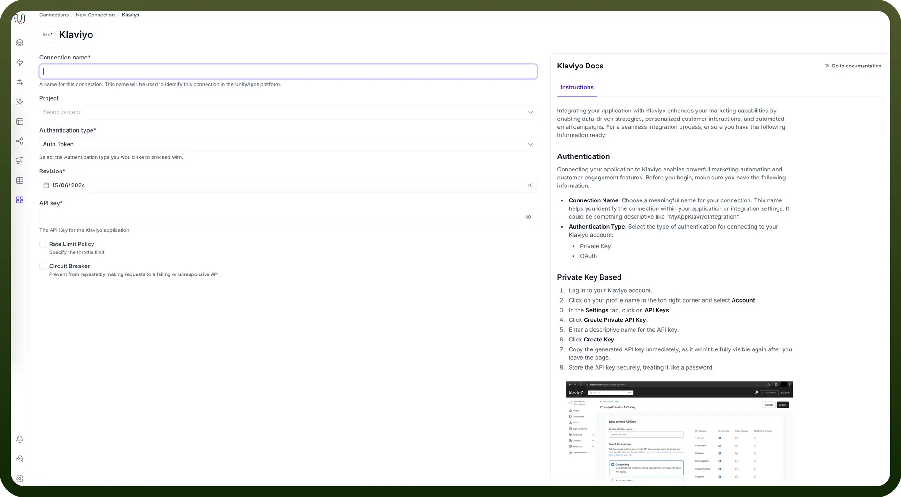
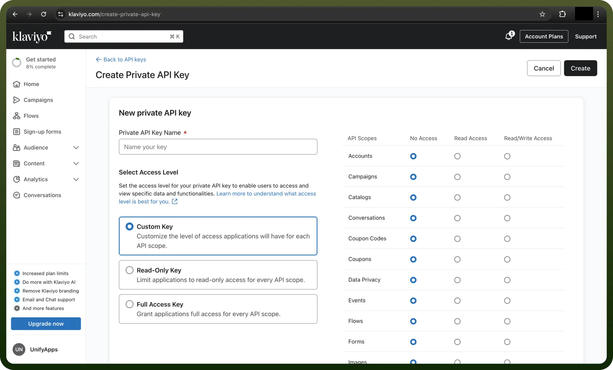
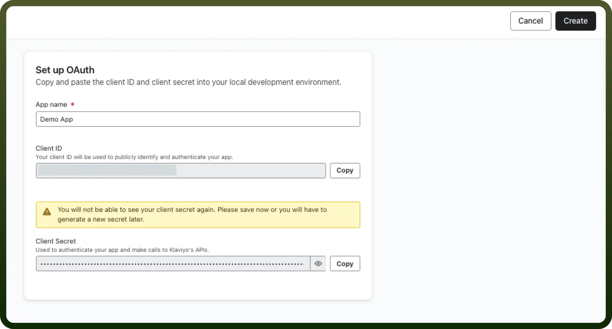
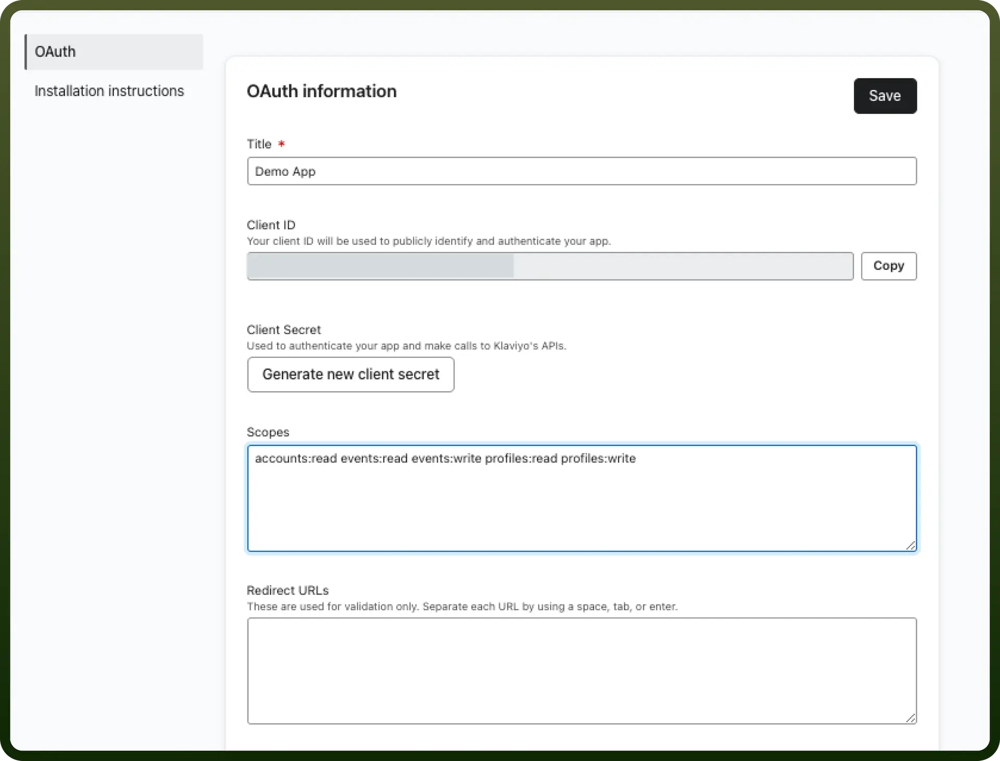
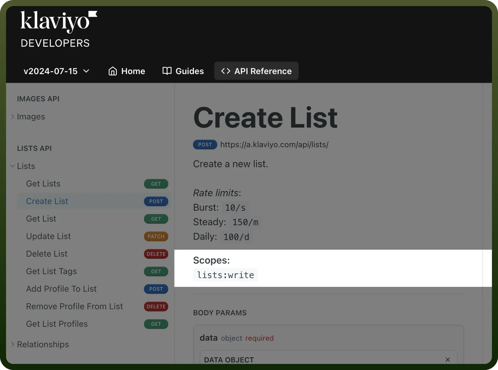

# Klaviyo as source

Source: https://www.unifyapps.com/docs/unify-data/klaviyo-as-source
Section: data

---

UnifyApps enables seamless integration with Klaviyo as a source for your data pipelines. This article covers essential configuration elements and best practices for connecting to Klaviyo sources.

## Overview

Klaviyo is a powerful customer data and marketing automation platform that helps businesses enhance their marketing capabilities by enabling data-driven strategies, personalized customer interactions, and automated email campaigns. UnifyApps provides native connectivity to extract data from Klaviyo efficiently and securely, supporting both historical data loads and continuous data synchronization.

## Connection Configuration

| **Parameter** | **Description** | **Example** |
|---|---|---|
| `Connection Name` | Descriptive identifier for your connection | "MyAppKlaviyoIntegration" |
| `Revision` | API revision date to use | "15/06/2024" |

## Authentication Methods

UnifyApps supports three authentication methods for Klaviyo:

### 1. Auth Token (Private API Key)

| **Parameter** | **Description** | **Example** |
|---|---|---|
| `API Key` | Private API key from Klaviyo | "pk_abcdef1234567890abcdef1234567890" |

**How to obtain a Private API Key:**

1. Log in to your Klaviyo account
2. Click on your profile name in the top right corner and select `Account`
3. In the `Settings` tab, click on '`API Keys'`
4. Click `Create Private API Key`
5. Enter a descriptive name for the API key
6. Click '`Create Key``'`
7. Copy the generated API key immediately, as it won't be fully visible again after you leave the page
8. Store the API key securely, treating it like a password

### 2. OAuth Authentication

| **Parameter** | **Description** | **Example** |
|---|---|---|
| `Revision` | API revision date | "15/06/2024" |
| `Callback URL` | OAuth authentication callback URL | "https://webhooks-global.ext-alb.uat.unifyapps.com/api/connector-auth-callback/oauth" |
| `Scopes` | Required API access permissions | Select appropriate scopes for your integration |

**How to set up OAuth authentication:**

1. Navigate to the **Manage apps** page in Klaviyo
2. Select **Create app** to create your new application
3. Name your application
4. Securely save your **client secret** and **client ID** (you won't be able to view your client secret again)
5. After creating your app, click **Continue** to continue setting up your OAuth app
6. Specify which scopes your app needs (using a space-separated list)
7. Add the callback URL from UnifyApps to your **Redirect URLs/Callback URLs** list

**Available Scopes:** For UnifyApps integration, the following read scopes are typically needed:

- `campaigns:read` - Access campaign data
- `events:read` - Access event data
- `flows:read` - Access flow automation data
- `lists:read` - Access list data
- `profiles:read` - Access profile data
- `templates:read` - Access template data

Additional available scopes include:

- Account management: `accounts:read`, `accounts:write`
- Audience management: `audiences:read`, `audiences:write`
- Catalog management: `catalogs:read`, `catalogs:write`
- Consent management: `consents:read`, `consents:write`
- Data privacy: `data_privacy:read`, `data_privacy:write`
- Metrics: `metrics:read`
- Segments: `segments:read, segments:write`
- Tags: `tags:read`, `tags:write`
- Subscriptions: `subscriptions:read`, `subscriptions:write`
- Tracking settings: `tracking-settings:read`, `tracking-settings:write`
- Reviews: `reviews:read`

Specify only the scopes your integration requires, following the principle of least privilege.

#### 3. OAuth with Client Credentials

| **Parameter** | **Description** | **Example** |
|---|---|---|
| `Revision` | API revision date | "15/06/2024" |
| `Client ID` | OAuth application client identifier | "client_abcdef1234567890" |
| `Client Secret` | OAuth application client secret | "cs_abcdef1234567890abcdef" |
| `Callback URL` | OAuth authentication callback URL | "https://webhooks-global.ext-alb.uat.unifyapps.com/api/connector-auth-callback/oauth" |
| `Scopes` | Required API access permissions | Select appropriate scopes for your integration |

**Note on Scopes:** For OAuth with Client Credentials, you'll need to specify the same types of scopes as with standard OAuth authentication. The scopes you select determine what data your integration can access from Klaviyo. For a source connection that only reads data, you should typically focus on the read scopes for the entities you need to extract.

## Supported Entities

UnifyApps can extract data from the following Klaviyo entities:

| **Entity** | **Description** | **Common Use Cases** |
|---|---|---|
| `Email Campaign` | Email marketing campaigns | Campaign performance analysis, content effectiveness tracking |
| `Event` | Customer interactions and behaviors | Customer journey analysis, engagement tracking |
| `Flow` | Automated marketing workflows | Automation performance analysis, conversion path optimization |
| `List` | Customer segmentation lists | Audience analysis, segmentation effectiveness |
| `Profile` | Customer profiles and attributes | Customer data enrichment, demographic analysis |
| `SMS Campaign` | SMS marketing campaigns | Mobile engagement analysis, SMS performance tracking |
| `Template` | Email and message templates | Content performance analysis, template usage tracking |

## Data Synchronization Method

UnifyApps implements cursor-based pagination polling for all Klaviyo entities:

- Efficiently handles large datasets with thousands of records
- Maintains proper ordering during incremental extraction
- Implements exponential backoff strategy to avoid hitting API rate limits
- Automatically retries failed requests with increasing wait times
- Ensures consistent data extraction across all entities

## CRUD Operations Tracking

When tracking changes from Klaviyo sources:

| **Operation** | **Support** | **Notes** |
|---|---|---|
| `Create` | ✓ Supported | New record insertions are detected |
| `Read` | ✓ Supported | Data retrieval via Klaviyo API |
| `Update` | ✓ Supported | Updates are detected as new inserts with the updated values |
| `Delete` | ✗ Not Supported | Delete operations cannot be detected |

**Note**: Due to limitations in the Klaviyo API, update operations appear as new inserts in the destination, and delete operations are not tracked. Consider this when designing your data synchronization strategy.

## Ingestion Modes

| **Mode** | **Description** | **Business Use Case** |
|---|---|---|
| `Historical and Live` | Loads all existing data and captures ongoing changes | Marketing platform migration with continuous customer data synchronization |

## Common Business Scenarios

**Customer Data Integration**

- Extract profile and event data from Klaviyo
- Combine with data from other systems for a unified customer view
- Enable 360-degree customer insights for personalized marketing

**Marketing Performance Analysis**

- Synchronize campaign, flow, and event data
- Measure effectiveness across email and SMS channels
- Calculate ROI for different marketing initiatives

**Segmentation Strategy Optimization**

- Extract list and profile data
- Analyze segment performance and engagement patterns
- Refine targeting strategies based on historical performance

**Automation Workflow Enhancement**

- Monitor flow performance and conversion rates
- Identify bottlenecks in customer journeys
- Optimize multi-step nurture sequences

## Best Practices

| **Category** | **Recommendations** |
|---|---|
| `Performance` | Schedule extractions during off-peak hours Prioritize critical entities for more frequent syncing Use incremental loading for high-volume events |
| `Data Quality` | Regularly validate profile data synchronization Ensure consistent handling of custom properties Maintain proper event tracking taxonomy |
| `Security` | Use OAuth for enhanced security where possible Restrict API token permissions to read-only access Rotate credentials periodically |
| `Monitoring` | Set up alerts for synchronization failures Monitor API rate limits to prevent throttling Track data volume changes for anomaly detection |

## Limitations and Considerations

- **API Rate Limits**: Klaviyo enforces rate limits based on your plan. UnifyApps uses exponential backoff to automatically handle rate limiting, but consider this when scheduling multiple concurrent extractions.
- **Historical Event Data**: Consider data volume when extracting historical events, as active accounts may have millions of events.
- **Update Detection**: Since updates appear as new records, implement business logic to handle duplicates.
- **Custom Properties**: Klaviyo allows custom properties on profiles and events. Ensure your schema can accommodate these flexible attributes.
- **Data Retention**: Klaviyo may have different retention periods for different entities. Consider this when planning historical data extraction.

By properly configuring your Klaviyo source connections and following these guidelines, you can ensure reliable, efficient data extraction while meeting your business requirements for marketing automation and customer data analysis.
