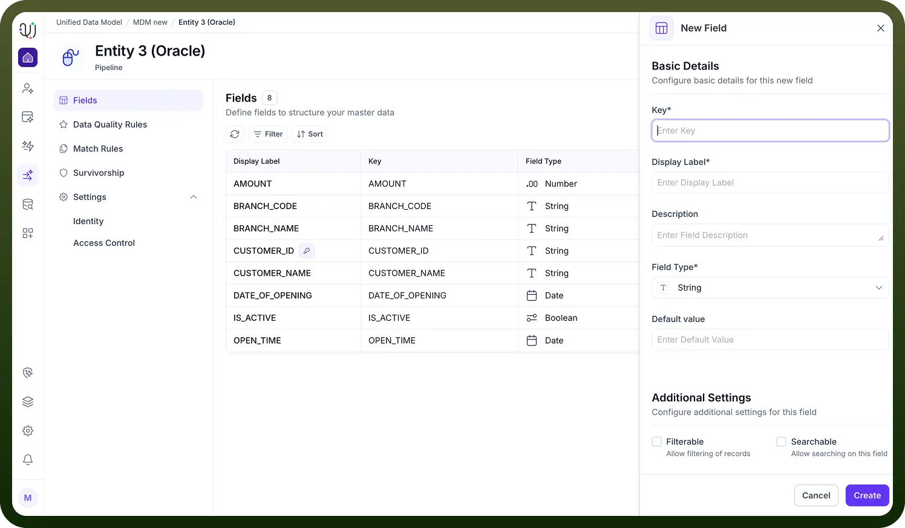

# Manual Field Creation

Source: https://www.unifyapps.com/docs/unify-data/manual-field-creation
Section: data

---

**Overview**

While importing fields from external sources is efficient for bulk schema generation, Manual Field Creation offers the highest level of granular control over your data model.

This method is essential when defining custom business logic, creating internal identifiers, or establishing fields that do not exist in any upstream source system.

Through the New Field configuration panel, you can explicitly define every attribute of a data point, from its data type to its security properties and search behaviors. 
**The Configuration Process**

To initiate this process, navigate to the Fields tab of your Entity and click the + Add Field button.

The configuration is divided into two strategic sections:

1. **Basic Details** This section defines the core identity and structural format of the field.
- **Key:** The unique, machine-readable identifier for the field (e.g., customer_id ). This key is used in API calls and internal references.
- **Display Label:** The human-readable name that appears in the user interface and reports (e.g., "Customer ID").
- **Description:** An optional field to document the purpose of the data point for other developers or data stewards.
- **Field Type:** Specifies the data format. Common options include **String**, **Integer**, **Date**, and **Boolean**.
- **Default Value:** Allows you to set a static value that will be automatically populated if the incoming data record is null or missing this attribute. 2. **Additional Settings** These settings control how the UnifyApps platform indexes, validates, and secures the data stored in this field.

  

- **Filterable:** Enables this field to be used as a filter criteria in dashboards and queries (e.g., "Show all records where Status = Active").
- **Searchable:** Indexes the field for full-text search, allowing users to find records by typing values contained within this field.
- **Hashable:** Applies a cryptographic hash to the data. This is often used for high-performance matching algorithms where exact text comparison is costly.
- **Sortable:** Allows lists and reports to be ordered in ascending or descending order based on the values in this field.
- **Primary Key:** Designates this field as the unique identifier for the record. Every Entity must have at least one Primary Key to ensure data integrity.
- **Is Required:** Enforces a validation rule that prevents records from being saved if this field is empty.
- **Secure Field:** Encrypts the data at rest. This is critical for handling Sensitive Personal Information (SPI) or Personally Identifiable Information (PII) to ensure compliance with privacy regulations.
