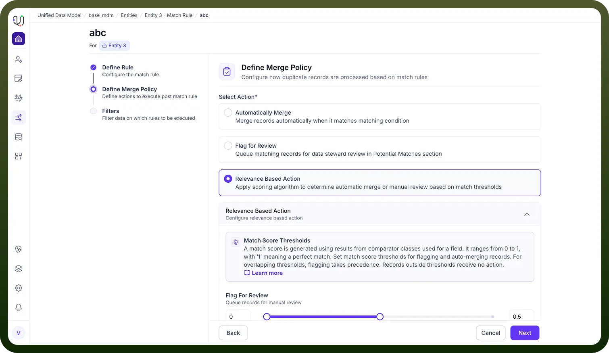

# Match Rule Outcomes

Source: https://www.unifyapps.com/docs/unify-data/match-rule-outcomes
Section: data

---

**Overview**

After defining the criteria for identifying duplicate records (the "Match Rule"), the next critical step is establishing the Merge Policy.

The Merge Policy dictates the specific action the system should take once a match is detected.

UnifyApps provides three distinct outcome strategies, allowing you to balance automation efficiency with data governance control.

1. **Automatically Merge** This is the "hands-off" approach designed for high-confidence matches. When selected, the system will merge records automatically as soon as they satisfy the matching condition. Best Use Case: This is ideal for deterministic rules, such as matching on a unique identifier (e.g., Social Security Number or Email Address), where the likelihood of a false positive is virtually zero.
2. **Flag for Review** This outcome prioritizes human oversight over speed. Instead of merging data immediately, the system will queue matching records for data steward review within the "Potential Matches" section. Best Use Case: Suitable for "fuzzy" matching rules (e.g., matching on Name + City) where there is a risk of linking two different people who happen to share similar attributes. A Data Steward can then visually inspect and approve or reject the merge.

  

3. **Precedence:** If your configured thresholds overlap, the "Flagging" action takes precedence to prevent accidental incorrect merges.
  1. **Relevance Based Action** This is a hybrid, intelligent strategy that applies a scoring algorithm to determine the action dynamically. How It Works:
  2. **Scoring:** The system generates a match score ranging from **0 to 1** (where '1' represents a perfect match) based on the comparator classes used for the field.
  3. **Threshold Configuration:** You can configure specific score ranges to define behavior:
  - **Flag Range:** Lower scores (e.g., 0.5 to 0.8) can be set to "Flag for Review," requiring human confirmation.
  - **Merge Range:** Higher scores (e.g., 0.9 to 1.0) can be set to "Auto-Merge," trusting the high degree of similarity.
