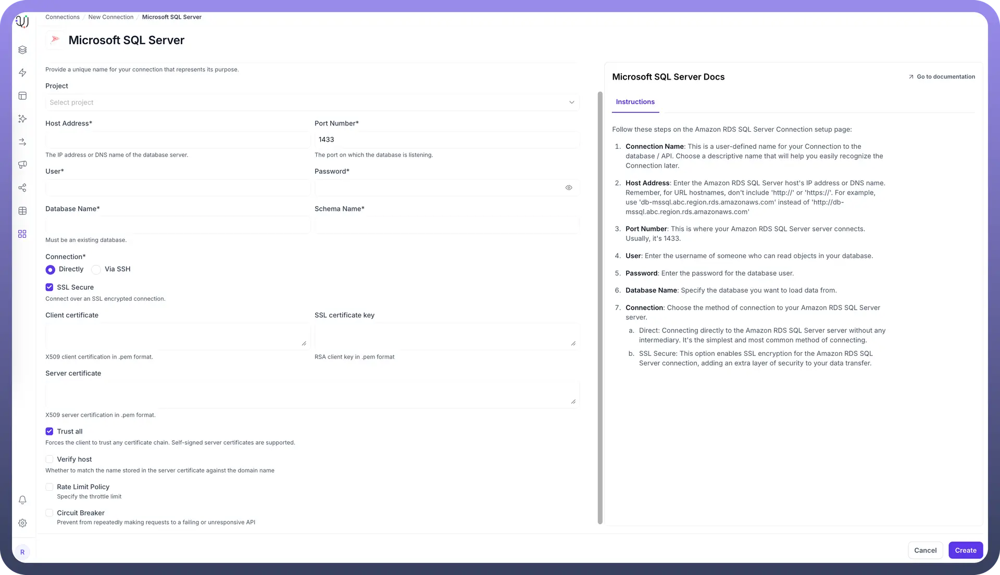

# Microsoft SQL Server as Destination

Source: https://www.unifyapps.com/docs/unify-data/microsoft-sql-server-as-destination
Section: data

---

UnifyApps enables seamless integration with Microsoft SQL Server databases as a destination for your data pipelines. This article covers essential configuration elements and best practices for connecting to MSSQL destinations.

## Overview

Microsoft SQL Server is widely used for enterprise applications including business intelligence, transaction processing, and analytics platforms. UnifyApps provides native connectivity to load data into these MSSQL environments efficiently and securely.

## Connection Configuration



| **Parameter** | **Description** | **Example** |
|---|---|---|
| `Connection Name` | Descriptive identifier for your connection | "Production MSSQL CRM" |
| `Host Address` | MSSQL server hostname or IP address | "mssqldb-prod.xxxx.database.windows.net" |
| `Port Number` | Database listener port | 1433 (default) |
| `User` | Database username with write permissions | "unify_writer" |
| `Password` | Authentication credentials | "********" |
| `Database Name` | Name of your MSSQL database | "CustomerDB" |
| `Schema Name` | Schema containing your destination tables | "dbo" (default) |
| `Connection Type` | Method of connecting to the database | Direct or SSH Tunnel |

To set up a MSSQL destination, navigate to the Connections section, click New Connection, and select Microsoft SQL Server. Fill in the parameters above based on your MSSQL environment details.

For SSH tunnel connections, additional parameters are required:

- `SSH Host`**:** Hostname or IP address of the SSH server
- `SSH Port`**:** Port for SSH connections (default 22)
- `SSH User`**:** Username for SSH authentication
- `SSH Authentication`**:** Password or key-based authentication

## Destination Settings Configuration

UnifyApps provides flexible configuration options for MSSQL destinations through the Settings tab in Data Pipelines:

**Destination Timezone (Optional)**


The Destination Timezone setting in the Pipeline Settings tab allows you to adjust the timezone of date and time fields when loading data to your destination.

**Key Features:**

- **Adjust timezone of date time fields when loading data to destination**
- **Define destination timezone** (e.g., Asia/Kolkata, UTC) to adjust timezone of date time fields when loading data
- **Maintain temporal consistency** across different geographic locations and systems

**Configuration Steps:**

1. Navigate to your Data Pipeline
2. Open the `Settings` tab
3. Locate the "`Destination Timezone (Optional`)" section
4. Select your desired timezone from the dropdown menu
5. The system will automatically convert timestamp data from the source timezone to your specified destination timezone during the loading process

**Benefits:**

- **Geographic Consistency:** Ensure date/time data reflects the correct local time for your destination system
- **Business Logic Alignment:** Align timestamps with business operations in specific time zones
- **Reporting Accuracy:** Maintain accurate temporal data for region-specific reporting and analytics
- **Compliance Support:** Meet regulatory requirements for timestamp accuracy in specific jurisdictions

This setting is particularly useful when loading data from sources in different time zones or when your destination system serves users in a specific geographic region.

## CRUD Operations Support

All database operations to MSSQL destinations are supported and logged as unique actions:

| **Operation** | **Description** | **Business Value** |
|---|---|---|
| `Create` | New record insertions | Enable data growth and pipeline expansion |
| `Read` | Data retrieval for validation | Support data quality checks and monitoring |
| `Update` | Record modifications | Maintain data accuracy and freshness |
| `Delete` | Record removals | Support data lifecycle management and compliance |

This comprehensive logging supports audit requirements and troubleshooting efforts.

## Supported Data Types

| **Category** | **Supported Types** |
|---|---|
| `Integer` | tinyint, smallint, int, bigint, bit |
| `Decimal` | numeric, decimal, money, smallmoney, float, real |
| `Date/Time` | date, time, datetime, datetime2, datetimeoffset, smalldatetime |
| `String` | char, varchar, text, nchar, nvarchar, ntext |
| `Binary` | binary, varbinary |
| `Specialized` | sql_variant, uniqueidentifier, rowversion |
| `JSON` | json |

All common MSSQL data types are supported, including specialized types for transactional systems and modern applications.

### Special Considerations for rowversion Data Type

The **rowversion** (also known as timestamp) data type is particularly important for data synchronization scenarios:

**Key Characteristics:**

- Automatically generated binary value that uniquely identifies row modifications
- Changes whenever the row is inserted or updated
- Essential for optimistic concurrency control and change tracking

**Common Use Cases:**

- **Data Synchronization:** Use rowversion columns to identify which records have been modified since the last sync operation
- **Conflict Detection:** Implement optimistic locking mechanisms to detect concurrent modifications
- **Incremental Loading:** Efficiently identify changed records for delta synchronization without maintaining separate audit columns
- **ETL Optimization:** Track the last processed rowversion value to resume data loading from the exact point of interruption
- **Change Data Capture:** Build custom CDC solutions by comparing rowversion values between source and destination

## Prerequisites and Permissions

To establish a successful MSSQL destination connection, ensure:

- Access to an active MSSQL Server instance
- Minimum required role: "db_datawriter" on the target database
- Recommended permissions: INSERT, UPDATE, DELETE on relevant tables
- CREATE TABLE permissions for dynamic table creation
- Proper network connectivity and firewall rules

### Additional Permissions for Advanced Operations

For comprehensive data loading capabilities:

```
-- Grant data modification permissions
GRANT INSERT, UPDATE, DELETE ON SCHEMA::dbo TO [unify_writer];
-- Grant table creation permissions
GRANT CREATE TABLE TO [unify_writer];
-- Grant schema permissions
GRANT ALTER ON SCHEMA::dbo TO [unify_writer];
-- For bulk operations
GRANT ADMINISTER BULK OPERATIONS TO [unify_writer];
```

## Common Business Scenarios

**Customer Data Loading**

- Load customer records into MSSQL CRM databases
- Ensure proper handling of nullable fields and relationships
- Maintain customer hierarchies and related entities
- Support upsert operations for customer data synchronization

**Financial Data Integration**

- Load transaction data into MSSQL financial systems
- Configure date/time handling for fiscal period accuracy
- Implement data validation for financial integrity
- Support batch processing for end-of-day reconciliation

**Product Catalog Management**

- Load product catalog and inventory updates into MSSQL
- Handle high-volume product attribute changes
- Maintain product hierarchies and category relationships
- Support real-time inventory level updates

**Analytics and Reporting**

- Populate data marts for business intelligence tools
- Load aggregated data for reporting dashboards
- Support historical data loading for trend analysis
- Enable cross-functional reporting across departments

## Best Practices

**Performance Optimization**

- **Batch Operations:** Use bulk insert operations for large datasets to improve performance
- **Indexing Strategy:** Ensure destination tables have appropriate indexes for write operations
- **Connection Pooling:** Leverage connection pooling for high-frequency data loads
- **Transaction Management:** Use appropriate transaction sizes to balance performance and recovery
- **Partitioning:** Consider table partitioning for very large destination tables

**Security Considerations**

- **Least Privilege:** Create database users with minimum required permissions for write operations
- **Network Security:** Use SSH tunneling for databases in protected networks
- **Credential Management:** Secure credentials using enterprise password policies and rotation
- **Audit Logging:** Enable database audit logging for compliance and security monitoring
- **Data Masking:** Implement data masking for sensitive information in non-production environments

**Data Governance**

- **Schema Management:** Document destination schema designs and data mappings
- **Data Lineage:** Maintain comprehensive data lineage documentation for compliance
- **Quality Assurance:** Implement data validation rules and quality checks
- **Change Management:** Establish proper change control procedures for schema modifications
- **Monitoring:** Set up alerts for pipeline failures and data quality issues

**Optimization Strategies**

- **Table Design:** Design destination tables with appropriate data types and constraints
- **Bulk Operations:** Configure bulk insert settings for optimal performance
- **Error Handling:** Implement robust error handling and retry mechanisms
- **Monitoring:** Use SQL Server performance counters to monitor load operations
- **Maintenance:** Schedule regular maintenance tasks like index rebuilding and statistics updates

**Connection Management**

- **Connection Limits:** Monitor and manage database connection limits
- **Timeout Settings:** Configure appropriate timeout values for large data loads
- **Retry Logic:** Implement intelligent retry logic for transient connection failures
- **Health Checks:** Regular connection health monitoring and validation

## Data Loading Patterns

**Real-time Loading**

- Support for continuous data streaming into MSSQL tables
- Low-latency data updates for operational systems
- Event-driven data loading based on source changes

**Batch Loading**

- Scheduled batch operations during maintenance windows
- High-volume data processing with optimal resource utilization
- Support for complex data transformations during loading

**Incremental Loading**

- Delta-based loading to minimize data transfer and processing
- Change tracking integration for efficient incremental updates
- Conflict resolution strategies for concurrent data modifications

By properly configuring your MSSQL destination connections and following these guidelines, you can ensure reliable, efficient data loading while meeting your business requirements for data timeliness, completeness, and compliance.

UnifyApps integration with Microsoft SQL Server enables you to leverage your enterprise database as a powerful destination for analytics, operational intelligence, and business process automation workflows.
