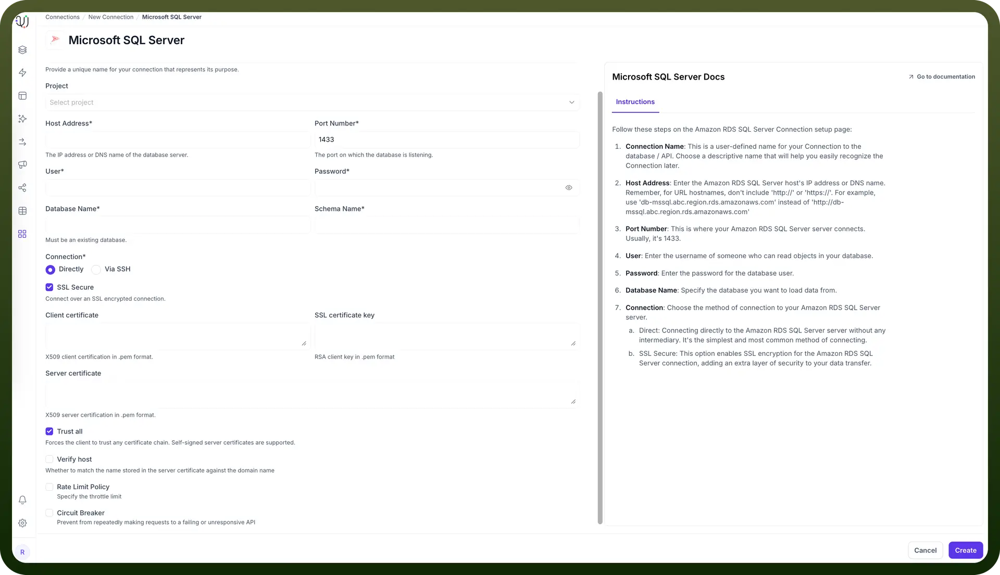
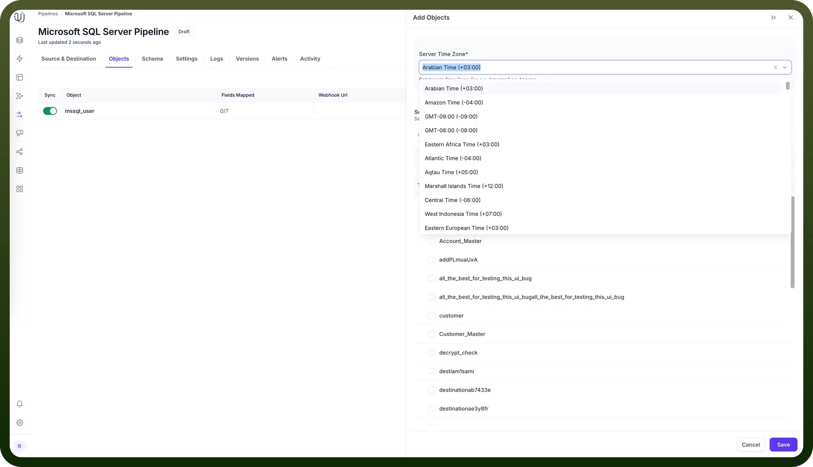

# Microsoft SQL Server as Source

Source: https://www.unifyapps.com/docs/unify-data/microsoft-sql-server-as-source
Section: data

---

UnifyApps enables seamless integration with Microsoft SQL Server databases as a source for your data pipelines. This article covers essential configuration elements and best practices for connecting to MSSQL sources.

## Overview

Microsoft SQL Server is widely used for enterprise applications including business intelligence, transaction processing, and analytics platforms. UnifyApps provides native connectivity to extract data from these MSSQL environments efficiently and securely.

## Connection Configuration

| **Parameter** | **Description** | **Example** |
|---|---|---|
| `Connection Name` | Descriptive identifier for your connection | "Production MSSQL CRM" |
| `Host Address` | MSSQL server hostname or IP address | "mssqldb-qa.xxxx.database.windows.net" |
| `Port Number` | Database listener port | 1433 (default) |
| `User` | Database username with read permissions | "unify_reader" |
| `Password` | Authentication credentials | "********" |
| `Database Name` | Name of your MSSQL database | "CustomerDB" |
| `Schema Name` | Schema containing your source tables | "dbo" (default) |
| `Connection Type` | Method of connecting to the database | Direct or SSH Tunnel |

To set up a MSSQL source, navigate to the Connections section, click New Connection, and select Microsoft SQL Server. Fill in the parameters above based on your MSSQL environment details.

For SSH tunnel connections, additional parameters are required:

- `SSH Host`: Hostname or IP address of the SSH server
- `SSH Port`: Port for SSH connections (default 22)
- `SSH User`: Username for SSH authentication
- `SSH Authentication`: Password or key-based authentication

## Server Timezone Configuration

When adding objects from a MSSQL source, you'll need to specify the database server's timezone. This setting is crucial for proper handling of date and time values.

- In the Add Objects dialog, find the Server Time Zone setting
- Select your MSSQL server's timezone

This ensures all timestamp data is normalized to UTC during processing, maintaining consistency across your data pipeline.

## Ingestion Modes

| **Mode** | **Description** | **Business Use Case** |
|---|---|---|
| `Historical and Live` | Loads all existing data and captures ongoing changes | CRM system migration with continuous synchronization |
| `Live Only` | Captures only new data from deployment forward | Real-time sales dashboard without historical context |
| `Historical Only` | One-time load of all existing data | Financial quarter-end reporting or compliance snapshot |

Choose the mode that aligns with your business requirements during pipeline configuration.

## Change Data Capture (CDC) Requirements

For Historical and Live or Live Only modes that track ongoing changes, CDC must be properly configured:

1. **Database-Level Configuration:** `USE YourDatabaseName; GO EXEC sys.sp_cdc_enable_db;`
2. **Table-Level Configuration:** `EXEC sys.sp_cdc_enable_table @source_schema = N'YourSchemaName', @source_name = N'YourTableName', @role_name = NULL; -- Or specify a role, e.g., N'cdc_role'`
3. **Verification queries:**
  - To check database CDC status: `SELECT name, is_cdc_enabled FROM sys.databases WHERE name = 'YourDatabaseName';`
  - To check table CDC status: `SELECT name, is_tracked_by_cdc FROM sys.tables WHERE is_tracked_by_cdc = 1;`
4. **SQL Server Agent**: Ensure SQL Server Agent is running as it's required for CDC operations.

## CRUD Operations Tracking

All database operations from MSSQL sources are identified and logged as unique actions:

| **Operation** | **Description** | **Business Value** |
|---|---|---|
| `Create` | New record insertions | Track new customer accounts or orders |
| `Read` | Data retrieval actions | Monitor query patterns and data access |
| `Update` | Record modifications | Audit changes to sensitive customer data |
| `Delete` | Record removals | Compliance tracking for record deletion |

This comprehensive logging supports audit requirements and troubleshooting efforts.

## Supported Data Types

| **Category** | **Supported Types** |
|---|---|
| `Integer` | tinyint, smallint, int, bigint, bit |
| `Decimal` | numeric, decimal, money, smallmoney, float, real |
| `Date/Time` | date, time, datetime, datetime2, datetimeoffset, smalldatetime |
| `String` | char, varchar, text, nchar, nvarchar, ntext |
| `Binary` | binary, varbinary |
| `Specialized` | sql_variant, uniqueidentifier, rowversion |
| `JSON` | json |

All common MSSQL data types are supported, including specialized types for transactional systems and modern applications.

## Prerequisites and Permissions

To establish a successful MSSQL source connection, ensure:

- Access to an active MSSQL Server instance
- Minimum required role: "`db_datareader`" on the target database
- Recommended permission: SELECT on relevant tables or views
- Proper network connectivity and firewall rules

## Common Business Scenarios

**Customer Data Integration**

- Extract customer records from MSSQL CRM databases
- Ensure proper handling of nullable fields and relationships
- Map customer hierarchies and related entities

**Financial Reporting**

- Connect to MSSQL financial systems to extract transaction data
- Configure date/time handling for fiscal period accuracy
- Implement data quality checks for financial integrity

**Product Inventory Management**

- Extract product catalog and inventory levels from MSSQL
- Set up incremental sync for high-volume inventory changes
- Ensure proper handling of product hierarchies and attributes

## Best Practices

| **Category** | **Recommendations** |
|---|---|
| `Performance` | Extract only necessary columns to minimize network load Use WHERE clauses to filter large tables Schedule bulk operations during off-hours |
| `Security` | Create read-only MSSQL users with minimum permissions Use SSH tunneling for databases in protected networks Secure credentials using enterprise password policies |
| `Data Governance` | Document source-to-target mappings Maintain data lineage for compliance reporting Set up alerts for pipeline failures |
| `Optimization` | Index frequently queried columns in source tables Properly configure CDC retention Use partitioned tables for very large datasets |

By properly configuring your MSSQL source connections and following these guidelines, you can ensure reliable, efficient data extraction while meeting your business requirements for data timeliness, completeness, and compliance.
