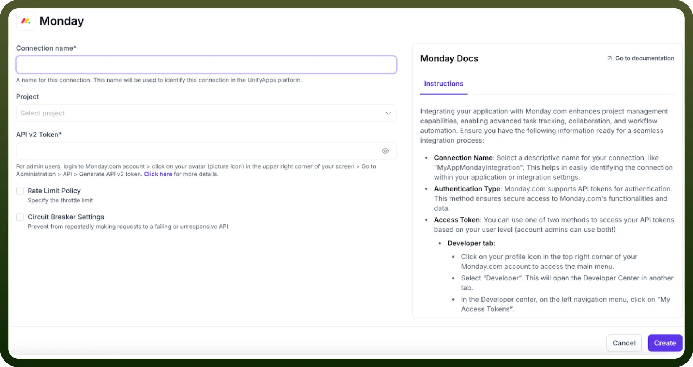
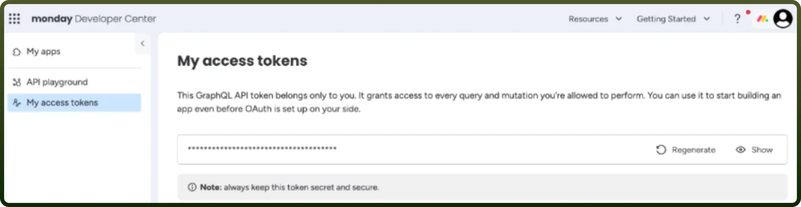

# Monday as Source

Source: https://www.unifyapps.com/docs/unify-data/monday-as-source
Section: data

---

UnifyApps enables seamless integration with Monday as a source for your data pipelines. This article covers essential configuration elements and best practices for connecting to Monday sources.

## Overview

Monday.com is a Work OS for managing projects and workflows with customizable boards, task tracking, and automation. UnifyApps offers secure, native integration with Monday.com, making it easy to extract structured data for analytics or operations.

## Connection Configuration

| **Parameter** | **Description** | **Example** |
|---|---|---|
| `Connection Name*` | Descriptive identifier for your connection | "`MyMondayIntegration`" |

## Authentication Methods

UnifyApps supports authentication for Monday:

**1. API key**

**How to obtain the private keys :**

1. Go to [https://monday.com](https://monday.com) and log into your account.
2. Click on your profile picture in the bottom-left corner.
3. Select “`Admin`” from the dropdown menu (only visible if you are an admin).
4. Navigate to the “`API`” section under the “`Developers`” tab.
5. Click on the “`Generate`” button to create a new API v2 token.
6. Copy the token securely and store it in a safe location—this token will not be shown again.
7. Use the generated token in the Authorization header for API calls: `Authorization: <your_token>`
8. If needed, restrict access to specific scopes or rotate the token periodically for security.

## Supported Entities

| **Entity** | **Description** | **Common Use Cases** |
|---|---|---|
| `Boards` | Visual containers for managing workflows | Project tracking, team collaboration, campaign planning |
| `Items` | Rows or tasks within a board | Task management, status reporting, backlog tracking |
| `Groups` | Sections within boards for organizing items | Sprint planning, prioritization tiers, team-based segmentation |
| `Columns` | Fields that define data attributes for items | Custom workflows, deadline tracking, progress monitoring |
| `Users` | Workspace users and their metadata | Access control, collaboration analysis, usage reporting |
| `Updates` | Comments and activity logs related to items | Team communication insights, accountability tracking |
| `Tags` | Labels attached to items for categorization | Filtering, reporting by topic or team |

## Ingestion Modes

| **Mode** | **Description** | **Business Use Case** |
|---|---|---|
| `Historical and Live` | Loads all existing data and captures ongoing changes | Marketing platform migration with continuous customer data synchronization |

## Common Business Scenarios

1. **Project and Task Reporting** Extract items and board data to build real-time dashboards that track project progress, deadlines, and ownership.
2. **Team Performance Analytics** Analyze updates, status changes, and user activity to monitor workload distribution and productivity across departments.
3. **Cross-Platform Workflow Integration** Sync Monday data with CRMs, ERPs, or helpdesk tools to unify operations across multiple systems.
4. **Resource Allocation Insights** Use group and column data to assess resource commitments, identify bottlenecks, and rebalance tasks.
5. **Process Automation Audits** Track automation triggers, updates, and statuses to refine workflows and reduce manual effort.
6. **Compliance and Change Logs** Extract update logs and item histories for audit trails, change tracking, and regulatory compliance.

## Best Practices

| **Category** | **Recommendations** |
|---|---|
| `Performance` | Use pagination and filtering when querying large boards. Extract data during off-peak hours. |
| `Data Quality` | Normalize column types and custom fields across boards. Validate item structure regularly. |
| `Security` | Use OAuth 2.0 where available. Limit API token access to only required scopes. Rotate tokens periodically. |
| `Monitoring` | Enable logging of sync jobs. Track changes in board structures. Set alerts for API failures or rate limiting. |

## Limitations and Considerations

1. **Rate Limits**: Monday.com enforces a rate limit (default: 10M complexity per minute). Hitting this may pause data extraction; UnifyApps handles retries with exponential backoff.
2. **Deleted Data**: The API does not expose deleted boards, items, or updates, making delete tracking impossible.
3. **Nested Data**: Some data (e.g., column values, subitems) requires nested queries and may need multiple calls to fully extract.
4. **Custom Columns**: Boards can have dynamic/custom columns. Schema changes must be handled adaptively in downstream systems.
5. **Data Consistency**: Since Monday.com does not support webhook-based full data sync for all entities, polling is required for freshness.
6. **Permission Limits**: Access to data is restricted by the token’s user permission. Ensure the token has visibility into all required boards/workspaces.
