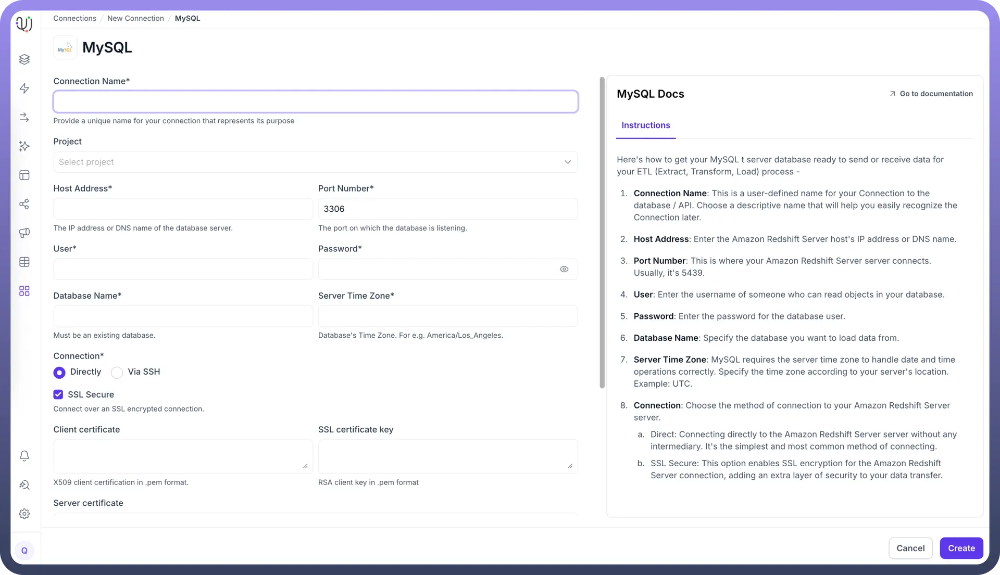

# MySQL as Destination

Source: https://www.unifyapps.com/docs/unify-data/mysql-as-destination
Section: data

---

UnifyApps enables seamless integration with MySQL databases as a destination for your data pipelines. This article covers essential configuration elements and best practices for loading data into MySQL destinations.

## Overview

MySQL is widely used for web applications, online transaction processing, and e-commerce platforms. UnifyApps provides native connectivity to load data into these MySQL environments efficiently and securely, making it ideal for operational databases, web application backends, and real-time data stores.

## Prerequisites

Before configuring MySQL as your destination, ensure you have:

1. **MySQL Server Instance**: Access to an active MySQL Server instance (version 5.6 or later recommended)
2. **Connection Information**: Server hostname/IP address, port number (default 3306), and database name
3. **Authentication Credentials**: MySQL username and password with appropriate privileges
4. **Database Privileges**: The user needs CREATE, INSERT, UPDATE, and DELETE privileges on the target database:`GRANT CREATE, INSERT, UPDATE, DELETE ON `<database_name>`.* TO 'unify_writer'@'%'; FLUSH PRIVILEGES;`
5. **Network Connectivity**: Proper firewall rules allowing access on MySQL port

## Connection Configuration

| **Parameter** | **Description** | **Example** |
|---|---|---|
| `Connection Name`* | Descriptive identifier for your connection | "Production MySQL Data Store" |
| `Project` | Optional project categorization | "Web Application Backend" |
| `Host Address`* | MySQL server hostname or IP address | "mysql-app.example.com" |
| `Port Number`* | Database listener port | 3306 (default) |
| `User`* | Database username with write permissions | "unify_writer" |
| `Password`* | Authentication credentials | "********" |
| `Database Name`* | Name of your target MySQL database | "application_db" |
| `Server Time Zone`* | Database server's timezone | "UTC" |
| `Connection`* | Method of connecting to the database | Direct or Via SSH |

To set up a MySQL destination, navigate to the Connection Manger, click New Connection, and select MySQL as destination. Fill in the parameters above based on your MySQL environment details.

## Authentication

1. `Connection Name`**:** Choose a meaningful name for your destination connection, such as "E-commerce MySQL Database"
2. `Project`**:** Optional project categorization to organize your connections
3. `Database Host`**:** The MySQL database server's IP address or DNS hostname
4. `Database Port`**:** The port on which your MySQL server accepts connections (default: 3306)
5. `Database User`**:** The authenticated user with permissions to create and modify tables in your target database
6. `Database Password`**:** The password for the database user
7. `Database Name`**:** Name of the target MySQL database where data will be loaded
8. `Server Time Zone`**:** The timezone setting of your MySQL server for proper timestamp handling

## Schema Mapping

MySQL as Destination in UnifyApps supports **Manual Mapping only**. This provides precise control over data transformation and loading:

- Define custom column names and MySQL-specific data types
- Apply data transformations during the mapping process
- Handle MySQL data structures with precision
- Ensure data quality through explicit mapping definitions
- Optimize for MySQL's storage engines and indexing capabilities

During pipeline configuration, you'll manually specify the mapping between source fields and MySQL destination columns, enabling optimal data transformation for your application requirements.

## Supported Data Types

UnifyApps handles these MySQL data types for destination loading, ensuring proper conversion from your source systems:

| **Category** | **Supported Types** |
|---|---|
| `Integer` | TINYINT, SMALLINT, MEDIUMINT, INT, BIGINT |
| `Decimal` | NUMERIC, FLOAT, DOUBLE, DECIMAL |
| `Date/Time` | DATE, DATETIME, TIMESTAMP, TIME |
| `String` | CHAR, VARCHAR, TEXT |
| `Binary` | BINARY, VARBINARY, BLOB |
| `Boolean` | BOOLEAN (alias for TINYINT(1)) |
| `Bit-field` | BIT |

All common MySQL data types are supported, enabling comprehensive data loading into various MySQL applications.

## Common Business Scenarios

**Web Application Data Store**

- Load processed data into MySQL databases powering web applications
- Enable real-time data access for dynamic web content
- Support high-throughput read operations for user-facing applications

**E-commerce Platform Integration**

- Load product catalogs, inventory, and order data into MySQL
- Configure data loading for real-time inventory management
- Ensure proper handling of transactional data integrity

**Operational Analytics**

- Load transformed data for operational reporting and dashboards
- Enable real-time monitoring of business metrics
- Support decision-making with up-to-date operational data

**Customer Data Management**

- Centralize customer profiles and activity data in MySQL
- Enable personalization features with real-time data access
- Support customer-facing applications with optimized data structures

## Best Practices

**Performance Optimization**

- Use appropriate batch sizes for bulk loading operations
- Create indexes on frequently queried columns after data loading
- Choose optimal storage engines (InnoDB for transactional consistency)
- Schedule heavy loads during off-peak hours to minimize application impact

**Security Considerations**

- Create dedicated MySQL users with minimum required permissions
- Use SSL/TLS encryption for data in transit
- Implement network-level security with firewalls and VPCs
- Follow enterprise password policies and credential rotation

**Data Quality Management**

- Implement data validation rules in your pipeline configuration
- Monitor for MySQL constraint violations and data type mismatches
- Set up alerts for pipeline failures or data quality issues
- Use staging tables for complex transformations before final loading

**Database Optimization**

- Configure appropriate MySQL server settings for your workload
- Use InnoDB storage engine for transactional consistency
- Implement proper indexing strategy for query performance
- Monitor and optimize MySQL configuration parameters

## Monitoring and Maintenance

**Performance Monitoring**

- Track data loading times and throughput rates
- Monitor MySQL server resource utilization during pipeline execution
- Use MySQL performance schema for detailed query analysis
- Set up alerts for long-running or failed operations

**Database Maintenance**

- Schedule regular maintenance windows for optimization tasks
- Monitor database size and plan for storage growth
- Implement appropriate backup and recovery procedures
- Maintain MySQL connection pool settings for optimal performance

MySQL's reliability and performance make it an excellent destination for data pipelines supporting web applications and operational systems. By following these configuration guidelines and best practices, you can ensure reliable, efficient data loading that meets your application requirements for performance, scalability, and data integrity.

UnifyApps integration with MySQL databases facilitates seamless data loading from multiple sources, enhancing your application data infrastructure for real-time operations, analytics, and user-facing features.
