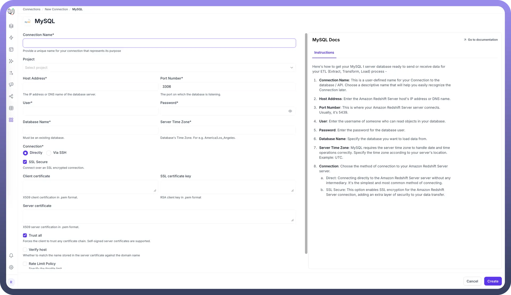
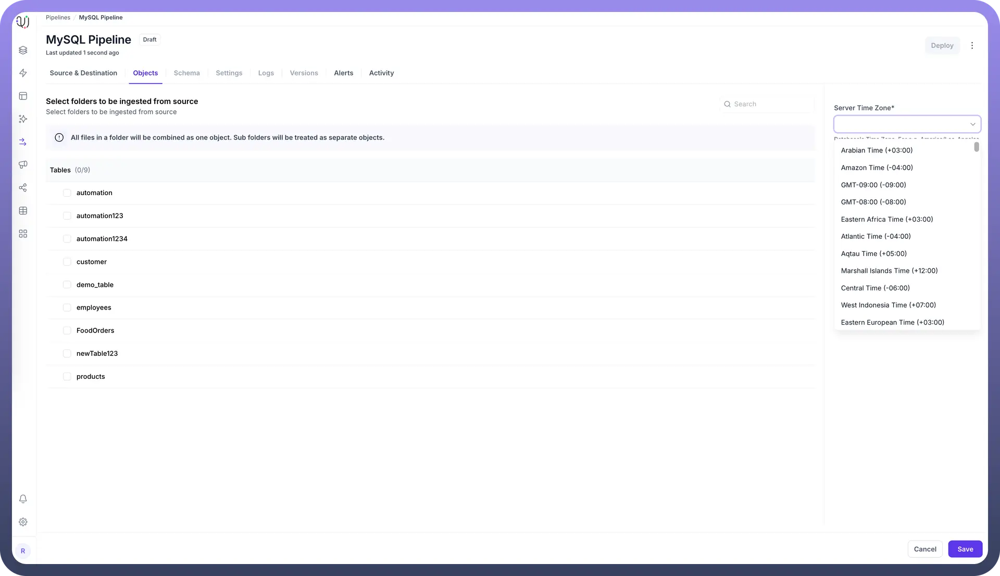

# MySQL as Source

Source: https://www.unifyapps.com/docs/unify-data/mysql-as-source
Section: data

---

UnifyApps enables seamless integration with MySQL databases as a source for your data pipelines. This article covers essential configuration elements and best practices for connecting to MySQL sources.

## Overview

MySQL is widely used for web applications, online transaction processing, and e-commerce platforms. UnifyApps provides native connectivity to extract data from these MySQL environments efficiently and securely.

## Connection Configuration

| **Parameter** | **Description** | **Example** |
|---|---|---|
| `Connection Name*` | Descriptive identifier for your connection | "Production MySQL Web App" |
| `Project` | Optional project categorization | "E-commerce Platform" |
| `Host Address*` | MySQL server hostname or IP address | "mysql.example.com" |
| `Port Number*` | Database listener port | 3306 (default) |
| `User*` | Database username with read permissions | "unify_reader" |
| `Password*` | Authentication credentials | "********" |
| `Database Name*` | Name of your MySQL database | "ecommerce_db" |
| `Server Time Zone*` | Database server's timezone | "UTC" |
| `Connection*` | Method of connecting to the database | Direct or Via SSH |

To set up a MySQL source, navigate to the Connections section, click New Connection, and select MySQL. Fill in the parameters above based on your MySQL environment details.

## Server Timezone Configuration

When adding objects from a MySQL source, you'll need to specify the database server's timezone. This setting is crucial for proper handling of date and time values.

- In the Add Objects dialog, find the Server Time Zone setting
- Select your MySQL server's timezone

This ensures all timestamp data is normalized to UTC during processing, maintaining consistency across your data pipeline.

## Ingestion Modes

| **Mode** | **Description** | **Business Use Case** |
|---|---|---|
| `Historical and Live` | Loads all existing data and captures ongoing changes | E-commerce platform migration with continuous order synchronization |
| `Live Only` | Captures only new data from deployment forward | Real-time inventory tracking without historical data |
| `Historical Only` | One-time load of all existing data | Marketing analysis or quarterly reporting snapshot |

Choose the mode that aligns with your business requirements during pipeline configuration.

## Binary Log Configuration for Change Data Capture

For Historical and Live or Live Only modes that track ongoing changes, MySQL's binary logging must be properly configured:

1. **Server Configuration**: Edit your MySQL configuration file (my.cnf or my.ini) to enable binary logging:`[mysqld] server-id=1 log_bin=mysql-bin binlog_format=ROW binlog_row_image=FULL`
2. **Verification**: Confirm binary logging is enabled:`SHOW VARIABLES LIKE 'log_bin'; SHOW VARIABLES LIKE 'binlog_format';`
3. The results should show:
  - log_bin: ON
  - binlog_format: ROW
4. **User Privileges**: The MySQL user needs specific permissions: `GRANT SELECT, REPLICATION SLAVE, REPLICATION CLIENT ON *.* TO 'unify_reader'@'%'; FLUSH PRIVILEGES;`
5. **CONNECTION PERMISSIONS**`-- Create user and allow connection to the MySQL server CREATE USER 'etl_user'@'%' IDENTIFIED BY 'StrongPassword!2024'; -- Grant connection access to a specific database GRANT USAGE ON your_database_name.* TO 'etl_user'@'%';`
6. **READ PERMISSIONS**`-- Allow reading data from tables and views GRANT SELECT ON your_database_name.* TO 'etl_user'@'%'; -- Allow reading view definitions (optional) GRANT SHOW VIEW ON your_database_name.* TO 'etl_user'@'%';`
7. **WRITE PERMISSIONS**`-- Allow inserting data into tables GRANT INSERT ON your_database_name.* TO 'etl_user'@'%'; -- Allow updating existing data GRANT UPDATE ON your_database_name.* TO 'etl_user'@'%'; -- Allow deleting records GRANT DELETE ON your_database_name.* TO 'etl_user'@'%';`
8. **EXECUTION PERMISSIONS**`-- Allow executing stored procedures and functions GRANT EXECUTE ON your_database_name.* TO 'etl_user'@'%';`
9. **CREATE PERMISSIONS**`-- Allow creation of new tables, views, procedures, functions GRANT CREATE ON your_database_name.* TO 'etl_user'@'%'; -- Allow creating temporary tables (optional, often needed in ETL) GRANT CREATE TEMPORARY TABLES ON your_database_name.* TO 'etl_user'@'%';`
10. **ALTER AND DELETE PERMISSIONS** `-- Allow altering tables (add/drop columns, modify data types) GRANT ALTER ON your_database_name.* TO 'etl_user'@'%'; -- Allow dropping tables, views, procedures, etc. GRANT DROP ON your_database_name.* TO 'etl_user'@'%'; -- Grant global RELOAD privilege (required for some replication, metadata, or flush operations) GRANT RELOAD ON *.* TO 'connector_user'@'%';`
11. **Binary Log Retention**: Set appropriate retention period:`SET GLOBAL binlog_expire_logs_seconds = 604800; -- 7 days`

### CRUD Operations Tracking

All database operations from MySQL sources are identified and logged as unique actions:

| **Operation** | **Description** | **Business Value** |
|---|---|---|
| `Create` | New record insertions | Track new product listings or customer registrations |
| `Read` | Data retrieval actions | Monitor query patterns and data access |
| `Update` | Record modifications | Audit changes to product prices or inventory levels |
| `Delete` | Record removals | Compliance tracking for order cancellations |

This comprehensive logging supports audit requirements and troubleshooting efforts.

### Supported Data Types

| **Category** | **Supported Types** |
|---|---|
| `Integer` | TINYINT, SMALLINT, MEDIUMINT, INT, BIGINT |
| `Decimal` | NUMERIC, FLOAT, DOUBLE, DECIMAL |
| `Date/Time` | DATE, DATETIME, TIMESTAMP, TIME |
| `String` | CHAR, VARCHAR, TEXT |
| `Binary` | BINARY, VARBINARY, BLOB |
| `Boolean` | BOOLEAN (alias for TINYINT(1)) |
| `Bit-field` | BIT |

All common MySQL data types are supported, enabling comprehensive data extraction from various MySQL applications.

### Prerequisites and Permissions

To establish a successful MySQL source connection, ensure:

- Access to an active MySQL Server instance (version 5.6 or later recommended)
- Minimum required permissions: SELECT, REPLICATION SLAVE, REPLICATION CLIENT
- Binary logging enabled for change data capture
- Proper network connectivity and firewall rules allowing access on MySQL port

## Common Business Scenarios

**E-commerce Data Integration**

- Extract product, inventory, and order data from MySQL databases
- Configure real-time order status updates
- Ensure proper tracking of inventory changes

**Web Analytics Consolidation**

- Connect to MySQL databases storing web analytics data
- Optimize extraction for high-volume user behavior tables
- Configure appropriate sampling for very large datasets

**Customer Management**

- Extract customer profiles and activity data
- Ensure proper handling of personally identifiable information (PII)
- Implement data masking or filtering as needed for compliance

## Best Practices

| **Category** | **Recommendations** |
|---|---|
| `Performance` | Create read replicas for heavy extraction workloads Extract only necessary columns to minimize network load Use WHERE clauses with indexed columns to filter large tables |
| `Security` | Create dedicated MySQL users with minimum permissions Use SSL/TLS encryption for data in transit Implement network-level security with firewalls and VPCs |
| `Data Governance` | Document source-to-target mappings Maintain data lineage for compliance reporting Set up alerts for binary log purging or pipeline failures |
| `Optimization` | Configure appropriate binary log retention periods Index frequently queried columns in source tables Use InnoDB storage engine for transactional consistency |

By properly configuring your MySQL source connections and following these guidelines, you can ensure reliable, efficient data extraction while meeting your business requirements for data timeliness, completeness, and compliance.
