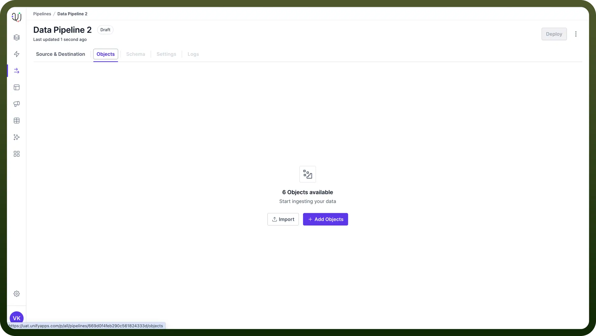
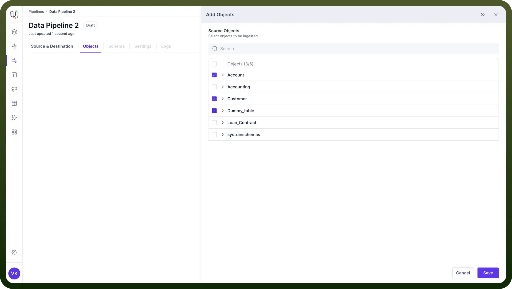
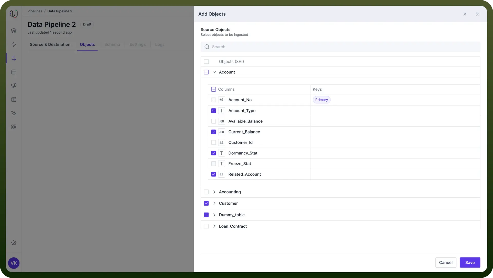
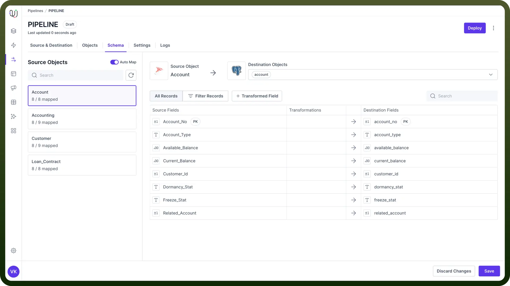
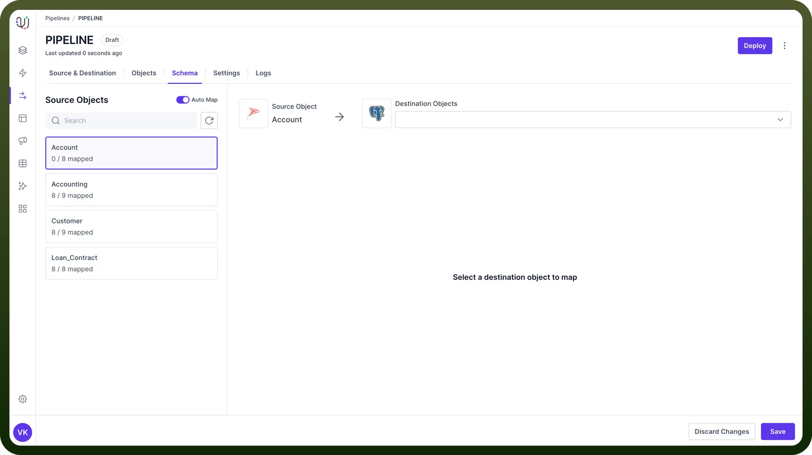
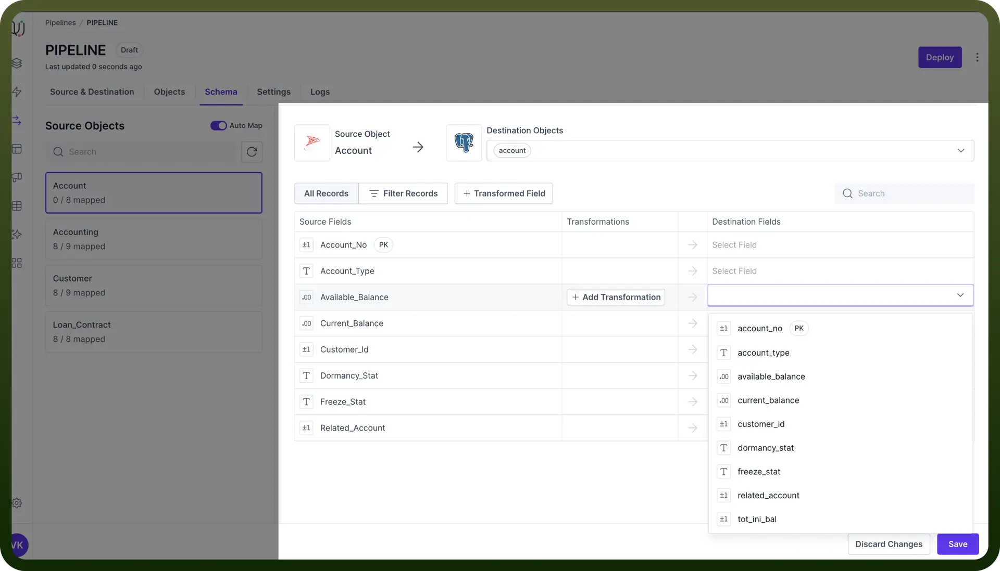
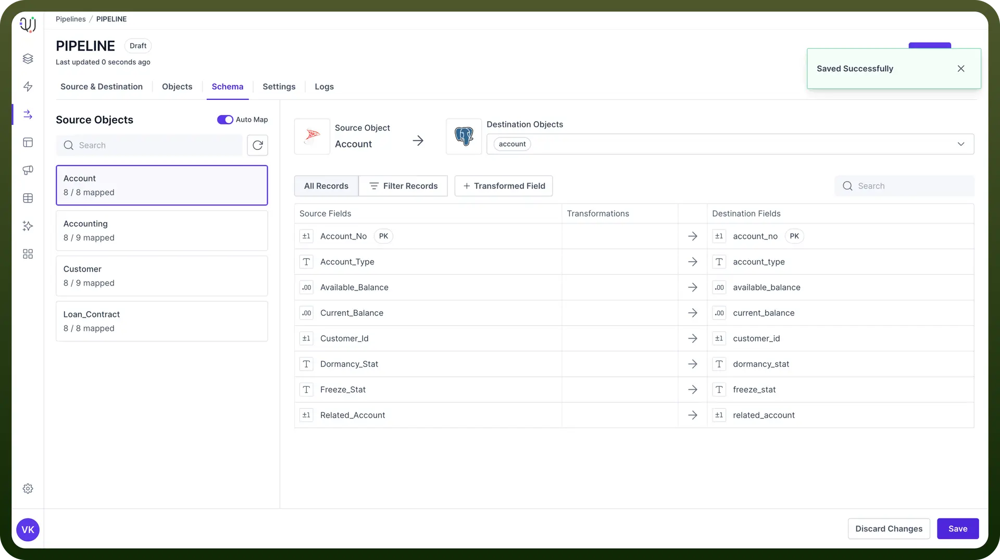

# Object Selection & Schema Mapping

Source: https://www.unifyapps.com/docs/unify-data/object-selection-and-schema-mapping
Section: data

---

After setting up your source and destination, the next crucial steps in creating your data pipeline are selecting the objects you want to transfer and mapping the schemas between your source and destination.

These steps ensure that the right data is moved and properly structured in your destination.

## Object Selection

This involves choosing which tables, views, or other data structures from your source you want to include in your pipeline.

Follow these steps to select the objects for your data pipeline:

1. Navigate to the "`Objects`" tab in the UnifyData interface.
2. Click on "`Add Objects`". This will open the object selection pane.

  

3. You'll see a list of available objects from your source. Select the objects you want to include in your pipeline by clicking the checkbox next to each object name.

  

4. To view the fields within an object, click on the object name to expand it.
5. You can select specific fields within each object if you don't need all the data. This can help optimize your pipeline's performance.

  

6. After selecting all necessary objects and fields, click "`Save`" to add them to your pipeline.

> **Note:** If you want to select all the objects at once, just click on the top most checkbox. It will select all the objects with their respective fields.

## Schema Mapping

This is the process of defining how fields in your source data correspond to fields in your destination. It's a critical part of the Data Pipeline process.

Once you've selected your objects, the next step is to map the schemas between your source and destination. UnifyData offers both automatic and manual mapping options.

### Automatic Mapping

1. In the Schema Mapping section, you'll see a toggle for "`Auto Map`".
2. Turn on this toggle to let UnifyData automatically map source fields to destination fields based on name and data type similarities.

  

> **Note:** While auto-mapping can save time, always review the suggested mappings to ensure accuracy.

### Manual Mapping

For more control or to adjust auto-mapped fields:

1. Select the source object you want to map from the left panel.

  

2. Choose the corresponding destination object from the right panel.

  

3. You'll see a list of fields from the source object. For each field:
  - Select the matching destination field from the drop-down list.
  - If there's no match, you can choose to skip the field or create a new field in the destination.
4. After mapping all fields, click "`Save`" to store your mappings.

> **Note:** You can use the Search bar on the left to find source objects or the Search bar in each object view to find source fields.
