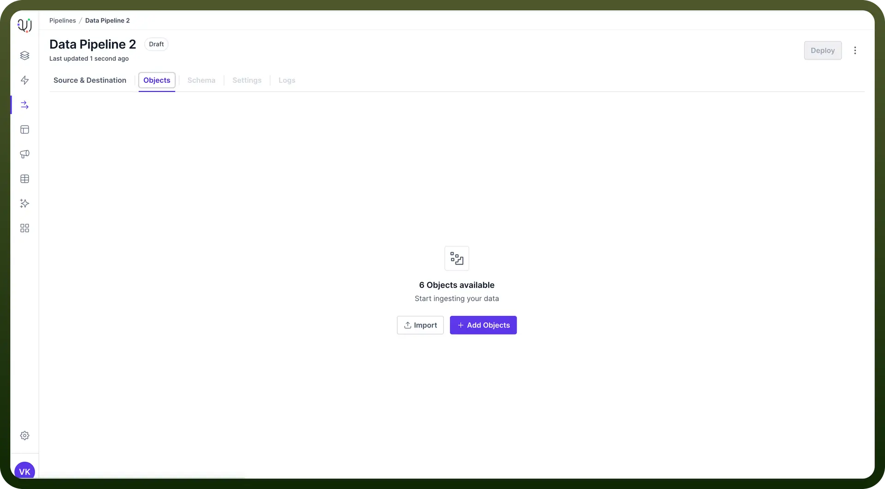
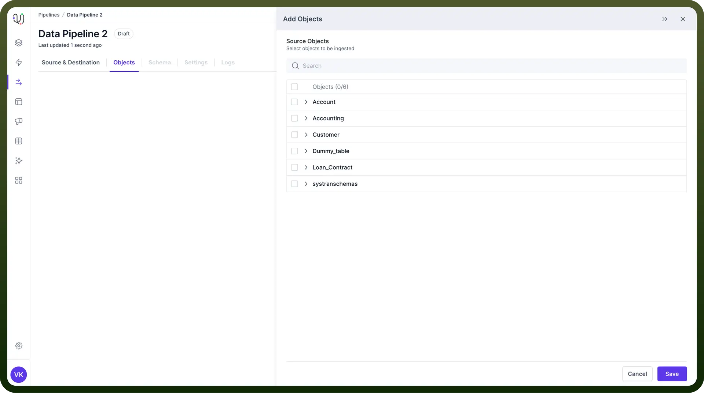
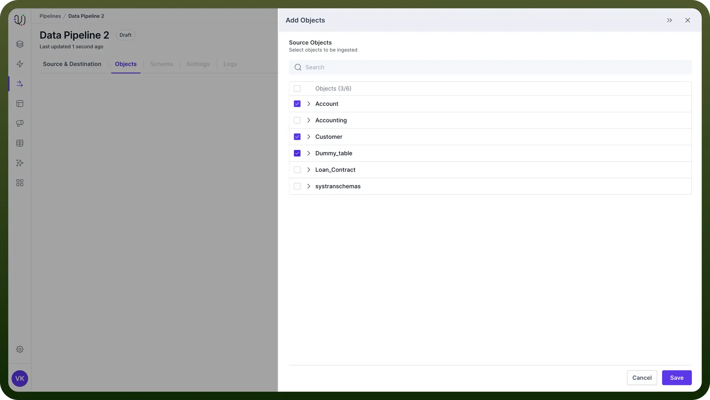
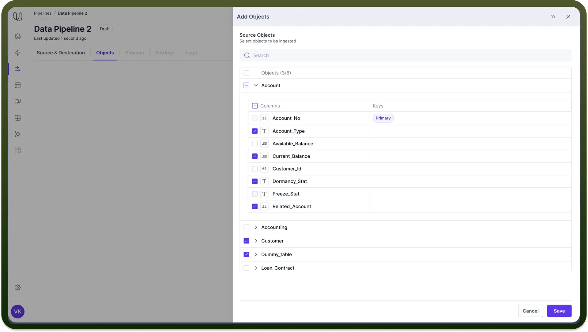
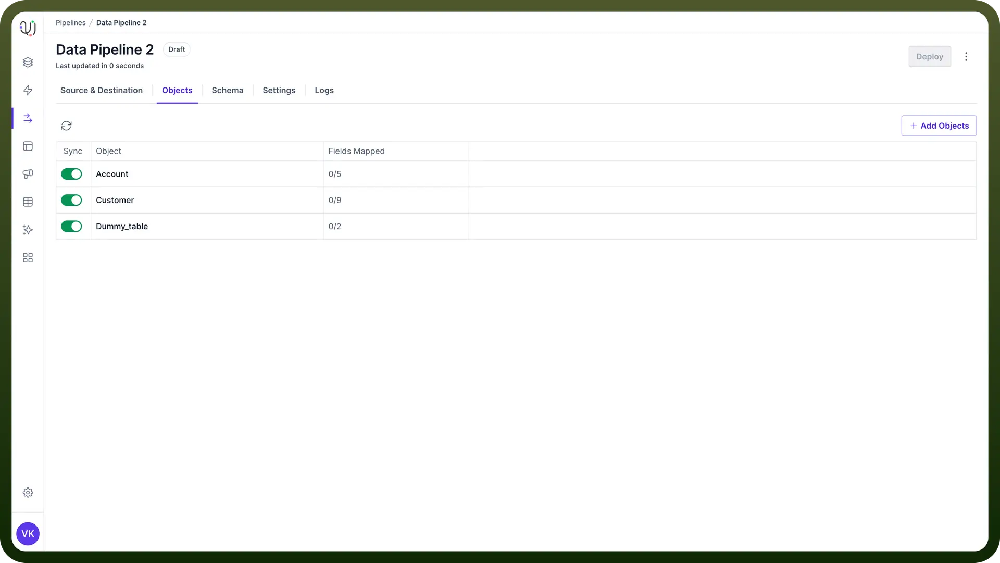
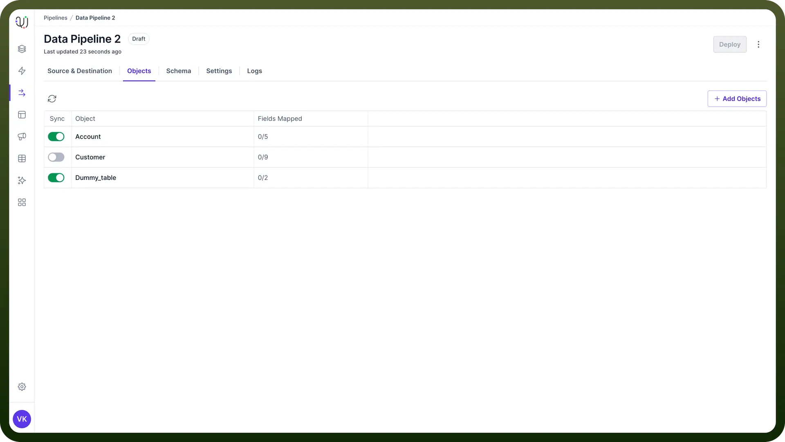

# Objects Selection

Source: https://www.unifyapps.com/docs/unify-data/objects-selection
Section: data

---

## Introduction

Object selection is an important step in configuring your data pipelines within UnifyData. 

This process involves choosing the necessary objects, such as **tables** in databases or **folders** in file storage systems like Amazon S3 and Google Cloud Storage.

In this article, we'll walk you through the process of **object selection**, helping you understand:

- What objects and fields are in the context of data pipelines
- How to select objects and fields in UnifyData
- Best practices for efficient object selection

## Understanding Pipeline Objects

UnifyData works with various types of source systems which have different structures of storing data such as SQL databases, applications etc.

These objects include:

- `Tables`: Tables are the most common database objects, especially in relational databases. They organize data into rows (**records**) and columns (**fields**).
- `Files`: In file-based storage systems, files are the primary data objects. Can include **CSV**, **JSON**, **XML**, or other structured and semi-structured data formats.
- `Folders`: Folders organize files in a hierarchical structure. It is common in cloud storage systems like Amazon S3 or Google Cloud Storage.
- `Entities`**:** Applications such as Microsoft Dynamics 365 store data in the form of entities.

## Steps for Object Selection

1. **Add Objects** In the '`Objects`' tab, you can add the necessary objects from the source to your data pipeline. **Click on Add Objects**:
  - Click the `Add Objects` button.
  - This action will open a third pane displaying the available objects from the source.

    

2. **Select Objects** Choose the objects you need by following these steps:
  - **Select the Required Objects**:
    - Select the objects you need by checking the box next to each object name.
  - **Expand Objects to View Fields/Folders**:
    - Click on an object name to expand it and view its fields or sub-folders.
    - For database tables, you'll see a list of fields (**columns**).
    - For file storage systems, you might see sub-folders.

      

3. **Select Fields** After expanding the objects, you can selectively choose the fields or sub-folders required for your data pipeline.
  - **Choose the Necessary Fields/Folders**:
    - Check the `boxes` next to the fields or folders you need.
    - The `Primary Keys` will be indicated in a separate column for database tables.

      

4. **Save Selections** Once you have selected the necessary fields or folders, you need to save your selections to include them in your data pipeline.
  - **Save the Selected Objects and Fields/Folders**:
    - Click `Save` to add the selected objects and fields/folders to your data pipeline.

      

## Objects List View

The Objects List View provides an overview of all the selected objects and their fields or folders. 
This view helps you manage and track the objects included in your data pipeline.

- **Details in Objects List View**:
  - `View` all the selected objects and their respective fields or folders.
  - `See the number of fields` selected and how many have been mapped to the destination object’s fields.

### Object Ingestion Toggle

Each object in the list view has an object ingestion toggle that allows you to control data synchronization.

- **Using the Toggle**:
  - The toggle allows you to turn `data synchronization` on or off for each object.
  - Turning off the sync `stops data movement` for the object but preserves the schema mapping.
  - This feature allows you to `re-enable sync` with the same mapping later.

    

## Best Practices

1. **Plan Your Object Selection**
  - Clearly **define the data source** and its schema before selecting objects. This ensures an organized data structure and reduces the risk of errors.
  - Have a clear understanding of the data requirements for your pipeline. Select only the necessary objects and fields to optimize performance and storage.
2. **Optimize for Performance** Select Only Required Data - Avoid selecting unnecessary objects and fields. This reduces data volume and improves pipeline performance.
