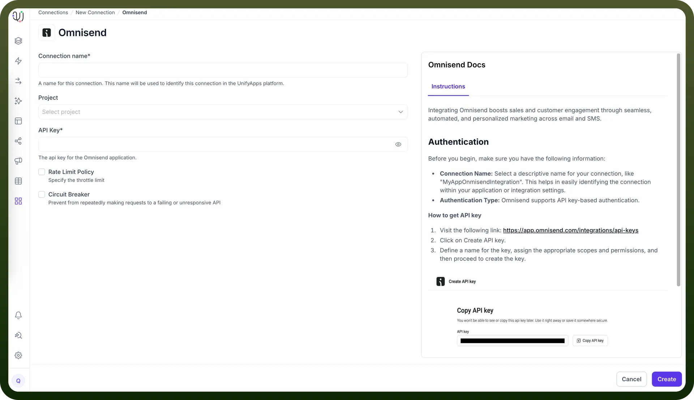
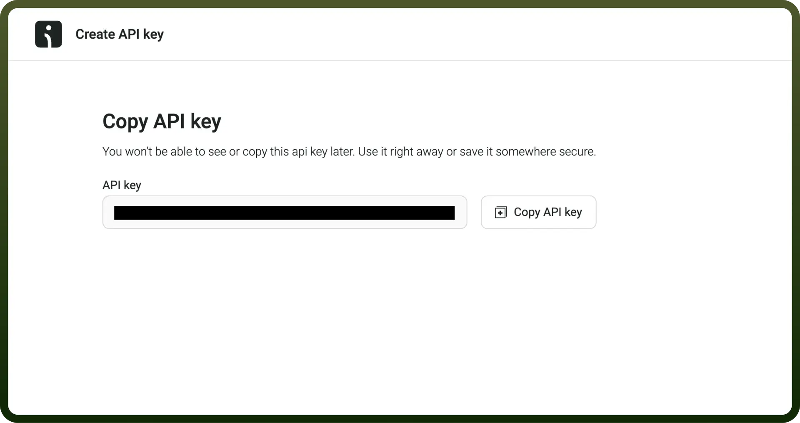

# Omnisend as Source

Source: https://www.unifyapps.com/docs/unify-data/omnisend-as-source
Section: data

---

UnifyApps enables seamless integration with Omnisend as a source for your data pipelines. This article covers essential configuration elements and best practices for connecting to Omnisend sources.

## Overview

Omnisend is a powerful marketing automation platform that helps businesses boost sales and customer engagement through seamless, automated, and personalized marketing across email and SMS channels. UnifyApps provides native connectivity to extract data from Omnisend efficiently and securely, supporting both historical data loads and continuous data synchronization.

## Connection Configuration

| **Parameter** | **Description** | **Example** |
|---|---|---|
| `Connection Name`* | Descriptive identifier for your connection | "MyAppOmnisendIntegration" |
| `Authentication Type`* | Method of authentication to Omnisend | API key-based authentication |
| `API Key`* | Authentication key for accessing Omnisend API | "6791fbf1454………" |

1. To acquire the API Key, Visit the following link: [https://app.omnisend.com/integrations/api-keys](https://app.omnisend.com/integrations/api-keys)
2. Click on Create API key
3. Define a name for the key, assign the appropriate scopes and permissions, and then proceed to create the key

## Supported Entities

UnifyApps can extract data from the following Omnisend entities:

| **Entity** | **Description** | **Common Use Cases** |
|---|---|---|
| `Campaign` | Marketing campaigns created in Omnisend | Campaign performance analysis, content effectiveness tracking |
| `Cart` | Shopping cart information for customers | Abandoned cart analysis, purchase funnel optimization |
| `Contact` | Customer profiles and contact information | Customer segmentation, profile enrichment |
| `Order` | Customer purchase information | Sales analysis, customer lifetime value calculation |
| `Product` | Product catalog information | Inventory analysis, product performance tracking |

For more information regarding Omnisend entities please refer to Omnisend docs [https://api-docs.omnisend.com/](https://api-docs.omnisend.com/)

## Data Synchronization Methods

UnifyApps implements different polling strategies based on the entity type to ensure efficient data extraction:

**Reverse Polling (for Carts, Campaigns, Products, Orders)**

For these entities, UnifyApps implements a reverse polling strategy:

- Retrieves most recent records first, then works backward
- Optimized for time-sensitive data like recent orders or cart updates
- Ensures newest data is prioritized in the synchronization process

**Cursor-Based Pagination (for Contacts)**

For contact data, UnifyApps uses cursor-based pagination:

- Handles large contact databases efficiently
- Uses pagination tokens to track progress through the dataset
- Maintains consistent synchronization even with frequent updates

## CRUD Operations Tracking

When tracking changes from Omnisend sources:

| **Operation** | **Support** | **Notes** |
|---|---|---|
| `Create` | ✓ Supported | New record insertions are detected |
| `Read` | ✓ Supported | Data retrieval via Omnisend API |
| `Update` | ✓ Supported | Updates to existing records are detected but as insertion events and are upserted via the primary key |
| `Delete` | ✗ Not Supported | Delete operations cannot be detected |

> **Note:** Due to limitations in the Omnisend API, delete operations are not tracked. Consider this when designing your data synchronization strategy.

## Ingestion Modes

| **Mode** | **Description** | **Business Use Case** |
|---|---|---|
| `Historical and Live` | Loads all existing data and captures ongoing changes | E-commerce platform migration with continuous customer data synchronization |

## Common Business Scenarios

**Customer Data Integration**

- Extract contact profiles from Omnisend
- Combine with data from other systems for a unified customer view
- Enable personalized marketing across channels

**E-commerce Performance Analysis**

- Synchronize order and cart data from Omnisend
- Track conversion rates and abandoned cart metrics
- Analyze customer purchase patterns

**Campaign Effectiveness Measurement**

- Extract campaign data from Omnisend
- Correlate with sales data for ROI calculation
- Compare performance across different marketing channels

**Product Catalog Synchronization**

- Keep product information consistent across systems
- Track product performance in marketing campaigns
- Enable accurate inventory reporting

## Best Practices

| **Category** | **Recommendations** |
|---|---|
| `Performance` | Schedule extractions during off-peak hours Apply appropriate filtering to limit large data transfers Prioritize incremental over full extractions when possible |
| `Data Quality` | Regularly validate contact data synchronization Ensure order IDs remain consistent across systems Maintain consistent product identifiers |
| `Security` | Restrict API key permissions to read-only access Rotate API keys periodically Store connection credentials securely |
| `Monitoring` | Set up alerts for synchronization failures Monitor API rate limits to prevent throttling Track data volume changes for anomaly detection |

## Limitations and Considerations

- **API Rate Limits**: Omnisend enforces rate limits that may affect data extraction speed. Configure appropriate throttling in high-volume scenarios.
- **Data Retention**: Consider Omnisend's data retention policies when planning historical data extraction.
- **Delete Detection**: As delete operations are not supported, implement alternative strategies for handling deleted records.

By properly configuring your Omnisend source connections and following these guidelines, you can ensure reliable, efficient data extraction while meeting your business requirements for marketing automation and customer engagement analytics.
