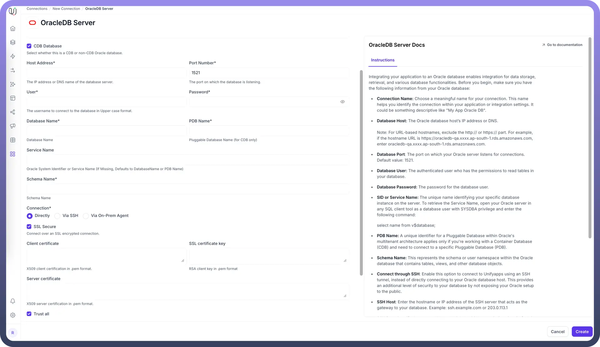
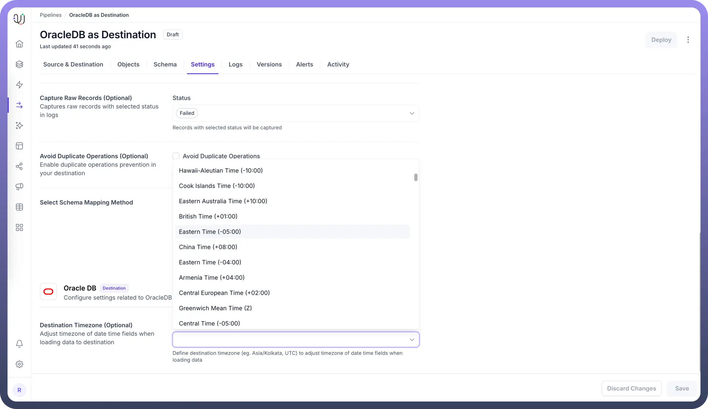

# Oracle DB as Destination

Source: https://www.unifyapps.com/docs/unify-data/oracle-db-as-destination
Section: data

---

UnifyApps enables seamless integration with Oracle databases as a destination for your data pipelines. This article covers essential configuration elements and best practices for loading data into Oracle destinations.

## Overview

Oracle Database is widely used for enterprise applications including ERP systems, financial platforms, and customer management solutions. UnifyApps provides native connectivity to load data into these Oracle environments efficiently and securely, making it ideal for enterprise data warehousing, operational data stores, and business-critical applications.

## Prerequisites

Before configuring Oracle as your destination, ensure you have:

1. **Oracle Database Instance**: Access to an active Oracle database instance (on-premises or cloud)
2. **Connection Information**: Server hostname/IP address, port number (default 1521), and database/service name details
3. **Authentication Credentials**: Oracle database username and password with appropriate privileges
4. **Database Privileges**: The user needs CREATE, INSERT, UPDATE, and DELETE privileges on the target schema:

```
GRANT CREATE SESSION TO <username>;
GRANT CREATE TABLE TO <username>;
GRANT INSERT, UPDATE, DELETE ON <schema>.<table> TO <username>;
```

5. **Schema Access**: Appropriate permissions for the target schema where data will be loaded

## Connection Configuration



| **Parameter** | **Description** | **Example** |
|---|---|---|
| `Connection Name` | Descriptive identifier for your connection | "`Data Warehouse Oracle`" |
| `Host Address` | Oracle server hostname or IP address | "`oracle-dw.example.com`" |
| `Port Number` | Database listener port | 1521 (default) |
| `User` | Database username with write permissions | "`unify_writer`" |
| `Password` | Authentication credentials | "`********`" |
| `Database/Service Name` | SID or service name of your Oracle instance | "`DWPROD`" |
| `PDB Name` | Name of Pluggable Database (if using CDB) | "`DW_PDB`" |
| `Schema Name` | Schema for loading destination tables | "`STAGING`" |
| `Connection Type` | Method of connecting to the database | Direct |

To set up an Oracle destination, navigate to the Connections section, click New Connection, and select OracleDB Server as destination. Fill in the parameters above based on your Oracle environment details.

## Authentication

1. **Connection Name:** Choose a meaningful name for your destination connection, such as "`Enterprise Data Warehouse Oracle`"
2. **Database Host:** The Oracle database server's IP address or DNS hostname
3. **Database Port:** The port on which your Oracle listener accepts connections (default: 1521)
4. **Database User:** The authenticated user with permissions to create and modify tables in your target schema
5. **Database Password:** The password for the database user
6. **Database/Service Name:** The Oracle SID or service name for your target database instance
7. **PDB Name:** If using Oracle Container Database (CDB), specify the Pluggable Database name
8. **Schema Name:** Target schema where tables will be created and data loaded

## Schema Mapping

OracleDB as Destination in UnifyApps supports **Manual Mapping only**. This provides precise control over data transformation and loading:

- Define custom column names and Oracle-specific data types
- Apply data transformations during the mapping process
- Handle complex Oracle data structures with precision
- Ensure data quality through explicit mapping definitions
- Leverage Oracle's advanced data type capabilities

During pipeline configuration, you'll manually specify the mapping between source fields and Oracle destination columns, enabling optimal data transformation for your enterprise requirements.

## Supported Data Types

UnifyApps handles these Oracle data types for destination loading, ensuring proper conversion from your source systems:

| **Category** | **Supported Types** |
|---|---|
| `Text` | VARCHAR2, NVARCHAR2, CHAR, NCHAR, LONG |
| `Numeric` | NUMBER, FLOAT, BINARY_FLOAT |
| `Date/Time` | DATE, TIMESTAMP, TIMESTAMP WITH TIME ZONE |
| `Binary` | RAW, LONG RAW |
| `Large Objects` | CLOB, NCLOB, BLOB, BFILE |
| `Row Identifiers` | ROWID, UROWID |

All common Oracle data types are supported, including specialized types for financial and transactional systems.

## Destination Loading Timezone Configuration



When configuring your Oracle destination pipeline, you can set the Destination Loading Timezone in the pipeline settings tab:

- Navigate to the pipeline settings and find the Destination Loading Timezone option
- Configure this setting to specify how timestamp data should be stored in Oracle
- This setting controls the timezone context for data being loaded into your Oracle destination
- Select the appropriate timezone based on your business requirements and Oracle database configuration
- This ensures all timestamp data is consistently handled during the loading process, maintaining data integrity across your pipeline

## Common Business Scenarios

**Enterprise Data Warehousing**

- Load transformed data from multiple sources into Oracle data warehouse
- Build dimensional models leveraging Oracle's advanced analytical capabilities
- Enable complex business intelligence queries with optimized schema design

**Financial Data Integration**

- Load financial data into Oracle Financials or custom financial applications
- Ensure fiscal period timestamps are properly timezone-adjusted
- Maintain regulatory compliance for financial data storage

**Customer Data Consolidation**

- Centralize customer records into Oracle CRM or EBS systems
- Map customer hierarchies and relationships during loading
- Maintain referential integrity in destination tables

**Supply Chain Data Management**

- Load inventory and order data into Oracle SCM applications
- Configure data loading for critical business operations
- Apply appropriate data validation for high-volume transaction data

## Best Practices

**Performance Optimization**

- Use appropriate batch sizes for bulk loading operations
- Create indexes on frequently queried columns after data loading
- Leverage Oracle's partitioning capabilities for large datasets
- Schedule heavy loads during off-peak hours to minimize impact

**Security Considerations**

- Create dedicated Oracle users with minimum required permissions
- Follow enterprise password policies and credential rotation
- Coordinate with enterprise security teams for database access

**Data Quality Management**

- Implement data validation rules in your pipeline configuration
- Monitor for Oracle constraint violations and data type mismatches
- Set up alerts for pipeline failures or data quality issues
- Use staging tables for complex transformations before final loading

**Enterprise Integration**

- Document source-to-target mappings for compliance reporting
- Maintain data lineage for audit and governance requirements
- Coordinate with Oracle DBA team for optimal configuration
- Follow enterprise change management processes

## Monitoring and Maintenance

**Performance Monitoring**

- Track data loading times and throughput rates
- Monitor Oracle database resource utilization during pipeline execution
- Use Oracle AWR reports to analyze loading performance
- Set up alerts for long-running or failed operations

**Database Maintenance**

- Coordinate with Oracle DBA team for regular maintenance windows
- Monitor tablespace usage and plan for storage growth
- Implement appropriate backup and recovery procedures
- Maintain Oracle connection pool settings for optimal performance

Oracle Database's enterprise-grade architecture and reliability make it an excellent destination for mission-critical data pipelines. By following these configuration guidelines and best practices, you can ensure reliable, efficient data loading that meets your enterprise requirements for performance, scalability, and data integrity.

UnifyApps integration with Oracle databases facilitates seamless data loading from multiple sources, enhancing your enterprise data infrastructure for analytics, reporting, and operational excellence.
