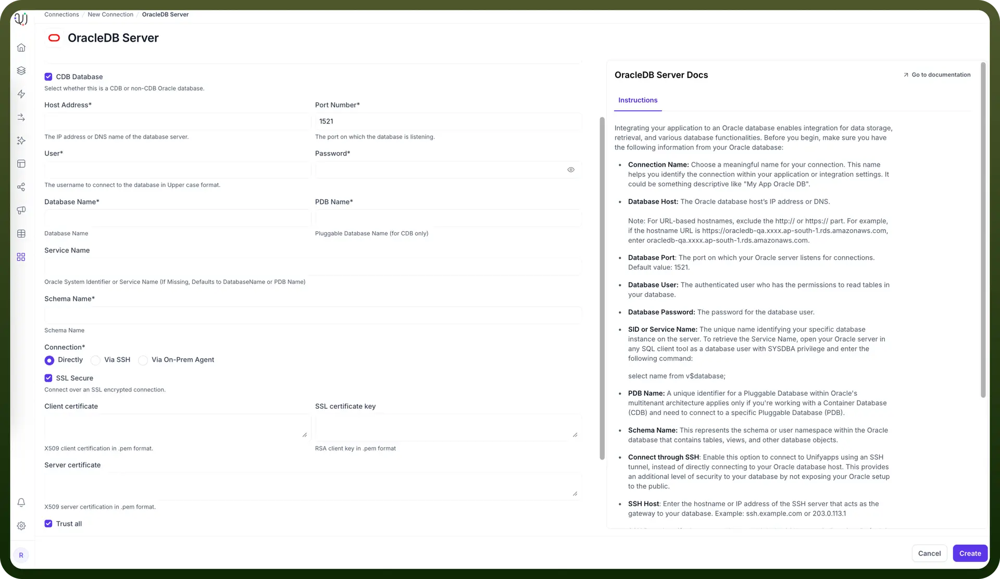
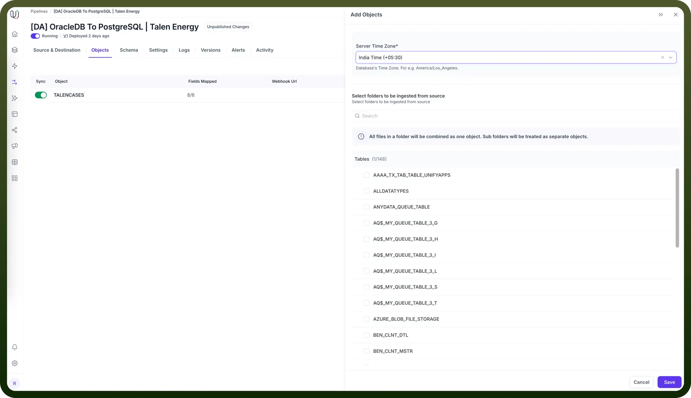

# OracleDB as Source

Source: https://www.unifyapps.com/docs/unify-data/oracledb-as-source
Section: data

---

UnifyApps enables seamless integration with Oracle databases as a source for your data pipelines. This article covers essential configuration elements and best practices for connecting to Oracle sources.

## Overview

Oracle Database is widely used for enterprise applications including ERP systems, financial platforms, and customer management solutions. UnifyApps provides native connectivity to extract data from these Oracle environments efficiently and securely.

## Connection Configuration

| **Parameter** | **Description** | **Example** |
|---|---|---|
| `Connection Name` | Descriptive identifier for your connection | "Production Oracle ERP" |
| `Host Address` | Oracle server hostname or IP address | "oracle-db.example.com" |
| `Port Number` | Database listener port | 1521 (default) |
| `User` | Database username with read permissions | "unify_reader" |
| `Password` | Authentication credentials | "********" |
| `Database/Service Name` | SID or service name of your Oracle instance | "PRODDB" |
| `PDB Name` | Name of Pluggable Database (if using CDB) | "SALES_PDB" |
| `Schema Name` | Schema containing your source tables | "FINANCE" |
| `Connection Type` | Method of connecting to the database | Direct, SSH Tunnel, or SSL |

To set up an Oracle source, navigate to the Connections section, click `New Connection`, and select `OracleDB Server`. Fill in the parameters above based on your Oracle environment details.

## Server Timezone Configuration

When adding objects from an Oracle source, you'll need to specify the database server's timezone. This setting is crucial for proper handling of date and time values.

1. In the Add Objects dialog, find the Server Time Zone setting
2. Select your Oracle server's timezone (e.g., "India Time (+05:30)")

This ensures all timestamp data is normalized to UTC during processing, maintaining consistency across your data pipeline.

## Ingestion Modes

| **Mode** | **Description** | **Business Use Case** |
|---|---|---|
| `Historical and Live` | Loads all existing data and captures ongoing changes | ERP system migration with continuous synchronization |
| `Live Only` | Captures only new data from deployment forward | Real-time sales dashboard without historical context |
| `Historical Only` | One-time load of all existing data | Financial quarter-end reporting or compliance snapshot |

Choose the mode that aligns with your business requirements during pipeline configuration.

## CRUD Operations Tracking

All database operations from Oracle sources are identified and logged as unique actions:

| **Operation** | **Description** | **Business Value** |
|---|---|---|
| `Create` | New record insertions | Track new customer accounts or orders |
| `Read` | Data retrieval actions | Monitor query patterns and data access |
| `Update` | Record modifications | Audit changes to sensitive financial data |
| `Delete` | Record removals | Compliance tracking for record deletion |

This comprehensive logging supports audit requirements and troubleshooting efforts.

## Supported Data Types

| **Category** | **Supported Types** |
|---|---|
| `Text` | VARCHAR2, NVARCHAR2, CHAR, NCHAR, LONG |
| `Numeric` | NUMBER, FLOAT, BINARY_FLOAT |
| `Date/Time` | DATE, TIMESTAMP, TIMESTAMP WITH TIME ZONE |
| `Binary` | RAW, LONG RAW |
| `Large Objects` | CLOB, NCLOB, BLOB, BFILE |
| `Row Identifiers` | ROWID, UROWID |

All common Oracle data types are supported, including specialized types for financial and transactional systems.

## **Common Business Scenarios**

1. **Financial Data Integration**
  - Connect to Oracle Financials to extract GL, AP/AR data
  - Ensure fiscal period timestamps are properly timezone-adjusted
  - Consider regulatory requirements for financial data transfers
2. **Customer Data Synchronization**
  - Extract customer records from Oracle CRM or EBS
  - Map customer hierarchies and relationships
  - Maintain referential integrity during extraction
3. **Supply Chain Visibility**
  - Connect to Oracle SCM for inventory and order data
  - Configure real-time syncing for critical inventory levels
  - Apply appropriate filtering for high-volume transaction tables

## **Best Practices**

| **Category** | **Recommendations** |
|---|---|
| `Performance` | Extract only necessary columns to minimize network load, Use WHERE clauses to filter large tables, Schedule bulk operations during off-hours |
| `Security` | Create read-only Oracle users with minimum permissions, Use SSH tunneling for databases in protected networks, Secure credentials using enterprise password policies |
| `Data Governance` | Document source-to-target mappings, Maintain data lineage for compliance reporting, Set up alerts for pipeline failures |
| `Optimization` | Index frequently queried columns in source tables, Monitor and tune Oracle AWR reports for extraction queries, Use partitioned tables for very large datasets |

By properly configuring your Oracle source connections and following these guidelines, you can ensure reliable, efficient data extraction while meeting your business requirements for data timeliness, completeness, and compliance.
