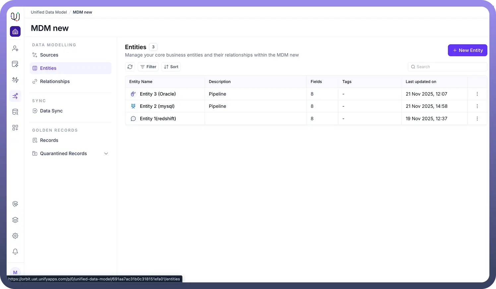
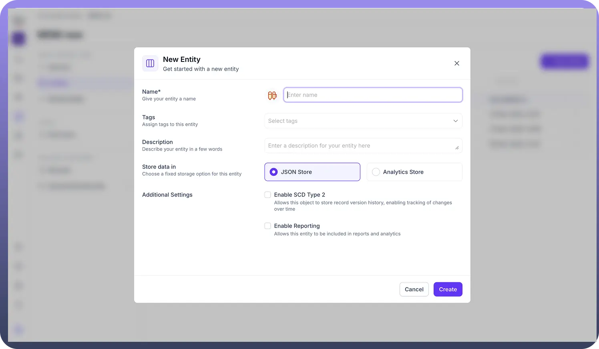

# Creating Entities

Source: https://www.unifyapps.com/docs/unify-data/overview-creating-entities
Section: data

---

**Overview**

In the UnifyApps ecosystem, Entities (often referred to as Objects) serve as the fundamental building blocks of your Unified Data Model (UDM).

Located within the mdm module, an Entity acts as a structured container that defines the properties, behaviors, and storage mechanisms for your core business data—whether that is customer information, product catalogs, or financial transaction logs.

Establishing robust Entities is the critical first step in the Master Data Management (MDM) lifecycle, bridging the gap between raw data ingestion from Sources and the generation of trusted Golden Records.

## **Entity Overview**

The **Entity Overview** within the **Unified Data Model (UDM)** provides a centralized view for managing and understanding your data architecture. It offers data engineers and architects a clear, high-level perspective of entity structure, complexity, and recency.

### **Key Components of the Entity Overview**

- **Entity Name & Description:** Clearly identifies each business object (e.g., *Entity 1*, *Entity 2*) along with its purpose within the unified data model.
- **Field Complexity:** The **Fields** column displays the number of attributes defined for each entity (e.g., *38 fields*, *14 fields*), offering quick insight into the depth and breadth of each model.
- **Multidomain Tagging:** The **Tags** section (e.g., *snowflake*, *base*) enables classification across domains. Tags help group entities by origin, department, or project, ensuring clean organization in complex or multi-source environments.

**Audit Timestamps:**
 The **Last Updated On** column provides visibility into recent schema changes, supporting governance, version awareness, and ongoing model maintenance.

## **Strategic Capabilities**

Creating an entity in UnifyApps goes beyond defining fields—it involves configuring how data is stored, governed, and processed across the entire lifecycle of the pipeline.

### **Storage Flexibility**

When initializing an entity, UnifyApps allows you to select from storage engines designed for different performance and structural needs:

- **JSON Store:** Suited for flexible and semi-structured data. It supports **SCD Type 2** for maintaining historical record changes, along with capabilities that enable adaptable reporting and schema evolution.

**Analytics Store:**
 Optimized for large-scale analytical workloads and high-performance querying. It also supports **SCD Type 2**, ensuring full historical tracking while enabling efficient handling of time-series and composite key–based data.
